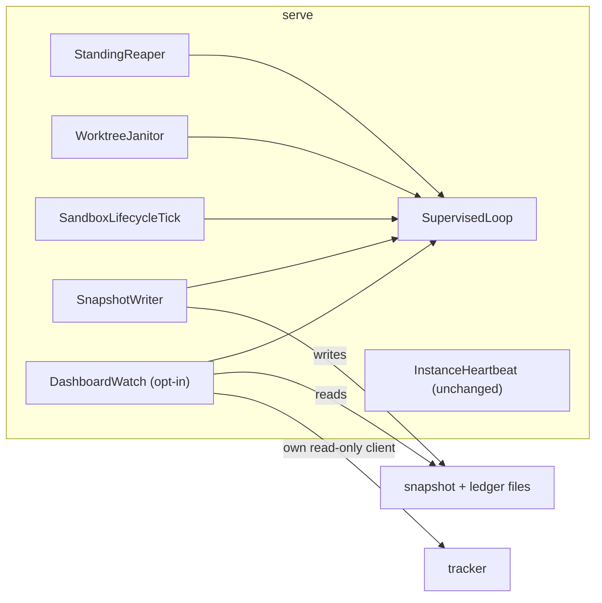

# Design: supervise-daemon-loops-and-embed-dashboard

## Context

See proposal.md (Why) for motivation. The current state that shapes the approach:

- **Four hand-written daemon loops in `:application`**, each starting its own virtual thread:

  | Loop                                       | Order       | Wait                                  | Guard                            | On thread death                         | Stop                               |
  |--------------------------------------------|-------------|---------------------------------------|----------------------------------|-----------------------------------------|------------------------------------|
  | `app/lease/StandingReaper`                 | wait → tick | fixed interval                        | `Throwable`, wait inside         | respawn via `RestartBackoff`, unbounded | yes                                |
  | `app/serve/WorktreeJanitor`                | tick → wait | fixed 1 h                             | `RuntimeException`, wait outside | nothing                                 | none                               |
  | `app/serve/SandboxLifecycleTick`           | tick → wait | fixed interval                        | `RuntimeException`, wait outside | nothing                                 | none                               |
  | `serveobservability/writer/SnapshotWriter` | tick → wait | interval or `markDirty()` (semaphore) | `RuntimeException`               | nothing                                 | `stop()` / `stopAfterFinalWrite()` |

  The janitor and the sweep tick are a declared hand-synchronized pair. `SnapshotWriter.awaitNextWake`
  re-sets the interrupt flag and returns, so an interrupt while `running` spins the loop without
  waiting. `stopAfterFinalWrite` joins the thread captured at `start()`. `ServeShutdown` stops only
  the reaper.
- **`InstanceHeartbeat`** is a fifth long-lived thread whose death is deliberately not resurrected
  (design D3 of `add-claim-heartbeat`). It is out of scope (proposal NG1).
- **The dashboard** (`DashboardCommand`) is the only place that derives the serve directory, the
  default output path (`dashboard.html`), the ready window (`BOARD_READY_LIMIT = 50`) and the board
  fetch (`BoardComposition.compose` over a tracker from `TrackerWiring.resolveReadOnly`, which
  reloads `.gnomish/` from the checkout). `DashboardWatchLoop.run` is a caller-thread `while` loop
  with its own interrupt check.
- **`serve`** binds its tracker configuration from origin's default branch (`BoundTracker`, FR13 of
  `add-base-ref-resolution`). Its live tracker is wrapped in `TrackerHealthTracker`, whose
  `consecutiveFailures` feeds the snapshot and the dashboard's alarm rule 4.
- **The operator-event catalog** demands one code per WARN/ERROR call site and a literal
  `OperatorEvent.X` at the site (`LogContractGateSpec`). The "Repeated failures log edges, not
  floods" requirement names `logtext.RepeatSuppressor` as the owner of repeat suppression.
- **Two types for "now", three fakes, no production gate.** The domain port
  `domain.engine.port.Clock` (one method, `now()`; `add-stage-engine` D8) is held by 16 production
  files in `:application`, 14 in `:adapters`, 6 in `sandbox/*` and 6 in `:domain`; `java.time.Clock`
  by 31 in `:application`, 4 in `:bootstrap`, 1 in `adapters/git` and `logtext.RepeatSuppressor`.
  `ManualRunConfiguration` declares a bean of each. `domain.engine.time.SystemClock` wraps the JDK
  clock into the port; nothing bridged the other way until task 2.3 added `app.daemon.SuppressorClock`.
  Where the two meet, a component builds a third: `InstanceHeartbeat` builds its suppressor on
  `Clock.systemUTC()` beside its injected port clock; `ServeAssembly`, `TakeHeartbeat` and
  `RemoteOutageGates` each construct `new SystemClock()` twice beside a clock they hold. Six writes in
  `adapters/github` and `GitTaskRepository.createTask` stamp `Instant.now()` with no seam, while the
  latter's declared sync twin `GitObjectsTaskRepository` takes a clock. Twenty `X.system()`
  convenience factories (`TerminalWriteRetry`, `RepeatSuppressor`, `GitInfrastructureRetry`) are
  called from ordinary constructors and field initializers, each wiring a real clock. Tests hold
  three fakes (`VirtualClock` for the port, `MovableClock` and `StepClock` for the JDK type), eleven
  specs build two and pin them by hand, and `checkTestTimeInjection` matches only `.system(` in test
  sources. A third seam, `app.lease.MonotonicTime`, has three users while seven sites read
  `System.nanoTime()` directly. The JDK's own answer, `java.time.InstantSource` (JDK 17,
  JDK-8266847), appears in no artifact of this repository.
- **The board** builds `BoardModel` with `EligibilityInputs(…, openFrontCount, wipLimit)`, but the
  model keeps neither. `BoardJsonMapper` re-derives the open-front count and takes `wipLimit` as a
  parameter. Its javadoc records that decision ("pass config explicitly, don't smuggle it into the
  model").

## Goals / Non-Goals

**Goals:** one loop shape (FR1–FR5) under a type every daemon loop holds; the embedded dashboard as
a configuration of existing parts, not a second renderer (FR9); the WIP stat read from the same
value eligibility was judged by (FR12); one type and one production source for the current instant
(FR17–FR21).

**Non-Goals:** a scheduler or executor framework (one virtual thread per loop stays); per-loop
snapshot vitals beyond the reaper's existing `restartCount` (NG6); changing what any tick does.

## Decisions

**D1 — `SupervisedLoop`: one instance per loop, held by composition.** A new final class
`app.daemon.SupervisedLoop` owns the thread, the order, the wait, the guard, the stop and the
restart policy. Each loop class keeps its own `tick()`, `lastRunAt` and policy collaborators. It holds
a `SupervisedLoop` field built in its constructor from a parameter object `LoopShape(DaemonComponent
component, LoopOrder order, LoopWait wait, RestartPolicy policy)`, plus a `Clock`. `LoopWait` is a
sealed interface with two implementations. `FixedInterval(Sleeper, Duration)` is used by the reaper,
janitor, sweep and dashboard. `IntervalOrSignal(Duration)` owns the semaphore and coalesces surplus
permits. It is used by the snapshot writer and exposes `signal()` for `markDirty()`. Every loop
is framed with its `DaemonComponent`, and `DASHBOARD` is added to that enum. Implements FR1, FR6.
*Rationale:* composition keeps each loop's tick and its specs where they are. The shared part is
exactly the shape `fix-reaper-idle-liveness` D4 settled for the reaper. *Alternatives rejected:* an
abstract base class: it couples five unrelated ticks through inheritance, and the base's lifecycle
leaks into each subclass's specs. `ScheduledExecutorService`: a throwing task silently suppresses
all later runs (the exact silent death this change removes), it has no wake-signal wait for the
writer, and it has no thread-death hook to hang a restart policy on.

**D2 (amended 2026-10-10) — Level-1 guard catches `Exception` around tick and wait; failures log
as edges; an `Error` ends the worker and D5 takes over.** The tick and the wait each run inside
`catch (Exception)` (FR2). Failures go through `RepeatSuppressor`, keyed by the loop's component,
with the reason read by `FailureReason.of` (the one owner of a streak identity). The first failure,
or a changed reason, logs WARN. Repeats log at DEBUG, with the suppressor's periodic counted
roll-up. The first clean tick after a failure logs one INFO recovery line. A clean tick also calls
`RestartPolicy.markCleanTick()`, which resets the backoff. An `Error` from the tick or the wait is
not caught: it leaves the guard, the worker thread dies, and the uncaught-exception handler asks the
restart policy (D5) — the respawn with backoff replaces "log and continue" for that class. The
wait stays inside the loop's control (D3) either way, so a throwing sleeper is an `Exception` edge,
and a stop never races the death.

*Rationale.* The original D2 caught `Throwable` and kept a second mechanism, the restart policy,
for "whatever still escapes" — and the only thing that could escape was the guard's own reporting
(a throwable whose message cannot be read, a logger fault). Two mechanisms covered one concern, and
the second was reachable only through a crack in the first. The cost showed in the specs: every
test of the restart path had to kill the worker with a throwable whose `getMessage` (earlier
`toString`) throws, in 37 places across 15 spec files, and those fixtures encoded which method the
reporting reads — routing the reason through `FailureReason.of` failed 8 of them with no behavior
changed. The sources draw the line where this amendment draws it: a worker catches what it can
recover from and lets the rest end the thread for a handler to decide (*Java Concurrency in
Practice* §7.3, the JDK's own `ThreadPoolExecutor.runWorker`, Akka's default decider:
`Exception` → restart, other throwables escalate); `Error` is "serious problems that a reasonable
application should not try to catch" (its javadoc; *Effective Java* item 70; Sonar S1181; CERT
ERR08-J), and a `catch (Throwable)` that continued after `OutOfMemoryError` left the MongoDB Java
driver's monitor threads as a zombie JVM (JAVA-5913, 2025). The repeat-suppression requirement is
unchanged for the `Exception` class: a permanently failing dashboard render still logs one WARN and
DEBUG repeats, not a WARN every 10 s.

*Alternatives rejected.* (a) Keep `catch (Throwable)`, as the reaper's D4 settled it. Its case is
real: four loops once died silently from an `Error` or a throwing sleeper, and "never lose a loop"
is the simplest promise. But that argument predates the supervisor: a death is no longer silent —
it is an ERROR line, a backoff and a respawn — so the total guard only duplicates D5 and hides it
from every test. (b) `catch (RuntimeException)` with the wait *outside* the guard
(`fix-reaper-idle-liveness` FR3 called it a defect): rejected still, for the wait, not the catch
type — the wait stays inside the loop's control so a throwing sleeper is an edge, not a death.
(c) Escalate `VirtualMachineError` to a process exit, as Cassandra's `JVMStabilityInspector` and
Kafka's `FatalExitError` do: a different decision with a different cost for a factory holding live
task slots, deferred to a change of its own; here every `Error` goes through the policy.

*The suppressor is the loop's own, built from the loop's clock and interval.* `SupervisedLoop` takes
a `Clock` and builds its `RepeatSuppressor` itself; no loop class constructs one, and none passes one
in. The roll-up period is derived from the wait's interval — at most one reminder per six ticks, and
never shorter than `RepeatSuppressor.DEFAULT_ROLL_UP_INTERVAL` — by one function in `app.daemon`
(`RollUpPeriod.forInterval`), which `BeatTiming.rollUp()` delegates to. *Rationale:* a roll-up period
equal to the tick is no suppression: every repeat outlives it and qualifies as a roll-up, so a
reaper ticking every 5 min on the catalog's 5 min default would log one WARN per tick, and the
janitor (1 h) the same. `HeartbeatRollUpPeriodSpec` already states this rule for the heartbeat; a
second copy of it per loop is the undeclared pair `manual-sync-pairs.md` forbids. A
`RepeatSuppressor` holds one period, so one instance per loop is forced by the type, and the
"one shared suppressor per process" question dissolves: the streak key is already per component.
The clock is the one the loop class already holds for `lastRunAt` (and the `Bounded` policy's), so
every loop's roll-ups and recovery run on virtual time under test; `RepeatSuppressor.system()` in a
loop class would put real time where the class's specs are virtual. That clock is an
`InstantSource` (D16), handed to the suppressor as is. Task 2.3 met a type gap here — the loop held
the domain port while `RepeatSuppressor` asked for `java.time.Clock` — and bridged it with
`app.daemon.SuppressorClock`; D16 removes the gap, and task 3.2 deletes the bridge. Recovery has no hysteresis: a
loop that fails every other tick logs a WARN/INFO pair per flap — the suppressor's existing
behavior everywhere, not changed here.

**D3 — Interrupt handling is defined once.** After every tick and every wait the loop checks its
`stopping` flag first: if it is set, the loop returns, with no WARN/ERROR and no respawn. Otherwise a
set interrupt flag is cleared with `Thread.interrupted()`, logged once as an edge (WARN, stray
interrupt), and the loop goes on to its next normal wait. A wait cut short by an interrupt never
turns into a tick-without-wait cycle. `FixedInterval` relies on the injected `Sleeper`, which
restores the flag. `IntervalOrSignal` catches `InterruptedException` and restores the flag, and the
same check handles both. Implements FR5. *Rationale:* both latent busy loops (`SnapshotWriter`, and
`ThreadSleeper` returning early under a set flag) are fixed in one place, and the "interrupt is a
stop" classification of `factory-serve` holds because a real stop always sets `stopping` before it
interrupts, and interrupts only a wait (D4). *Alternative rejected:* treating any interrupt as a stop. A stray interrupt would then
end the loop silently, which is the failure this change exists to remove.

**D4 — Stop, join and respawn under one small lock.** `SupervisedLoop` keeps `volatile boolean
stopping` and, guarded by a private lock, the `worker` field and a `waiting` flag that the worker
sets under the lock as it enters its wait and clears as it leaves it. `stop()` sets `stopping`, then
under the lock interrupts the worker only if `waiting` is set; `IntervalOrSignal` is also released
with `signal()`. A tick in progress is never interrupted: it runs to completion and the loop ends at
the `stopping` check that follows it. This keeps the stop quiet (FR4): ticks perform interruptible
I/O (`AtomicFileWriter` writes through `Files.writeString`, an interruptible channel; the janitor
scans the file system; the sweep waits on docker subprocesses), and an interrupt there would surface
as the tick's own WARN (`SNAPSHOT_WRITE_FAILED`, `DASHBOARD_RENDER_WRITE_FAILED`, the janitor's and
the sweep's codes), which the "interrupt is a stop" classification of `factory-serve` does not cover.
Today's `SnapshotWriter.stop()` already lets a write finish. For the reaper this is a change: a
sweep listing in flight is no longer interrupted but completes within the tracker client's own
deadline. `ServeShutdown` does not join the reaper, so shutdown is not delayed, and the interrupt
classification at the reaper's tracker sites stays in place for any interrupt from elsewhere.
`stopAndJoin()` repeats "read the current worker under the lock, join it outside the
lock" until no worker remains, so a respawn that happened in between is joined too. The death handler
follows the three-phase shape of `lock-scope.md`: decide (`stopping`? give up?) and count under
the lock, then wait the backoff with nothing held, then re-check `stopping` under the lock and
spawn only if it is still clear. Nothing blocking is ever held under the lock. Implements FR4,
NFR-R2, NFR-R3. *Rationale:* this is the reaper's existing race-free shape, extended with the join a
single-writer final write needs (D8). *Alternative rejected:* joining only the thread captured at
`start()` (today's `stopAfterFinalWrite`). It returns while a respawned writer can still write.
*Alternative rejected:* interrupting the worker in any phase. It shortens a stop by at most one
tick, and pays for it with WARN lines and half-done disposals on every `Ctrl-C` that lands
mid-tick. The cost of the chosen shape is that `stopAndJoin` waits out the current tick: one file
write for the writer and the dashboard, the only two callers of the join (D8, D9).

**D5 — Restart policies: `Unbounded` and `Bounded`.** `RestartPolicy` is a sealed interface over
the existing `RestartBackoff`, which moves from `app.lease` to `app.daemon`. `RemoteOutageProbeSchedule`
keeps calling `nextJitteredBackoff` unchanged.
- `Unbounded(base, cap)`: respawn after the doubling backoff, logging ERROR with a lifetime restart
  count. It never gives up. The reaper keeps base = its interval, cap = 10 min, so its behavior
  and its `restartCount` vital are unchanged. The janitor and the sweep tick use the same policy:
  their ticks fail mostly on transient external causes (file system, Docker).
- `Bounded(base, cap, maxRestarts, window, Clock)`: the same, but more than `maxRestarts` restarts
  within `window` logs one ERROR that the loop is disabled, and the loop does not respawn. The
  dashboard uses N = 5 within 10 minutes and base = its 10 s render cadence (resolves Q1).
The death handler writes its lines through one `withRenderableCause` guard: it runs in the
worker's uncaught-exception handler, where the JVM drops whatever is thrown, so a cause the line
cannot render (its message throws) is replaced by a stand-in naming its type and the line is
written again — the respawn never depends on the death line rendering. Specs kill a worker with a
plain `Error` from the tick (as the sources test a supervisor); the message-throwing fixtures
(`Wordless`, `UnrenderableTwice`) stay only in `SupervisedLoopDeathLineSpec`, where the handler's
own rendering is the subject.
The snapshot writer is `Unbounded` with base = the snapshot interval and the default 10 min cap
(resolves Q2). A single death is then followed by a write within two intervals, inside the dashboard's
`3 × interval` staleness window, so it never shows as a dead daemon. A writer that keeps dying does
go stale, and its ERROR lines name it. Implements FR3, FR6. *Rationale:* restart intensity follows the
OTP supervisor model: a child that dies repeatedly for the same reason is stopped rather than
restarted forever. The dashboard is the only optional loop, and its render is deterministic, so
repeated deaths mean a bug that a restart will not cure. *Alternative rejected:* `Unbounded` for the
dashboard. Its only effect would be an endless ERROR stream for an optional view.

**D6 — Operator events belong to the component; the loop is named by the `component` key.** The
component's sites take new catalog codes: `DAEMON_LOOP_TICK_FAILED`, `DAEMON_LOOP_STRAY_INTERRUPT`,
`DAEMON_LOOP_WORKER_DIED`, `DAEMON_LOOP_GAVE_UP` and `DAEMON_LOOP_BACKOFF_SLEEP_FAILED`. The
per-loop codes the component replaces are retired and never reused: GF067
`STANDING_REAPER_TICK_FAILED`, GF068 `STANDING_REAPER_WORKER_DIED`, GF069
`STANDING_REAPER_BACKOFF_SLEEP_FAILED`, GF073 `SANDBOX_LIFECYCLE_TICK_FAILED`, GF077
`WORKTREE_JANITOR_TICK_FAILED` and GF105 `SNAPSHOT_TICK_FAILED`. Codes raised inside ticks
(janitor scan, sweep actions, `DASHBOARD_RENDER_WRITE_FAILED`, the writer's own write/sweep
failures) stay with their sites. Every line carries the `component` MDC key (`reaper`,
`janitor`, `sweep`, `snapshot`, `dashboard`), so `grep component=janitor` still isolates one
loop (NFR-O1). The observability operator guide gains a "Retired codes" subsection (none exists
today; the guide names the enum as the full list) mapping each retired code to its replacement and
`component` filter. *Rationale:* the
catalog rule is "one code, one call site", and the call site is now genuinely one. The question of
which loop degraded is answered by the key every line already carries.
*Alternatives rejected:* per-loop codes passed in as parameters. The static gate requires a literal
`OperatorEvent.X` at the site, so this needs five `log-contract-exempt` escapes. Per-loop logging
callbacks: four near-identical log methods per loop, the very copy this change removes.

**D7 — Migration of the four loops.** Each class keeps its public surface for its callers, except
that the janitor and the sweep tick gain `stop()`.

| Loop                   | Order       | Wait                                  | Policy (base / cap / bound)          |
|------------------------|-------------|---------------------------------------|--------------------------------------|
| `StandingReaper`       | wait → tick | `FixedInterval(interval)`             | Unbounded, interval / 10 min         |
| `WorktreeJanitor`      | tick → wait | `FixedInterval(1 h)`                  | Unbounded, 1 h / 10 min              |
| `SandboxLifecycleTick` | tick → wait | `FixedInterval(sweep interval)`       | Unbounded, interval / 10 min         |
| `SnapshotWriter`       | tick → wait | `IntervalOrSignal(snapshot interval)` | Unbounded, interval / 10 min         |
| `DashboardWatch` (D10) | tick → wait | `FixedInterval(10 s)`                 | Bounded, 10 s / 10 min / 5 in 10 min |

`StandingReaper.restartCount()` reads the policy's count, so the `vitals.reaper.restartCount` field
and alarm rule 5 are unchanged. `SnapshotWriter` loses its `log-contract-exempt` outer guard and its
own semaphore loop. Whenever a backoff is capped at 10 min below a 1 h interval, the cap wins: the
first respawn waits `min(base, cap)`.

**D8 — The snapshot writer's final write stays single-writer across respawns.**
`stopAfterFinalWrite()` becomes `loop.stopAndJoin()` followed by `writeCycle.writeOnce()` on the
caller. By D4, no worker exists and none can be spawned once `stopAndJoin` returns, so the final
`stopped` write is the last byte written (FR7, the FR1 invariant of `add-serve-observability`).
Pinned by a real-thread identity spec that kills the worker with an `Error` while the stop races the
backoff, and asserts no write after the final one (M5). *Alternative rejected:* a "final write done"
flag checked inside the tick. That is a second guard of the same invariant, and it cannot stop a
write already in progress.

**D9 — Shutdown stops every supervised loop; the dashboard renders last.** `ServeShutdown` gains a
`DaemonLoops` component (the janitor, the sweep tick and the reaper, as one group). It stops them
where it stops the reaper today, before the grace wait, so no disposal races a draining slot. The
snapshot writer keeps its position inside `ObservabilityWiring.finalizeStopped`. When the dashboard
is enabled, `ServeShutdownWiring` calls `dashboard.stopAndRenderFinal()` after `finalizeStopped`, on
both the drain and the signal paths. That call is `stopAndJoin`, then one synchronous render, so
the page reads the `stopped` snapshot (FR11, UX2). Every stop is idempotent, so the existing "second
pass is a no-op" scenario holds. The dashboard's `SnapshotReader` classifies a `stopped` snapshot as stopped at any age (found by
task 9.5): the final render follows the snapshot within seconds, and a fresh snapshot would
otherwise read "Daemon running". Crash consistency: the only durable effects are two atomically
replaced files with no reader that decides anything from their order. A kill between the final
snapshot and the final render leaves a page that reads "running" and goes stale, which is today's
standalone behavior. No kill-point matrix entry is needed. *Alternative rejected:* stopping the
janitor and the sweep tick after the grace wait. A disposal could then run against a slot that is
still releasing its environment.
*ADR 0010 verdict (task 4.3):* `app.serve.DaemonLoops` passes as a facade. (a) The three loops are
used together: `ServeCommand` starts them in one call, after the `started` ledger line, and
`ServeShutdown` stops them at one point in its sequence. (b) It has `start()` and `stop()` and no
accessor. (c) Its name is the plural of the glossary's *supervised daemon loop*, so no new glossary
entry is needed. The snapshot writer is not a member, because its stop is the final write (above).
`ServeShutdown`'s constructor takes `DaemonLoops`, not a `StandingReaper`, and that type enforces it.

**D10 — One dashboard assembly for both commands.** A new `app.DashboardWatch` (an instance, built
once per command) owns the serve-directory output default (`DEFAULT_FILE_NAME`), the ready window
(`BOARD_READY_LIMIT`), the board fetch (`BoardComposition.compose` over the tracker it is handed),
the render cycle, and the dashboard's `SupervisedLoop` (D7 row). It takes `(ProjectLayout layout,
String instanceName, @Nullable Path outOverride, BoardSource source)`. `BoardSource` is a record of
the read-only `Tracker`, the `TrackerConfig` and the `FactoryProperties.Tracker`, so the two
commands differ only in where the source comes from (D11). `DashboardWatchLoop.renderOnce` becomes
the tick, and its `while` loop and interrupt check are deleted. Standalone `gnomish dashboard
--watch` now starts the same loop and joins it. If the Bounded policy gives up, the standalone
process exits with status 1, because it has nothing else to do. One-shot rendering stays a single
synchronous render through the same assembly. Implements FR9, FR14. *Rationale:* `dashboard-page`
requires the page to come from one composition. A second wiring inside `serve` would be the
undeclared pair `manual-sync-pairs.md` forbids. *Alternative rejected:* `serve` constructs a
`DashboardRenderCycle` itself. It would re-spell the path default, the ready window and the board
fetch.

**D11 — The board client inside `serve` is a separate read-only instance built from the bound
configuration.** The adapter instance is built by `TrackerWiring`, the one holder of the
credential seam (NFR-S1 of `collapse-composition-roots`, pinned by `TrackerWiringOwnerBoundarySpec`):
a new method `Tracker boardReader(BoundTracker bound, InstanceId readerId)` calls
`bound.factory().create(secrets, bound.trackerConfig(), readerId.value())`. It takes no `Path dir`,
so it can only read the configuration `serve` bound. `ServeRuntimeAssembly` (the composition site,
ADR 0010) receives it through a narrow role interface `BoardReaders` that `TrackerWiring`
implements, the way dispatch code takes `RefResolution`, and builds the embedded `BoardSource` from
the `BoundTracker` it already receives. The reader id is minted per invocation, exactly as
`resolveReadOnly` mints one for the standalone commands (`scope.mintInstanceId()`), so the board
client never acts under the daemon's claiming identity. The adapter instance is not wrapped in
`TrackerHealthTracker` and not epoch-stamped, and the serve path never calls
`TrackerWiring.resolveReadOnly`. Implements FR10, NFR-S1, NFR-P1. *Rationale:* this is the bulkhead
pattern. The adapter code is one: the same factory and the same configuration. The instance is
separate, so the dashboard's failures and latency stay out of the daemon's tracker health. The
configuration has one source per process: the law `serve` bound from origin. *Alternatives rejected:*
sharing the daemon's tracker. Board failures would then count in `consecutiveFailures` and in alarm
rule 4. `resolveReadOnly(dir, …)`: it reloads `.gnomish/` from the checkout, which gives a second
configuration source in one process, and the WIP limit shown could differ from the one the feed
enforces. Handing a `SecretsProvider` to the serve assembly so it can call `create` itself: the
credential seam would gain a second holder, which `TrackerWiringOwnerBoundarySpec` forbids.
*Note:* `create` provisions labels idempotently, as the standalone dashboard already does
on every start, which costs a few reads at startup.

**D12 — `serve` options.** `ServeArguments` gains `boolean dashboard` and `@Nullable Path
dashboardOut`. `ServeProperties` gains `@Nullable Boolean dashboard` (`factory.serve.dashboard`,
default `false`, `@ConfigLevel(Level.ANY)` like its siblings). The effective switch is `--dashboard
|| factory.serve.dashboard`. `--dashboard-out` with the effective switch off is a `UsageException`
(FR8). `--dashboard-out` is resolved like `gnomish dashboard --out`. The dashboard starts after
`observability().start()`, so its first render already finds a snapshot. It prints `gnomish serve:
dashboard -> <absolute path>` on the human console (UX1), and `AnchorLog.ServeConfig` gains the
enabled flag and the path (NFR-O2). *Alternative rejected:* a flag without a property. U3 needs a
per-machine default, and `--slots` over `factory.serve.slots` is the precedent.

**D13 — `BoardModel` carries the WIP limit it was judged by.** `BoardModel` gains `int wipLimit`
(taken from `EligibilityInputs.wipLimit()` inside `build`, the very value `EligibilityPolicy`
judged WIP-held rows against) and a derived `openFrontCount()` = working rows + awaiting rows.
`BoardJsonMapper.serialize/toDto` drop their `wipLimit` parameter and read the model. The
four-argument `build` overload, which today fills the limit with `Integer.MAX_VALUE` and is called
only from tests, is deleted: once the model carries the limit, it would be a second path that puts a
made-up limit on the page. The emitted
JSON is unchanged (FR14). `DashboardStatusCardRenderer` takes the `BoardSectionView` too. It
renders the snapshot stats only when a snapshot exists, and the WIP stat whenever a board model
exists (FR12, FR13, UX3), with no `bad` styling. *Rationale:* the counter must show the limit the
held rows were held by. Passing it separately to two renderers creates two paths for one value,
and the escape hatch the BoardJsonMapper javadoc kept open is closed by the signature. This
reverses that javadoc's decision, and the javadoc is rewritten in the same change.
*Alternative rejected:* the dashboard reads `trackerConfig.wipLimit()` beside the model. That is a
second read of the value with no guarantee it equals the one eligibility used, for example a
standalone dashboard's checkout config against a cached model.

**D14 — Sync surfaces.** Scout result:
- *Declared pair touched:* `WorktreeJanitor` ↔ `SandboxLifecycleTick` (the "immediate-then-cadence,
  tick failure logged and retried" loop shape). With the reaper, the writer and the new dashboard
  loop, this would be the fifth implementation of a daemon loop. `manual-sync-pairs.md` requires an
  abstraction from the third onward, so the pair is **dissolved into `SupervisedLoop`** (D1). Both
  `Kept in sync with` markers are removed. Their remaining shared trait (tick plus a volatile
  `lastRunAt`) is each class's own state, not a synchronized rule. The pair has no registry row, so
  the registry is not edited. *Alternative rejected:* keeping the declared pair and adding the
  dashboard as a third end, which the rule of three forbids.
- *Shared helper reused, not forked:* `RestartBackoff` keeps its two users (the policies and
  `RemoteOutageProbeSchedule`). It moves packages, its behavior is unchanged.
- *New parallel implementation avoided:* the embedded and the standalone dashboard share
  `DashboardWatch` (D10). There is no second renderer and no declared pair.
- *Untouched pairs:* `LedgerJsonMapper`/`LedgerAggregator`, `SnapshotJsonMapper`/`SnapshotJsonReader`,
  `FeedState`/`FeedPhase`, `HeartbeatWorkerState`/`HeartbeatState`: no wire token or constant set
  changes, because the WIP stat is read from the board, not the snapshot.
- *Declared pair re-synchronized (D17):* `GitTaskRepository` ↔ `GitObjectsTaskRepository` (markers
  on both ends, no registry row). The environment end takes an injected clock for the task file's
  `createdAt`; the host end stamps `Instant.now()`. Both ends now take the `InstantSource`, and the
  marker sentence on each end names the stamp as part of the synchronized write sequence.
  *Alternative rejected:* leaving the host end on `Instant.now()` with a note. That is a pair whose
  two ends already disagree, which is the divergence the marker exists to prevent.
- *Twins dissolved (D18):* `MovableClock` (`:test-fixtures`) and `StepClock` (`:application` tests)
  were two fakes for `java.time.Clock` beside `VirtualClock` for the port. One fake remains; the copy
  inside `RepeatSuppressorSpec` stays, as its javadoc already declares, because `:logtext` cannot
  depend on `:test-fixtures` without a cycle.
- *Twins unified (D20):* `VirtualTimeRetries` (`:test-fixtures`) was the test-side carrier of the
  instant-source-plus-sleeper pair with no production twin — every production site assembled the
  pair by hand. `TimeEquipment` is the one type for both sides; the fixture is rebuilt on it.
- *Declared pair re-synchronized (D22):* `TakeEngineExecution` ↔ `TakeContainerEngineExecution`
  diverged in task 3.3 on where the terminal-write retry comes from (member on the container end,
  built in place on the host end). D22 removes the retry from both: each takes the slot's
  `TakeOutcomeDispatch`, which carries the slot's one retry, and the `Kept in sync with` sentences
  name the dispatch as the shared terminal path. Neither twin holds `abortFuse` any more either.
- *Declared pair added (D17, D20; task 3.7):* `TestTimeInjectionCheck` (`build-logic`) ↔
  `TimeSourceOwnerBoundarySpec` (`:bootstrap`) hold one real-time literal set, the test side and
  the production side of the same rule. A shared abstraction is not available: the build cannot
  load a test class, and the spec cannot run inside the build. Both ends carry `Kept in sync with`;
  the pair is listed in the registry's no-shared-classpath table, and the spec pins the identity by
  reading the check's literal block from its source. *Alternative rejected:* an undeclared copy of
  the set on each side, the drift the rule exists to prevent.
- *SPI overload chain dissolved (D21):* the `default create` links on `TrackerAdapterFactory` and
  `CheckClientFactory` were a hand-synchronized rule ("override the last link only") across every
  implementor. One abstract `create(context)` replaces it; nothing is left to keep in step.

**D15 — The supervised daemon loop is recorded as durable policy, not only in this design.** This
`design.md` archives with the change and governs nothing afterwards (`crash-consistency.md`,
"Referencing"), but every future daemon loop must reuse `SupervisedLoop`. Three durable artifacts
carry that obligation:
- **ADR `docs/adr/0013-supervised-daemon-loop.md`** (0012 is claimed by `define-executor-contract`;
  renumber at archive if that changes). It records the decision and its alternatives (D1, D2, D5,
  D6). It also records the restart-policy choice: Unbounded for a loop the factory's correctness
  or the operator's view depends on, Bounded for an optional loop whose repeated death means a bug,
  and no supervision at all where death is the designed degradation (the heartbeat, which fails
  safe to the lease path).
- **Rule `.claude/rules/daemon-loops.md`** is the checklist loaded into every session, in the shape
  of `lock-scope.md`. It covers when to use the loop: a thread that lives as long as the process or
  daemon and repeats work on a cadence or a signal. It covers when not to: finite threads (a slot, a
  batch, a stream or subprocess pump), the feed thread that owns the daemon's lifetime, shutdown
  hooks, and a worker whose death must not be resurrected. It covers how to choose the order, the
  wait and the policy, and what to name in the `DaemonComponent` enum. It says what the reviewer
  and `/audit-codebase` check, and it names `DaemonLoopOwnerBoundarySpec` as the gate and its
  allowlist as the list of exemptions, each with its reason. The rule is listed in `CLAUDE.md`'s
  "Process Rules" table.
- **Glossary entry "supervised daemon loop"** in `docs/glossary.md` (the term, its two restart
  policies, *Never:* "background worker", "scheduler thread" as synonyms).
`SupervisedLoop`'s class javadoc points to the ADR and the rule. *Rationale:* the gate catches a new
hand-written loop, but only after someone writes it. The rule tells the author before that, and
the ADR is where the reasoning survives the archive. *Alternative rejected:* the javadoc alone. It
is read only by someone who already found the class, which is exactly who does not need telling.

The time source (D16–D19) gets the same three carriers: **ADR `docs/adr/0014-one-time-source.md`**
(the decision, the history of the port, the rejected shapes, the carrier for real time's two
halves (D20) and why the real sleeper lives in the root, wall versus monotonic time with the
exemption table of D19, and the two gates), a **glossary entry "instant source"** (*Never:* "clock
port", "domain clock"), and the existing **`testing.md` section "Time is injected"**, which names
`InstantSource` as the one type, `VirtualClock` as the one fake, and the widened pattern set of the
test gate. No new rule file: the obligation already lives in `testing.md`, and a second file would be
a second place to keep in step.

**D16 — One type for the current instant: `java.time.InstantSource`.** The domain port
`domain.engine.port.Clock` and its adapter `domain.engine.time.SystemClock` are deleted. Every
field, parameter and Spock double of the port type becomes `InstantSource`, and `now()` becomes
`instant()`. Every infrastructure parameter typed `java.time.Clock` (the ledger and snapshot
writers, `DashboardWatchLoop`, `GitObjectsTaskRepository`, `RepeatSuppressor` in `:logtext`, the
`app` commands and seams) narrows to `InstantSource`; `java.time.Clock` already implements it, so
no caller of theirs changes type. `app.daemon.SuppressorClock` is deleted. `:logtext` stays
JDK-only, since `InstantSource` is `java.base`. The `Sleeper` port is unchanged (NG9): it covers
what an instant source does not. Implements FR17, G5. *Rationale:* the port was written for the
reason the JDK added `InstantSource` — a source of `Instant` without the zone and tick surface of
`Clock` — but before anyone here knew the type existed; the JDK's API note states the practice
outright: "pass an `InstantSource` into any method that requires the current instant". Domain
purity is not at stake: the port already returned `java.time.Instant`, and `java.time` is a
value-type library, not infrastructure. One type ends the bridging (`SystemClock` one way,
`SuppressorClock` the other) and the second bean, and lets one fake serve every spec.
*Alternatives rejected:* (a) `interface Clock extends InstantSource { default Instant instant() {
return now(); } }` — two names for one concept forever; a Spock `Stub(Clock)` does not run the
default body, so a stubbed `now()` hands a suppressor a null `instant()`; PIT mutates the default
method on the interface. (b) An empty marker `interface Clock extends InstantSource {}` — it keeps a
domain-named type that adds nothing and still cannot be handed to `:logtext` without the JDK type
appearing anyway. (c) Keeping `SuppressorClock` as a permanent bridge — it fixes one meeting point
and leaves the other twenty.

**D17 — Real time enters production in the composition root only.** One `@Bean InstantSource
instantSource()` in `ManualRunConfiguration` replaces `systemClock()` and `javaTimeClock()`; the
`:bootstrap` factories that today call `new SystemClock()` or `Clock.systemUTC()` themselves
(`ContainerRunSupportFactory`, `ContainerRunSupport`, `SandboxLifecyclePassFactory`,
`TrackerCommandConfiguration`) take it as a parameter. Outside `:bootstrap`, production code never
constructs real time: not as `Clock.systemUTC()`, `Instant.now()`, `new SystemClock()`, and not
through an `X.system()` factory called from an ordinary constructor, field initializer or method.
The `system()` factories do not survive either: D20 deletes them, because the pair they wired
(instant source plus sleeper) now travels as one value the root builds. Every site that today
builds its own real time receives the source instead, through the wiring object it already takes.
The sites, by kind (the list is a design-time snapshot; the implementer's old-way grep is the
authority, and sites it finds beyond this list — `app/TakeBareAuto.java`, `app/TakeBatch.java`,
`app/serve/RemoteOutageWiring.java`/`RemoteOutageGate.java`, the `adapters/git` relay chain
`GitTaskStore`→`GitTaskBranches`→`DeliveredBranchReader`/`BranchStateReader`/`UsageHistoryWalker`,
`ContainerResumeBranch`, `PushBestEffortTaskLifecycleStore`/`PushBestEffortTaskRepository`,
`adapters/github/.../GithubCheckClientFactory.java`, and the new `RunAssembly.instantSource()`
accessor for the resume seams, found by task 3.3 — are consumers of the same owner):
- *A second clock beside an injected one:* `app/lease/InstanceHeartbeat.java:132` (the suppressor
  on `Clock.systemUTC()`; FR19 — the one two-clock defect with a wrong result, cf. resilience4j
  #2239, where a breaker's window ran on a clock its state never saw), `app/ServeAssembly.java`
  (janitor and sweep tick, two `new SystemClock()`), `app/TakeHeartbeat.java` (heartbeat and
  standing reaper), `app/serve/RemoteOutageGates.java` (both `system(…)` overloads: the gate's own
  clock), `app/serve/SlotLedger.java` (the `SlotLedger(int)` constructor), `app/TakeCommandSeams.java`
  (`DEFAULTS`).
- *No seam at all:* `adapters/github` — `GithubClaimLease`, `GithubMarkerWriter`,
  `GithubIndexRepair`, `GithubStaleClaimRemoval`, `GithubHeartbeat`, `GithubDecisions` (FR20; the
  adapter factory is `ServiceLoader`-built with no constructor, so it receives the time equipment
  through the SPI context of D21 and hands it to the six); `adapters/git/GitTaskRepository.java:117`
  (FR20, D14 pair); `adapters/.../inmemory/InMemoryTrackerHarness.java`;
  `app/ResumeDecisionCommit.java` (`decisionFor` takes the instant); `app/GitResumeContinuation.java`,
  `app/ContainerResumeOutcomes.java` (the `EscalationResume` clock); `adapters/.../check/CommandProcessRunner.java`
  and `ShellCommandCheckRunner.java` (the `new SystemClock()` constructors).
- *Convenience `system()` factories called outside the root:* `TerminalWriteRetry.system()` in
  `TakeFinishReport`, `TakeEscalationExit`, `TakeEngineExecution`, `TakeContainerEngineExecution`,
  `TakePauseExit`, `TakeReconcileFinish` (two), `TakeReconcile`; `RepeatSuppressor.system()` in
  `take/FinishedDecline`, `serve/RemoteOutageWiring`, `serve/RemoteOutageGates`, `serve/FeedAssembly`,
  `adapters/git/MidRoundPushRounds`, `adapters/git/SandboxRoundEnvironmentSource`,
  `adapters/git/FirstPush`, `adapters/github/.../GithubCheckExternalClient`;
  `GitInfrastructureRetry.system()` in `adapters/git/TaskBranchLocator` and `FirstPush`. Each
  receives the built retry or suppressor (or the time equipment to build it) from its wiring.
  `EgressAllowlist`'s `HostResolver.system()` is not time and is the one listed non-time exemption.
- *A real sleeper built in place* (the other half of real time, found when task 3.3 closed the
  clock half and left the pair's second member exactly where the first had been):
  `new ThreadSleeper()` in `app/TakeCommandSeams.java` (two), `app/ServeAssembly.java` (three),
  `app/ServeRuntimeAssembly.java`, and inside the two `system()` factories. D20 closes these.
Implements FR18, FR19, FR20. *Enforcement:* `TimeSourceOwnerBoundarySpec` in `:bootstrap`, in the
`BaseHeadDefaultBoundarySpec` shape: a scan of every module's `src/main` for `Clock.systemUTC(`,
`Clock.systemDefaultZone(`, `InstantSource.system(`, `Instant\.now(` (the dot escaped — the bare
pattern matches the declaration `Instant now()` in `ObservabilityWiring`), `new SystemClock(`,
`new ThreadSleeper(` and `\.system(` that fails outside an allowlist of the `:bootstrap`
composition files (each with its reason) plus `EgressAllowlist.java` (not time), and asserts it
reached every allowlisted file. The `:bootstrap` allowlist is narrow: the one file that builds the
time equipment (D20), not the module. On the test side,
`TestTimeInjectionCheck` (`build-logic`, `test-conventions.gradle`) widens from `.system(` to the
same literal set; the ~134 current hits in test sources either move to the one fake (D18) or carry
the existing `real-time-wiring` marker where the real wiring is the subject (`AppAssemblyFixture` and
the end-to-end fixtures that assemble the shipped composition). *Rationale:* a hidden clock is a
hidden dependency, and a second clock beside an injected one is a wrong measurement waiting for the
spec that would show it, except that no spec can, because the second clock is not reachable. The
compiler removes the escape hatch (no `SystemClock` to construct, no port to adapt); the gate removes
the literal. *Alternative rejected:* allowing `system()` factories to be called from any constructor,
with the literal gate alone. The twenty sites would keep real time in the very classes whose specs
run on virtual time, and the gate would guard the spelling, not the property.

**D18 — One virtual fake.** `VirtualClock` in `:test-fixtures` implements `InstantSource`: it keeps
its `advance(Duration)` and its `Instant.EPOCH` start, gains `instant()`, and loses the Groovy
property named `instant` that would shadow the method. `MovableClock` (`:test-fixtures`) and
`StepClock` (`:application` tests) are deleted; `StepClock`'s three callers (`DashboardWatchLoopSpec`,
`SnapshotWriterSpec`, `RotatingLedgerAppenderSpec`) advance the one fake explicitly between reads,
which says in the spec what the scripted sequence left implicit. The declared copy inside
`RepeatSuppressorSpec` stays (D14). Implements FR21, NFR-R4. *Rationale:* one type, one fake; the
eleven dual-clock specs lose their hand-pinning. *Alternative rejected:* keeping `StepClock` as a
second fake for scripted sequences — a second fake for one type re-creates the split in the test tree.

**D19 — Wall time and monotonic time stay two seams; the raw `nanoTime` sites are declared, not
routed.** `InstantSource` is wall time, for stamps and for intervals a human reads (a roll-up, a
staleness window measured against a tracker write). Elapsed time measured for its own sake
(`WallTime`, the process runners' durations, the take dispatcher's timings) belongs to
`System.nanoTime()` or the `MonotonicTime` seam, as Kafka's `Time` and Micrometer's `Clock` keep
`wallTime` and `monotonicTime` apart. This change does not route the seven raw sites
(`app/TakeDispatcher` (two), `app/serve/TakeSlotRunner`, `status/SummaryAccumulatorListener`,
`status/WallTime`, `adapters/git/GitProcessRunner`, `adapters/.../check/CommandProcessRunner`,
`sandbox/docker/.../DockerCli`): they are listed with that reason in ADR 0014 as the exemption table
the time gate does not scan for, and their routing through a shared `MonotonicTime` is a later
change (NG8). Where the factory accepts wall time for an elapsed measurement deliberately (the
suppressor's roll-up, the restart window), the ADR says so. *Rationale:* folding monotonic time into
this change would add a second seam move to an already wide rename; naming the sites now keeps them
from being mistaken for hidden clocks. *Alternative rejected:* one `Time` interface with both methods,
Kafka-style. It is the right end state for a later change, but it is not what the two-type defect
needs, and the JDK offers no standard type for it.

**D20 — One carrier for real time's two halves: `TimeEquipment`.** Real time is two seams, the
current instant (`InstantSource`) and waiting (`Sleeper`), and every policy the factory builds from
time — a retry, a suppressor, a loop's wait, a box's exec deadline — needs both. Task 3.3 swept the
first half and found the second lying exactly where the first had been: seven `new ThreadSleeper()`
sites outside the root, two surviving `X.system()` factories, eight production signatures carrying
the pair as two parameters, and three places that hid one half in a field because the signature
was at the parameter limit. The three "open decisions" of that task were one defect class. The fix
is the carrier: `record TimeEquipment(InstantSource clock, Sleeper sleeper)` in `:domain`
(`engine/time`, beside the `Sleeper` port — `:domain` because `adapters/git` and `sandbox/*` must
see it and `InstantSource` is `java.base`; `:logtext` does not need it, `RepeatSuppressor` takes
no sleeper). The root builds it once — `new TimeEquipment(InstantSource.system(), new
ThreadSleeper())` in `ManualRunConfiguration`, the only line of real time in the process — and
hands it down through the wiring objects that already exist. `ThreadSleeper` moves to `:bootstrap`:
outside the root it is then unconstructible, which turns the sleeper half of the FR18 gate into a
compile error rather than a grep. Every `static … system()` factory that wired real time is deleted
(`TerminalWriteRetry.system()`, `GitInfrastructureRetry.system()`; `RepeatSuppressor.system()` went
in 3.3; `HostResolver.system()` is not time and stays): each policy takes the equipment, or the
pair read from it by the root, in its constructor. The pair collapses wherever it rode as two:
`BoxTiming` becomes `(TimeEquipment, dockerCommandTimeout)`; `SlotWiring`, `FeedAssembly`,
`TakeCommandSeams`, `ServeAssembly`, `ServeRuntimeAssembly`, `TakeHeartbeat`, `ManualRunAssembly`
and the root's `@Bean` methods take one parameter where they took two — the counts fall
(`manualRunAssembly` 7→6, `slotWiringFactory` 7→6), which is the direction the parameter-count
rule wants and the opposite of what hiding a half achieved. The test twin already exists:
`VirtualTimeRetries` in `:test-fixtures` bundles a virtual clock, a budgeted virtual sleeper and
the retries built from them; it is rebuilt on `TimeEquipment` (`TimeEquipment.virtual()` or an
equivalent fixture), so the production carrier and the test carrier are one type. *ADR 0010's
three questions*, answered here as the rule requires: (a) used together — all eight pair-carrying
signatures and every policy constructor consume both members in one decision (compute a deadline
from the clock, sleep toward it); (b) behavior beyond accessors — `sleepUntil(Instant deadline)`
and `remaining(Instant deadline)`, the two-member computation every retry today re-implements
privately; if the implementing task finds these methods artificial, ADR 0010 says to record the
rejection and keep the pair flat — a bag is not an acceptable outcome; (c) a name the reader has —
the glossary already calls the pair "timing equipment" in the feed-assembly entry; `TimeEquipment`
gets its own entry. Implements FR18, FR22, G5. *Rationale:* a gate guards a spelling; a carrier
that is the only way to obtain a real sleeper guards the property, and it removes the
parameter-count pressure that produced the hidden halves in the first place. *Alternative
rejected:* widening the literal gate to `new ThreadSleeper(` and `.system(` and leaving the pair as
two parameters. Smaller, but it keeps every site one collaborator away from the same choice —
"eighth parameter, or hide it" — which the monotonic-time seam (NG8) will present again. What is
borrowed from it: the literal gate is still needed for `InstantSource.system()`, a JDK static no
type can hide.

**D21 — The plugin SPI hands dependencies through one context object per factory.**
`TrackerAdapterFactory` and `CheckClientFactory` are `ServiceLoader`-built through a public no-arg
constructor (D2 of `add-plugin-architecture`), so every host-provided collaborator reaches them as
a `create` argument. Today that is a chain of overloads — `create(secrets, config, instanceId)`,
`create(…, epochs)` on the tracker side; `create(secrets, subsection)`, `create(…, runContext)` on
the check side — and the time equipment would be the third link. Each link is a `default` method
that delegates to the previous one, and the javadoc carries the rule "override this one, never
both". That rule is a convention, and the failure it invites is the one FR19 just fixed in another
place: an implementor overriding an older link keeps stamping with the time it builds itself, and
nothing in the type says so. Every comparable plugin system (JUnit's `ExtensionContext`, Gradle's
service injection, Micronaut's `ApplicationContextConfigurer`, ForgeRock's `Options`) hands a
reflectively built plugin **one typed context** and grows that context by adding accessors. So:
`Tracker create(TrackerAdapterContext context)` and `ExternalCheckClient create(CheckClientContext
context)` become each factory's single `create`; the contexts are interfaces in
`gnomish-plugin-api` that the host implements, with accessors `secrets()`, `config()`,
`instanceId()`, `epochs()`, `timeEquipment()` (tracker) and `secrets()`, `subsection()`,
`runContext()`, `timeEquipment()` (check). The old overloads are **deleted, not deprecated**: no
third-party plugin exists (NG10), so compatibility would buy nothing and cost a second shape to
keep in step. `gnomish-plugin-api` bumps 0.10.0 → 0.11.0 (pre-1.0, a breaking change is a MINOR
bump; 0.10.0 was taken by `make-checkpoint-gate-durable`, merged into this branch before task 3.5
ran) and `compat-baseline/` is regenerated in the same change, as the module's build file records
for every earlier break. Implementors moved in this change: `GithubTrackerAdapterFactory`,
`GithubCheckClientFactory`, `InMemoryTrackerAdapterFactory`, `HttpCheckClientFactory`, the sample
plugin. Callers that build
the context: `TrackerWiring` (gains the time equipment as a constructor parameter; it is a Spring
component, so the root injects it) and `ProviderDispatchingExternalCheckClient` through
`CheckEquipment`. Implements FR20, FR23, G6. *Rationale:* one abstract `create` per factory makes
the host's full collaborator set the type's contract; the compiler, not a javadoc sentence, tells an
implementor what it receives. *Alternatives rejected:* (a) a third `default` overload carrying the
time equipment — binary-compatible and precedented twice, but the chain is the defect; (b) listing
the two `ServiceLoader` entry points as exemptions of the FR18 gate ("the plugin's own root") —
every stamp a plugin writes would then be untestable on virtual time, which FR20 exists to prevent.

**D22 — The two leaves the parameter limit pushed into hiding** (revised 2026-10-09 after the
task 3.6 verification and the `/architect` review: the first version was written against the
4-component `ContainerRunSupportFactory` and a `ContainerSupports` with timing values, neither of
which exists after the merge of `make-checkpoint-gate-durable`; its "terminal protocol" cluster
fails ADR 0010, and its fallback — an eighth record member under `@ParameterLimitExemption` —
cannot compile, because the gate exempts record constructors by syntax and reports the annotation
on a passing declaration as an error). The governing principle, borrowed from van Deursen and
Seemann (*DI Principles, Practices, and Patterns*, "Injecting runtime data into components"): a
constructor takes the collaborators and configuration that are stable for the object's lifetime; a
method takes the data of one operation. Both leaves were hiding real time because a relay was
carrying members it never used, and the fix is the relay, not the count.

- *Host and container engine execution* (`TakeEngineExecution`, `TakeContainerEngineExecution`).
  Neither twin uses `abortFuse` or the retry itself: each only hands them to `new
  TakeOutcomeDispatch(retry, park, abortFuse, finish)`. They are relays, and the leaf is the
  dispatch. The dispatch therefore changes shape to the one its own javadoc already claims (design
  D7 of collapse-composition-roots): the slot-fixed part — the terminal-write retry and the abort
  fuse — as fields, built **once per slot** by `SlotWiring.outcomeDispatch()` (the record's one
  method beyond accessors; its two inputs are the wiring's own members); the run-fixed part — the
  park and finish transitions, closures over one run's outcome — as the per-call job, carried as
  one value, `TerminalTransitions(park, finish)`. Both twins take the `TakeOutcomeDispatch` in place
  of `abortFuse` (host 7 → 7, container 6 → 5), and `TakeEngineExecution` stops constructing its own
  `TerminalWriteRetry`: one producer only (amended by task 3.9: `SlotWiring.terminalWriteRetry()`,
  which derives it from the slot assembly's `TimeEquipment` — the root no longer builds it, so the
  retry and the slot's clock cannot come from two values), which is the defect this decision exists for — a second producer of a time-built policy is the
  unlisted old-way survivor of `implementation.md`, not a parameter-count problem. The declared
  pair is re-synchronized (D14). ADR 0010 on the dispatch: (a) the retry and the fuse are not
  "used together" — the `Aborted` arm uses the fuse, the three others the retry — but the unit is
  the exhaustive outcome → transition mapping (GoF Strategy; Fowler, *Replace Conditional with
  Polymorphism*), and the deletion test holds for the dispatcher: without either member it cannot
  dispatch every outcome; (b) `dispatch`; (c) `TakeOutcomeDispatch` has existed since
  collapse-composition-roots. ADR 0010 on `TerminalTransitions`: (a) the pair is built together
  from one run's closures and consumed together, and `fix-terminal-receipt-convergence` plans to
  reshape exactly this pair (`TerminalEffect`), which it can now do in one type instead of two
  parameters; (b) the compact constructor refuses a null half, and the pair is what `dispatch`
  routes into; (c) "the run's terminal transitions" is the dispatch javadoc's own phrase. Lifetimes:
  the fuse already lives on the slot (`SlotWiring.abort`), the retry on the root; both are
  immutable records over an `AbortHandler` and a `TimeEquipment` that hold no per-run state, so a
  dispatch shared by every run of a slot captures nothing shorter-lived than itself. Why the retry
  is a member and not a decorator (Seemann's cross-cutting caveat; `decorators-at-composition-roots`):
  it is not transparent — on give-up it changes the outcome, leaving a note and the pending marker —
  so it is a step of the protocol, not a concern wrapped around it. *Rejected:* (i) a "terminal
  protocol" over the fuse and the retry — fails (a), each is used alone elsewhere (`TakeCrashAbort`;
  nine reconcile and exit paths), and (c), no such term exists; (ii) `credentialEnvVarsToScrub` +
  `lawBinding` — two of six arguments to `assemble`, no deletion-test bond, no name; (iii) an eighth
  record member — compiles, but it is the bag ADR 0010 says review must refuse.
- *`ContainerSupports` and the container support chain.* `ContainerSupports` had two constructors:
  a 6-argument production one supplying `DockerRuntimeProbe::dockerAvailable` — a concrete adapter
  from `sandbox.environment` — and a 7-argument one existing for three specs. That is Seemann's
  *Bastard Injection* (a Foreign Default: a shorter constructor may supply only a Local Default such
  as a Null Object, never another module's adapter), and it is why the eighth parameter had nowhere
  to go. The four members it uses only together — `bindingProperties`, `sandboxProperties`,
  `bindingRegistry`, the probe — are the inputs of one decision, `SandboxModeSelector.plan`, called
  from two places; the second, `TakeWorkRouter.plan`, reads the four back out of
  `ContainerTakeSupport`'s accessors and re-runs the static method — the "read members back out"
  shape ADR 0010 forbids (Fowler, *Tell, Don't Ask*). So `SandboxModeSelector` becomes an
  **instance** over the four with `plan(definition, clone)` (Fowler, *Combine Functions into Class*;
  a Facade Service by Seemann's definition since the behavior moves with the data), built once by
  the root; the probe is typed as a role interface in `:application`,
  `app.port.run.ContainerRuntimeProbe { boolean available(); }` (GOOS, "only mock types you own": a
  JDK `BooleanSupplier` names no role and reads like any other boolean seam), which
  `DockerRuntimeProbe::dockerAvailable` satisfies as a method reference in the root's `@Bean`.
  `ContainerTakeSupport` becomes `(modeSelector, containerSupportFactory)` — the four members leave,
  so the escape hatch is gone — and `hostOnly()` builds a selector whose probe throws if asked: with only the host binding
  registered and host as the default no plan reaches the probe, so a probe answering `false` would
  be an unkillable mutant; a throwing probe states the same claim ("never asked") checkably
  (amended 2026-10-09 during task 3.6).
  `ContainerSupports` has **one** constructor of six: the check-client registry, the factory
  properties, the sandbox properties, the selector, the task git and the `TimeEquipment`; the test
  constructor and the `@Autowired` marker go, and the three specs pass a selector over a scripted
  probe. ADR 0010 on the selector: (a) delete the probe and the remaining three cannot decide
  fail-closed; (b) `plan` resolves bindings, reconciles stage needs and throws `UsageException`;
  (c) "execution mode" — the glossary already speaks of a manual run's execution-mode plan and
  gains the entry. `sandboxProperties` is read by both the selector (the image prerequisite) and
  `ContainerRunSupportFactory` (the box equipment): two readers of one bound configuration record,
  not two representations of one fact — recorded so nobody later "deduplicates" by threading the
  selector through the factory. The `TimeEquipment` stops at its leaf: `ContainerSupports` hands it
  to `ContainerRunSupportFactory`'s installation constructor (now the 7-argument one, the only one
  left; the record's canonical form stays at 8), which builds the `BoxTiming` and the lifecycle pass
  from it as today. `ContainerRunSupport` drops its own equipment: `ContainerEnvironments` gains the
  `BoxTiming` as a fifth constructor argument, passed by `ContainerEnvironmentFactory.forTask`, with
  a `timing()` accessor — the plain accessor ADR 0010 allows for a member carrying no authority that
  another component must be constructed from — and the support reads
  `environments.timing().equipment()` for its store, its first-push suppressor, its round source
  and its `GitInfrastructureRetry`. *Deferred, out of this change's intent:* a three-valued probe
  carrying the reason (not installed / daemon down / available), as Nomad's driver fingerprint and
  Testcontainers' attempted-strategies message do — it changes the operator-facing refusal text,
  which belongs to a change of its own.
Implements FR18, FR22. *Rationale:* the parameter limit exists to surface a responsibility count;
answering it by hiding a dependency defeats the rule it satisfies, and answering it with a bag
hides the count. Both leaves fall under the limit by moving a decision to the object that owns its
inputs. *Alternatives rejected* are recorded per leaf above and in the single-owner table.

### Single-owner mechanisms

| Owner                                                 | Value (type)                                                                                          | Consumers                                                                                                                                                                                  | Old way removed                                                                                                                                                                                                                                                                                                                                                                                                                                                                                                               | Enforced by                                                                                                                                                                                                                                                                                                           |
|-------------------------------------------------------|-------------------------------------------------------------------------------------------------------|--------------------------------------------------------------------------------------------------------------------------------------------------------------------------------------------|-------------------------------------------------------------------------------------------------------------------------------------------------------------------------------------------------------------------------------------------------------------------------------------------------------------------------------------------------------------------------------------------------------------------------------------------------------------------------------------------------------------------------------|-----------------------------------------------------------------------------------------------------------------------------------------------------------------------------------------------------------------------------------------------------------------------------------------------------------------------|
| `app.daemon.SupervisedLoop` (D1–D5)                   | the long-lived daemon thread, its guard, stop and restart (`SupervisedLoop`, built from `LoopShape`)  | `app/lease/StandingReaper.java`, `app/serve/WorktreeJanitor.java`, `app/serve/SandboxLifecycleTick.java`, `serveobservability/writer/SnapshotWriter.java`, `app/DashboardWatch.java` (new) | each class's own `Thread.ofVirtual().name("gnomish-…").start(…)`, its `while` loop, its catch, `StandingReaper.onWorkerDeath`/`spawnWorker`, `SnapshotWriter.awaitNextWake`, `DashboardWatchLoop.run`. **Exemptions** (not daemon loops): `app/lease/HeldClaims.java` (heartbeat, not resurrected by D3 of `add-claim-heartbeat`); `app/serve/FeedCycle.java` (one finite thread per claim); `app/TakeBatch.java` (finite batch); `app/ServeShutdownWiring.java` (the feed thread owns the daemon's lifetime; shutdown hooks) | `DaemonLoopOwnerBoundarySpec` in `:bootstrap`: a scan of `application/src/main` (the layer holding every daemon loop; subprocess and stream pumps in other modules are finite threads and out of its scope) for `Thread.ofVirtual(`, `Thread.ofPlatform(` and `new Thread(` that fails outside the allowlist (`SupervisedLoop.java` plus the four exempt files) and asserts that it reached every allowlisted file; it also fails on `Executors.newScheduled`, `Executors.newSingleThreadScheduled`, `ScheduledExecutorService` and `new Timer(` anywhere in that tree |
| `app.daemon.RestartPolicy` over `RestartBackoff` (D5) | backoff and restart count (`RestartPolicy`)                                                           | `SupervisedLoop`; `StandingReaper.restartCount()` (reads it); `app/serve/RemoteOutageProbeSchedule.java` (keeps `nextJitteredBackoff`)                                                     | `new RestartBackoff()` inside `StandingReaper`                                                                                                                                                                                                                                                                                                                                                                                                                                                                                | the same boundary spec: `new RestartBackoff(` allowed only in `RestartPolicy.java` and `RemoteOutageProbeSchedule.java`                                                                                                                                                                                               |
| `app.daemon.RollUpPeriod` and the loop's own suppressor (D2) | the repeat-suppression period of a loop and the suppressor it reports to (`Duration` from `RollUpPeriod.forInterval`; `RepeatSuppressor` built inside `SupervisedLoop` from its `InstantSource`) | `SupervisedLoop` (builds the suppressor); `app/lease/BeatTiming.java` (`rollUp()` delegates — the heartbeat is exempt from `SupervisedLoop` but shares this rule); `app/lease/InstanceHeartbeat.java` (builds its suppressor from its own `InstantSource`, D17) | `RepeatSuppressor.system()` in `StandingReaper` (task 2.1); the `RepeatSuppressor` constructor parameter of `SupervisedLoop`; `BeatTiming.rollUp()`'s own `max`; the `SuppressorClock` bridge (task 2.3, deleted in 3.2); `Clock.systemUTC()` in `InstanceHeartbeat`; task 3.9: `HeartbeatBeater`'s `InstantSource clock` component beside the `RepeatSuppressor` it was handed (two values that could diverge — a beater on a second source was constructible, though `InstanceHeartbeat` built both from one `time.clock()`) | the signature: `SupervisedLoop` takes an `InstantSource`, no `RepeatSuppressor`; `DaemonLoopOwnerBoundarySpec`: `RepeatSuppressor.system(` and `new RepeatSuppressor(` banned in the five loop files and in `BeatTiming.java`, `RepeatSuppressor.DEFAULT_ROLL_UP_INTERVAL` read only in `RollUpPeriod.java`; `TimeSourceOwnerBoundarySpec` (row 7) for the clock the suppressor is built on; task 3.9: `HeartbeatBeater` holds no clock — `beat(ref, aliveAt)` takes the instant `InstanceHeartbeat.tick` read once for the tick (clause (i) of D22: the stamp is the data of one operation), so the only time source a beat can reach is the suppressor's, which `InstanceHeartbeat` builds from the same local; the suppressor stays shared with `HeartbeatTickLog` (one repeat series). Rejected by ADR 0010: a `RepeatSuppressor.clock()` accessor (a log-plane object read back for a payload stamp — the read-back-through-accessors shape) and a lease-local carrier of clock + suppressor (fails (b), no method beyond accessors, and (c), no name the reader has; the tick log would take only half of it). Identity spec: `HeartbeatOutageSuppressionSpec`'s FR19 feature — roll-up, recovery and the last alive-at stamp all on the heartbeat's one virtual source |
| the composition root's `InstantSource` bean (D16, D17)  | the current instant (`java.time.InstantSource`; the only type for "now" in the codebase)              | every production component that reads the current instant — the D17 sweep lists each file by kind: the two-clock sites, the no-seam sites, the convenience-factory sites, the in-place sleepers, and the sites task 3.3 found beyond the list (`TakeBareAuto`, `TakeBatch`, `RemoteOutageWiring`/`RemoteOutageGate`, the `adapters/git` relay chain, `GithubCheckClientFactory`, `RunAssembly.instantSource()`) — plus every former holder of the port or of `java.time.Clock` (narrowed, no wiring change); the two plugin factories receive it through the D21 context | `domain.engine.port.Clock` and `domain.engine.time.SystemClock` (deleted); `app.daemon.SuppressorClock` (deleted); the second bean `javaTimeClock()`; `Clock.systemUTC()`, `new SystemClock()`, `Instant.now()` outside `:bootstrap`; `new ThreadSleeper()` outside the root (D20); every `X.system()` factory (deleted, D20) and its callers. **Exemptions:** the one `:bootstrap` file that builds the time equipment (D20); `adapters/.../http/EgressAllowlist.java` (`HostResolver.system()`, not time); the eight `System.nanoTime()` sites in seven files, plus the `SystemMonotonicTime` seam itself (D19, monotonic time, listed in ADR 0014) | the type: no port to adapt, no `SystemClock` to construct, no `ThreadSleeper` reachable outside `:bootstrap`, no `system()` factory to call; `TimeSourceOwnerBoundarySpec` in `:bootstrap` over every module's `src/main`, allowlist asserted reached; `TestTimeInjectionCheck` over every test tree with the widened literal set. Identity spec (FR19): `HeartbeatOutageSuppressionSpec` drives the heartbeat on one virtual source and observes the suppressor's roll-up and recovery without real time passing |
| `domain.engine.time.TimeEquipment`, built once by the root (D20) | the pair "current instant + waiting" as one value (`TimeEquipment(InstantSource, Sleeper)`), with `sleepUntil`/`remaining` | every production holder of the pair: `SupervisedLoop`, `InstanceHeartbeat`, `StandingReaper`, `FeedAssembly`, `FeedAutomaton`, `WorktreeJanitor`, `SandboxLifecycleTick`, `SnapshotWriter` and `ObservabilityAssembly` (task 5.1: the writer's loop, its `writtenAt` stamp and its retention sweep stand on one equipment, which `ObservabilityAssembly` takes from `ServeAssembly`; the writer's constructor takes no bare `InstantSource`), `DashboardWatchLoop`, `TerminalWriteRetry`, `GitInfrastructureRetry`, `TakeCommandSeams`, `TakeHeartbeat`, `ServeAssembly`, `ServeRuntimeAssembly`, `ManualRunAssembly`, `BoxTiming` (sandbox), `SlotWiring` (task 3.9: `time()` reads its assembly's equipment, and `SlotWiringFactory`, `TakeDispatcher`, `TakeDisposition`, `TakeBareAuto`, `TakeBatch` and the slot's abort handler take "now" from it), `ContainerRunSupportFactory`/`ContainerSupports` (D22), the two SPI contexts (D21); found by task 3.4's live grep beyond this list: `DashboardCommand` (a Spring component that took the `ThreadSleeper` bean), `EnginePorts` (the equipment is its environment ports) and `ExternalPolling`, `TakeCommand` (through `TakeCommandSeams`), and `RunAssembly.timeEquipment()` (replaces `instantSource()`; the resume paths read its clock, and `TakeEngineExecution` builds its retry from it until D22 decides that leaf); `VirtualTimeEquipment` in `:test-fixtures` as the test twin, `VirtualTimeRetries` built on it | the (`InstantSource`, `Sleeper`) parameter pair on every signature above; `new ThreadSleeper()` at the seven in-place sites; `TerminalWriteRetry.system()` and `GitInfrastructureRetry.system()` (deleted); the hidden `InstantSource` fields of `ContainerRunSupport` and the `system()` call in `ContainerRunSupportFactory`. **Exemptions:** `RepeatSuppressor` keeps taking a bare `InstantSource` — it has no waiting half; the waiting-only leaves keep a bare `Sleeper` — `LoopWait.FixedInterval`, `FeedOutageRetry`, `EnvironmentSelfCheck`/`EgressSelfCheckProbes` — each handed the sleeper of the equipment its owner holds, since none reads the clock. The standing reaper's own `Sleeper` (`TakeCommandSeams.reaperSleeper`, `TakeHeartbeat.forRun`'s `reaperSleeper`; fix-reaper-idle-liveness FR5) is the one sleeper that re-pairs with a clock: `TakeHeartbeat.forRun` builds the reaper's equipment from the beat equipment's clock and that sleeper, the only such site, so the clock half has no second source and the sleeper defaults to the equipment's own in production; it stays separate because the death-and-recovery specs release the beat's and the reaper's waits one at a time. `TakeCommandSeams.withHeartbeatSleeper` (a test-only wither replacing the equipment's sleeper after construction, the `withClock` shape) is deleted: a spec's beat sleeper rides the equipment it hands to `TakeCommandSeams.defaults`. **Survivors left to task 3.6 (D22):** the in-place `new TimeEquipment(InstantSource.system(), new ThreadSleeper())` in `ContainerRunSupportFactory`'s installation constructor and in `ContainerRunSupport`'s field — both marked "open decision (task 3.3)", both blocked by the `ContainerSupports` test constructor at the parameter limit; D22 (revised) removes that constructor rather than widening it, and the equipment reaches `ContainerRunSupportFactory` from `ContainerSupports` and `ContainerRunSupport` from `ContainerEnvironments.timing()`. Task 3.4 also found a third `TerminalWriteRetry.system()` caller the 3.3 sweep missed, `TakeLoadedBranchRoutes.resumeAtGate`, and routed it to the record's own `retry`. **Task 3.9 (one time per graph):** `SlotWiringFactory`'s `InstantSource clock` and root-built `TerminalWriteRetry` parameters (two values that could diverge — the take fixture passed a spec clock beside a retry on a fresh virtual clock), the `clock` parameters of `TakeDispatcher`, `TakeDisposition` and `TakeBareAuto` beside the wiring they already took, `TakeCommandSeams.withClock`/`clock()` (a test-only wither replacing the time after construction), and `ServeRuntimeAssembly`'s own `TimeEquipment` beside the `ServeAssembly` holding one (its heartbeat and sweep tick log are now `ServeAssembly` builders) — all deleted. **Composition-level pairs left to the root's one bean:** `TakeCommand` takes `TakeCommandSeams` (the heartbeat's time) and the `SlotWiringFactory` (the slot's, via its assembly), and `ManualRunAssembly` takes `CheckEquipment` beside its equipment — each is a collaborator built by its own `@Bean` from the one `timeEquipment` bean, not a time-derived policy value; the take and serve fixtures (`TakeCommands`, `ServeCommands`) derive both sides from the spec's one assembly equipment, as the root does | the type: `ThreadSleeper` lives in `:bootstrap`, so no other module can construct the real sleeper; no `system()` factory exists to call; `TimeSourceOwnerBoundarySpec` (row 7) with `new ThreadSleeper(` in its literal set and a one-file `:bootstrap` allowlist. Task 3.9: `SlotWiringFactory`, `ServeRuntimeAssembly`, `TakeDispatcher`, `TakeDisposition` and `TakeBareAuto` take no time parameter at all, and `SlotWiring` has no retry member, so a second source has no parameter to arrive through; `SlotPolicyProducerBoundarySpec` pins the construction of `TerminalWriteRetry` (`new` or `::new`) to `SlotWiring.java` and `new AbortHandler(` to `SlotWiringFactory.java`. Identity spec: `FrozenTimeEquipmentRunSpec` in `:bootstrap` (task 3.7) — `AppAssemblyFixture` assembled on a frozen `TimeEquipment` (the fixture's `timeEquipment` argument, the root's bean by default, one value for the whole graph, the git bundle built by the root's `taskGit` bean over it) runs a container `gnomish run`, and every instant in every task-file and state-file version on the branch equals the frozen instant (the shape of FR19, across the whole run). A frozen source never elapses a roll-up period, so the run logs no roll-up; the roll-up half is driven where a period can elapse, by row 7's `HeartbeatOutageSuppressionSpec` |
| `SlotWiring.outcomeDispatch()` building the slot's `TakeOutcomeDispatch` (D22) | the slot's terminal dispatch: the slot's `TerminalWriteRetry` (derived by `SlotWiring.terminalWriteRetry()` from the assembly's `TimeEquipment`, task 3.9) and the slot's `AbortFuse` (its handler on the same clock) as fields, `dispatch(outcome, context, branchName, order, TerminalTransitions)` per run | `TakeEngineExecution`, `TakeContainerEngineExecution` (each holds the dispatch, built by `TakeFreshClaim`, `TakeResumeExecution`, `TakeContainerFreshClaim`, `TakeContainerResumeRunner` from `wiring.outcomeDispatch()`); `TerminalTransitions` built per run by each twin from its park and finish closures | `new TerminalWriteRetry(assembly.timeEquipment(), DEFAULT_BOUND)` in `TakeEngineExecution` (deleted — the second producer of a time-built policy); `abortFuse` and `retry` members of both twins; `new TakeOutcomeDispatch(retry, park, abortFuse, finish)` per run in both twins. Task 3.9: the root-built retry handed to `SlotWiringFactory` (`TrackerCommandConfiguration`) and the `terminalWriteRetry` record member of `SlotWiring` (deleted — the retry is derived, not carried). **Exemptions:** `AbortFuse` stays a member and `terminalWriteRetry()` a derived method of `SlotWiring` for their solo consumers (`TakeCrashAbort`; `TakeWorkRouter`, `TakeDispositionResume`, `TakeLoadedBranchRoutes`, `TakeReconcile*`, the exits) — the dispatch is one consumer of each, not their owner. ADR 0010 verdicts: dispatch — (a) deletion test, (b) `dispatch`, (c) existing name: pass; `TerminalTransitions` — (a) built and consumed together, (b) compact constructor + the routing target, (c) the dispatch javadoc's phrase: pass; "terminal protocol" — fails (a) and (c), rejected; `credentialEnvVarsToScrub` + `lawBinding` — fails (a) and (c), rejected | the signature: the twins take a `TakeOutcomeDispatch`, no `AbortFuse` and no `TerminalWriteRetry`; `SlotPolicyProducerBoundarySpec` (split out of `TimeSourceOwnerBoundarySpec`, 2026-10-10 audit fix) gains the construction of `TerminalWriteRetry` with a one-file allowlist (`SlotWiring.java` since task 3.9; it was `TrackerCommandConfiguration.java`), and `new AbortHandler(` with `SlotWiringFactory.java`, so a second producer fails the build; `TakeOutcomeDispatch`'s constructor is package-private and called only from `SlotWiring.java` (asserted by the same spec's `new TakeOutcomeDispatch(` literal). Identity spec: `SlotWiringFactorySpec`, "a run of the slot dispatches its terminal write and its abort stamp on the assembly's one clock" — a slot whose assembly stands on a virtual equipment at a distinctive instant: an aborted run's abort record is stamped with that instant, and a park against a tracker that stays down advances that same clock by the retry bound; a retry or abort handler on any other source leaves the clock unmoved or stamps another instant (red) |
| `SandboxModeSelector` as an instance built by the root (D22) | the execution-mode decision: `Plan plan(PipelineDefinition, RegisteredClone)` over the binding properties, the sandbox properties, the binding registry and the `ContainerRuntimeProbe` | `ContainerSupports.plan` (manual runs), `TakeWorkRouter.plan` (take/serve, through `wiring.containerTakeSupport().modeSelector()`); `ContainerTakeSupportFixture.hostOnly()` (`:test-fixtures`; moved out of production by the 2026-10-10 audit fix) builds one over a probe that throws if asked (no host-only plan reaches it) for the collaborator-light specs | the static `SandboxModeSelector.plan(definition, bindings, sandbox, registry, dockerAvailable, clone)`; the four accessors `bindingProperties()`, `sandboxProperties()`, `bindingRegistry()`, `dockerProbe()` on `ContainerTakeSupport` and their read-back in `TakeWorkRouter`; the `BooleanSupplier dockerProbe` parameter everywhere; `ContainerSupports`'s 7-argument test constructor and its 6-argument `@Autowired` one supplying `DockerRuntimeProbe::dockerAvailable` (one 6-argument constructor remains: registry, factory properties, sandbox properties, selector, git, equipment). **Two readers, recorded:** `sandboxProperties` is read by the selector (image prerequisite) and by `ContainerRunSupportFactory` (box equipment) — one bound record, two readers, not a duplicate. ADR 0010 verdicts: (a) without the probe the three cannot decide fail-closed, (b) `plan` resolves, reconciles and refuses, (c) "execution mode" (glossary entry added in 3.8): pass | the type: `plan` is an instance method, so no caller can supply its own four inputs; `ContainerTakeSupport` declares no accessor for any of the four; `ContainerRuntimeProbe` is the only probe type on any signature (`BooleanSupplier` banned in `application/src/main` and `bootstrap/src/main` by a literal in `TimeSourceOwnerBoundarySpec`'s sibling scan, allowlist asserted reached; its one earlier holder, `ConsoleTakeoverConfirmation`'s TTY seam, moves to the role interface `TerminalPresence` in task 3.7 rather than being exempted); `DockerRuntimeProbe` is referenced only from the root's `@Bean`; task 3.9 swept clause (iii) over this change's group-3 classes and moved the remaining JDK functional seams to role interfaces of their owning packages: `ConsoleTakeoverConfirmation`'s `Supplier<ConsoleIO>` → `app.ConsoleOpener`, `StandingReaper`'s `Supplier<Collection<TaskRef>>` → `app.lease.LiveClaims`, `WorktreeJanitor`'s `Supplier<Set<TaskRef>>` → `app.serve.OccupiedSlots` (implemented by `SlotLedger`), and the remote outage gate's `Runnable onTransition`/`Consumer<RemoteOutageClosedOutage>` → the existing `DirtyNotifier` and a new `RemoteOutageLedgerSink` (implemented by `RemoteOutageLedgerWriter` and `ForwardingRemoteOutageLedgerSink`, whose `Consumer.andThen` exemption in `DelegatingDecoratorCompletenessSpec` is deleted with it) — the signature is the enforcement |
| the host-built SPI context (D21) | every host-provided collaborator a plugin factory receives (`TrackerAdapterContext`, `CheckClientContext` — interfaces in `gnomish-plugin-api`) | `GithubTrackerAdapterFactory`, `GithubCheckClientFactory`, `InMemoryTrackerAdapterFactory`, `HttpCheckClientFactory`, the sample plugin (implementors); `TrackerWiring` and `ProviderDispatchingExternalCheckClient` via `CheckEquipment` (builders, each through a private host record — the credential seam stays in its owner); `FixedTrackerAdapterContext`, `FixedCheckClientContext` in `:test-fixtures` (the spec-side builders, virtual time by default) | the overload chains `create(secrets, config, instanceId)` / `create(…, epochs)` and `create(secrets, subsection)` / `create(…, runContext)` (deleted, not deprecated — NG10); `InstantSource.system()` inside the two GitHub factories | the type: one abstract `create` per factory, so an implementor cannot override "the wrong link"; japicmp records the break (0.10.0 → 0.11.0, baseline regenerated); `TimeSourceOwnerBoundarySpec` keeps the two factories out of its allowlist |
| `app.DashboardWatch` (D10)                            | the page's output path, ready window, board fetch and render loop (`DashboardWatch`)                  | `app/DashboardCommand.java` (one-shot and `--watch`), the serve runtime assembly (`app/ServeRuntimeAssembly.java`, through `app/ServeDashboard.java`, task 9.3)                                                  | `DashboardCommand`'s inline `serveDir.resolve(DEFAULT_FILE_NAME)`, `BOARD_READY_LIMIT`, `BoardComposition.compose` lambda, `new DashboardWatchLoop(…).run`                                                                                                                                                                                                                                                                                                                                                                    | the boundary spec, one allowlist per marker, each asserted reached: the literal `"dashboard.html"` only in `DashboardWatch.java`; calls to `BoardComposition.compose(` only in `DashboardWatch.java` and `BoardCommand.java` |
| `TrackerWiring.boardReader` over `BoundTracker` (D11) | the read-only board client built from the configuration and adapter factory bound from origin's default branch (`Tracker`, from a `BoundTracker` and a minted `InstanceId`) | the embedded `BoardSource`, built for the serve runtime assembly (`app/ServeRuntimeAssembly.java`) by `app/ServeDashboard.java`, which holds the `BoardReaders` role interface (task 9.3: the on/off decision is its own, so the runtime assembly stays straight-line)                                                | inside `serve`, `TrackerWiring.resolveReadOnly(dir, …)`; a `SecretsProvider` reaching the serve assembly. **Exemptions:** `app/DashboardCommand.java` and `app/BoardCommand.java` (standalone commands with no bound law)                                                                                                                                                                                                                                                                                                  | the type: `boardReader` takes a `BoundTracker`, and no `Path dir` reaches it. `TrackerWiringOwnerBoundarySpec` (unchanged): `SecretsProvider` stays declared only by `TrackerWiring`. Boundary spec: `resolveReadOnly(` declared only in `TrackerWiring.java` and called only from the two exempt files. Identity spec: `ServeDashboardBoundLimitSpec` — a `serve --dashboard --drain` run over a bare origin whose default branch sets `wip-limit: 10` (and a second row, 4, below the mapper's default) while the clone's checkout sets `wip-limit: 3` in a local commit renders origin's limit as the WIP denominator |
| `BoardModel` (D13)                                    | the WIP limit eligibility was judged by and the open-front count (`int wipLimit`, `openFrontCount()`) | `board/json/BoardJsonMapper.java`, `dashboard/DashboardStatusCardRenderer.java`, `app/BoardCommand.java`                                                                                   | `BoardJsonMapper.serialize(model, wipLimit)` / `toDto(model, wipLimit)` and its inline `workingRows().size() + awaitingHumanRows().size()`; the four-argument `BoardModel.build` overload that defaults the limit to `Integer.MAX_VALUE` (deleted, test callers moved to the five-argument form)                                                                                                                                                                                                        | the signature: no `wipLimit` parameter remains on any renderer. Identity spec: one model built with a limit and a WIP-held row; the JSON `wipLimit`, the status card's WIP denominator and the limit eligibility used are the same value. Byte-stability spec: the existing board JSON reference fixture is unchanged |

## Risks / Trade-offs

- [An `Error` now ends the worker instead of being logged as a tick failure (D2 as amended)] → the
  respawn with backoff replaces the continue; a persistent `Error` produces one ERROR line per
  death, bounded by the policy's cap, instead of a suppressed WARN streak, and a `Bounded` loop may
  give up on it — which is what a repeated `Error` means. A JVM that is really out of memory fails
  louder elsewhere; whether a `VirtualMachineError` should end the process is deferred (D2, (c)).
- [Retired operator codes break an operator's existing alert on GF068/GF105] → the operator guide
  lists retired→new codes. The reaper's `restartCount` vital and alarm rule 5 are unchanged.
- [The embedded dashboard reads files the same process writes, which is slightly wasteful] → it
  costs two small reads every 10 s, and in return the page from `serve` is the page from `dashboard`
  by construction (D10).
- [Repeated label provisioning by the second adapter instance at `serve` start] → it is idempotent,
  bounded and startup-only, and today's standalone dashboard already does the same.
- [Standalone `--watch` changes from "loop forever" to "exit 1 after 5 deaths in 10 min"] → a
  process that can no longer render should say so. Data-source failures are level-1 edges, not
  deaths, so tracker outages never trigger the exit.
- [Two renderers on one output file flicker] → stated in the operator guide (UX5). The atomic
  rename keeps each page whole.
- [The `InstantSource` rename touches about 83 files, 50 call sites and 32 Spock doubles] → it is
  mechanical and compiler-checked: a missed `now()` or a leftover port import fails `compileJava`,
  and a missed double fails its spec. It lands as its own task group (3) before the loop migration,
  so no later task is written against the old type.
- [`StepClock`'s scripted sequence becomes explicit `advance` calls] → three specs get longer by a
  line per read and say what they assert; the sequence semantics they relied on were implicit.
- [`gnomish-plugin-api` 0.10.0 → 0.11.0 is a breaking bump] → no third-party plugin exists (NG10);
  the in-repo implementors and the sample move in the same change, and the regenerated baseline
  puts the break and the bump in one diff, as every earlier break did.
- [`ThreadSleeper` moving to `:bootstrap` leaves a module with no real sleeper to hand a
  production-shaped helper] → that is the point: outside the root nothing may wire real time. A
  spec that needs real waiting is an end-to-end spec in `:bootstrap`, which has it.
- [`TimeEquipment` fails ADR 0010's behavior test and becomes a bag] → the implementing task answers
  the three questions in the single-owner table; a recorded rejection keeps the pair flat and the
  sleeper gate still holds by type.
- [`TakeOutcomeDispatch` shared by every run of a slot captures something shorter-lived than itself
  (a captive dependency)] → D22 lists what it holds: an `AbortFuse` over the slot's `AbortHandler`
  and the `TerminalWriteRetry` the wiring derives from its assembly's `TimeEquipment`; both are immutable records
  with no per-run state, and the per-run transitions arrive as a `dispatch` argument that the
  dispatch never retains (the javadoc states the per-call lifetime rule). A future member with run
  state goes into `TerminalTransitions`, not the dispatch.
- [`fix-terminal-receipt-convergence` reshapes park and finish into `TerminalEffect` right after
  `TerminalTransitions` lands] → that change now has one type to replace instead of two parameters
  on four signatures; its design cites `TerminalTransitions` as the pre-existing holder.
- [ADR 0014 may collide with a number another change claims] → task 3.8 checks `ls docs/adr` and
  the active changes before writing, as 5.2 does for 0013.

## Migration Plan

No data migration. The snapshot, ledger and board JSON are unchanged. Operators with alerts keyed
on the retired codes switch to the component codes filtered by `component`. `gnomish-up` switches in
the same change. A rollback restores the previous jar and script together.
