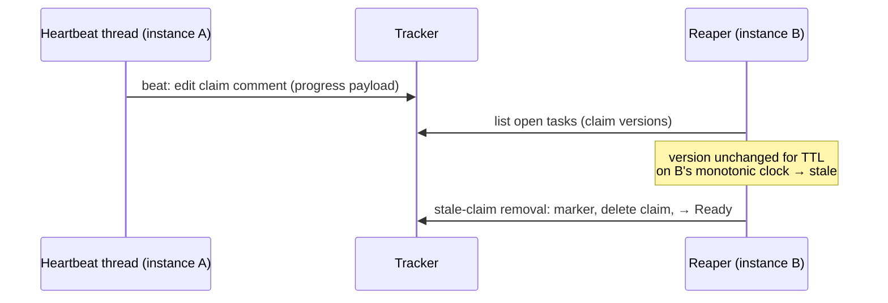
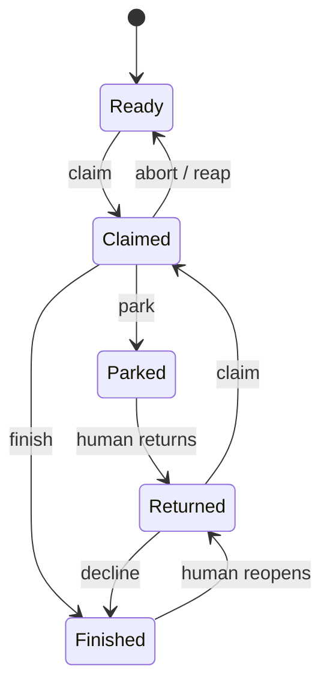
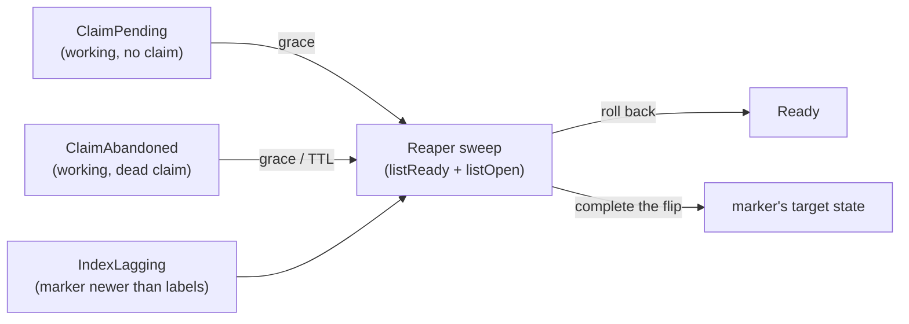

# claim-heartbeat

## Purpose

The lease-maintenance protocol over the `Tracker` port: heartbeat physics and
payload, staleness by local observation, the reaper, the takeover protocol,
zombie fencing, tracker-outage tolerance, and terminal-write reconcile. This
capability is core policy; the physical mapping lives in the adapters.

## Requirements

### Requirement: Heartbeat maintains the claim in place
An instance SHALL run one heartbeat thread that, on the configured interval,
edits the existing claim comment of every `Working` task the instance holds —
one write per beat, the claim-comment identity (the lease anchor) unchanged, no
new comments. The payload SHALL carry human-readable progress derived from
engine events (current stage, attempt, alive-at time). Beating is the
instance's duty, independent of gnome or slot-thread activity; the gnome never
sees the tracker. Claim liveness answers "is the holder process alive", never
"is the work progressing" — a hung gnome under a live instance is handled by
the per-stage `roundTimeout` of the executor, not by this protocol.
<!-- implements FR1 of add-claim-heartbeat -->
<!-- implements UX1 of add-claim-heartbeat -->

#### Scenario: Beats continue through a long round
- **WHEN** a gnome round runs for hours while the slot thread is blocked on the
  executor
- **THEN** the claim comment keeps being updated on every interval with current
  stage and attempt, and its comment identity never changes

#### Scenario: No comment spam
- **WHEN** a task is worked for one hour at the default interval
- **THEN** the issue thread gains no new heartbeat comments — only the claim
  comment's body has changed

### Requirement: Staleness by local observation of claim versions
A live claim SHALL be considered stale only when its version — the pair
(claim-comment identity, last-update time) reported by the adapter — has not
changed for TTL measured on the observer's monotonic clock since the
observer's own first observation of that version. Instance and server clocks
SHALL never be compared and no `now − updated_at` arithmetic is allowed.
TTL = multiplier × beat interval, both shared protocol constants. The
observation memory SHALL admit every enumerated task regardless of its claim
facts — a dead footprint or an absent claim is never filtered out for lacking
a live version; the graced window shapes (`ClaimPending`, `ClaimAbandoned`)
are timed by the window grace under the same first-observation monotonic
discipline before the reaper repairs them, while `IndexLagging` is repaired on
classification — its marker is already the truth. Observation memory, the TTL
policy, and the window grace SHALL live in core; adapters only report facts.
<!-- implements FR2 of add-claim-heartbeat -->
<!-- implements NFR-R1 of add-claim-heartbeat -->
<!-- implements FR19, FR12 of harden-task-branch-contract -->

#### Scenario: Grace period by construction
- **WHEN** a fresh instance starts and observes a claim whose last update is
  older than TTL by server timestamps
- **THEN** the claim is not treated as stale before TTL has elapsed on the
  fresh instance's own clock from its first observation

#### Scenario: Beaten claim never goes stale
- **WHEN** the holder beats its claim at the configured interval while an
  observer watches for many TTLs
- **THEN** the observer sees the version change within every TTL window and
  never classifies the claim as stale

#### Scenario: Absent version does not hide a task from observation
- **WHEN** a listing reports a working-labeled task with a dead claim
  footprint (no live version) or no claim footprint at all
- **THEN** the task enters observation memory, its window grace is timed from
  the observer's first observation of that fact combination, and after the
  grace it is eligible for repair — never invisible to the sweep

### Requirement: Reaper returns stale claims to circulation
The reaper's standing duty SHALL generalize from stale-claim removal to
tracker-shape repair, running for the whole run's lifetime — a `take`
invocation or the `serve` daemon — on its own thread, independent of how many
claims the instance currently holds, including zero. It SHALL NOT be gated on
the beat thread. Its sweep SHALL enumerate the union of both listings — every
open task carrying any state label, `listReady` plus `listOpen` — so no kill
window's frozen state is filtered out by the very label its sequence had not
written yet. On each tick the reaper updates its observation memory,
classifies every enumerated task, and repairs every non-steady shape by that
shape's recovery in the classification table: a stale `Working` claim and a
graced `ClaimAbandoned` footprint through the port's stale-claim removal, a
graced `ClaimPending` and an `IndexLagging` disagreement through the port's
index repair. A late claim comment that lands after its incomplete claim was
rolled back to ready (a ready-labeled task with a live claim footprint) SHALL
be enumerated by the same sweep and repaired, never left to win claim races
as a ghost. A killed reap SHALL remain repairable by any later tick: an
interrupted stale-claim removal freezes `ClaimAbandoned` or `IndexLagging`,
both swept. The reaper SHALL NOT claim a task for itself; a repaired task
re-enters the ordinary queue. Two instances repairing the same shape SHALL
converge safely: each repair is idempotent in effect and subsequent claiming
follows the ordinary lease. The heartbeat thread SHALL NOT run the reaper
duty in any mode; its sole duty is beating the instance's own held claims.
The reaper SHALL tick on the heartbeat's beat interval; the interval, TTL,
and window grace keep coming only from the factory's own clone of
`.gnomish/config.yaml` — no new gnome-writable input.

The reaper SHALL NEVER remove a claim currently held **and actively beaten**
by its own instance: before judging staleness it excludes a live snapshot of
the claims its heartbeat is beating (empty when the heartbeat is not
running), so a run whose beats are failing while its `listOpen` still
succeeds can never reap its own live claim — only a foreign observer may (a
running instance knows it is alive; a bare "version unchanged" cannot mean
"holder dead" for the holder itself). When the heartbeat is not beating a
claim — a fresh instance holding nothing, or one whose beat thread has died —
that claim is excluded from nothing and is reaped once its TTL elapses like
any other stale claim. A repair that fails with an infrastructure error SHALL
re-arm that shape for retry on a later tick, so an attempted-but-failed
repair never leaves a non-steady shape silently unrepaired until its facts
change.
<!-- implements FR4 of add-claim-heartbeat -->
<!-- implements NFR-R2 of add-claim-heartbeat -->
<!-- implements FR1, FR2, FR5 of fix-reaper-idle-liveness -->
<!-- implements NFR-R1, NFR-S1 of fix-reaper-idle-liveness -->
<!-- implements FR19, FR12 of harden-task-branch-contract -->

#### Scenario: Reaping continues while the instance holds no claim
- **WHEN** an instance holds and beats no claim of its own while a foreign
  `Working` claim in the listing stays at an unchanged version for TTL on the
  instance's monotonic clock
- **THEN** the reaper still ticks on its own thread, removes the stale foreign
  claim, and returns the task to `Ready` — no held claim of its own is required
  for reaping to run

#### Scenario: A restarted daemon returns its previous life's claims with nothing to claim
- **WHEN** a `serve` daemon that held two claims is killed and restarted, and
  the ready queue is empty so the new instance claims nothing
- **THEN** the standing reaper still observes the two claims left under the old
  instance id, reaps them once their TTL elapses, and returns both to `Ready`,
  without the new instance ever holding a claim first

#### Scenario: A dead heartbeat stops shielding its instance's claims
- **WHEN** an instance's heartbeat thread dies abnormally while its slots keep
  working, so its claims' versions stay unchanged for TTL
- **THEN** the instance's own standing reaper returns those claims to `Ready`;
  a slot still working such a task is a zombie from that point on and is
  neutralized by the ordinary fence path — the non-fast-forward push refusal
  or the pre-write claim check — on its next write

#### Scenario: An instance never reaps its own claim
- **WHEN** an instance's beats fail for longer than TTL while its `listOpen`
  keeps returning its own claim at an unchanged version
- **THEN** the instance never removes its own claim while its heartbeat is still
  beating it, and a foreign stale claim in the same listing is still reaped

#### Scenario: A failed removal is retried, not silently dropped
- **WHEN** the reaper's `removeStaleClaim` for a stale claim fails with an
  infrastructure error
- **THEN** the same unchanged version is emitted and retried on a later tick
  instead of being suppressed until the version changes or the instance
  restarts

#### Scenario: Dead instance's task returns without a human
- **WHEN** instance A dies mid-task and instance B works another task longer
  than TTL
- **THEN** B's standing reaper returns A's task to `Ready` with an audit
  marker, without claiming it, and a later run picks it up normally

#### Scenario: Double reap converges
- **WHEN** two instances detect the same stale claim and both invoke removal
- **THEN** the task ends in `Ready` exactly once — no error, no duplicate
  state transition, and at most one set of audit artifacts the thread can
  carry coherently

#### Scenario: Killed reap leaves a shape the next tick resolves
- **WHEN** a reaper posts the removal boundary or deletes a dead claim comment
  and dies before flipping the working label back to ready
- **THEN** a later tick classifies the frozen state and returns the task to
  `Ready` — the kill costs one grace window, never a stuck task

#### Scenario: Suspension leftover is swept off a ready task
- **WHEN** a delayed claim comment lands on a ready-labeled task after the
  reaper rolled its incomplete claim back
- **THEN** the sweep enumerates the task through the feed's claim facts,
  classifies the mismatch, and repairs it — no permanently race-winning claim
  survives on a ready task

### Requirement: The reaper thread survives abnormal faults
The standing reaper SHALL keep reaping for the whole life of the process after
any single abnormal fault. Its loop SHALL catch every `Throwable` around both
the reap tick and the interval wait, logging the fault and continuing on the
next tick, so an `Error` raised deep in an adapter or a sleeper that throws does
not end reaping. Only an intentional stop SHALL exit the loop. Should the thread
nonetheless die, it SHALL be restarted (supervised) on an exponential backoff
capped at 10 minutes; the backoff SHALL reset once a respawned reaper completes
one full tick without dying. Restarts SHALL be unbounded — the reaper never
gives up and its failure SHALL NOT kill the daemon — and an intentional stop
SHALL NOT trigger a restart. An abnormal death and each restart SHALL be logged
at ERROR, each restart line carrying a monotonic restart count — the log is the
exposure surface; an ordinary tick fault SHALL be logged at WARN.
<!-- implements FR3, FR4 of fix-reaper-idle-liveness -->
<!-- implements NFR-R2, NFR-O1 of fix-reaper-idle-liveness -->

#### Scenario: An Error on one tick does not end reaping
- **WHEN** the reap tick raises an `Error` from deep in an adapter on one
  interval
- **THEN** the fault is logged, the thread does not die, and the next tick reaps
  a stale claim normally

#### Scenario: A throwing sleeper does not end reaping
- **WHEN** the interval sleeper throws on one wait
- **THEN** the fault is logged, the loop continues, and reaping resumes on the
  following interval

#### Scenario: A truly dead thread is respawned, an intentional stop is not
- **WHEN** the reaper thread dies from an unhandled failure while the run is
  still active
- **THEN** it is restarted with backoff and reaping resumes; **AND WHEN** the
  run stops it via `stop()` instead, no replacement thread is started

### Requirement: Zombie fencing
The task branch SHALL NEVER be force-pushed by any party — the git
non-fast-forward refusal is the hard fence: of two writers holding the same
task, the late pusher gets a persist refusal and follows the normal `Aborted`
path. Tracker writes that git does not fence (park, finish, release) SHALL be
preceded by a cheap conditional "claim still ours" check; the residual
window may cost a stray label or comment, never data corruption, and
converges with the new holder's next write.
<!-- implements FR7 of add-claim-heartbeat -->

#### Scenario: Zombie push is rejected
- **WHEN** a reaped instance thaws and pushes its round while the new holder
  has already pushed
- **THEN** the zombie's push fails as non-fast-forward, its run ends via the
  normal abort path, and the new holder's branch is untouched

#### Scenario: Zombie park is stopped by the pre-write check
- **WHEN** a zombie attempts to park a task whose claim now belongs to another
  instance
- **THEN** the pre-write check detects the foreign claim and the park is not
  written

### Requirement: Beat failures are classified, not counted
A failed beat SHALL be handled by cause: network errors and 5xx are logged as
WARN and work continues — the next round boundary resolves the situation; a
"claim marker gone" answer means the claim is lost — at the nearest round
boundary the run SHALL stop, salvage-push best-effort (the fence arbitrates),
free the slot, and write no tracker state for the task that is no longer ours.
A holder that cannot confirm its own heartbeat — its beats have failed long
enough that it no longer knows its claim is live — SHALL stop writing at the
next boundary: no push and no tracker write until it re-verifies the claim.
Re-verification confirming the claim resumes writing; a gone claim follows the
lost-claim path above (self-fencing).
<!-- implements FR8 of add-claim-heartbeat -->
<!-- implements FR13 of harden-task-branch-contract -->

#### Scenario: Transient outage does not stop work
- **WHEN** three consecutive beats fail with 5xx while the gnome works
- **THEN** the run continues, each failure logged as WARN, and beats resume
  when the tracker recovers

#### Scenario: Lost claim ends the run at the boundary
- **WHEN** a beat reports the claim marker gone (task reaped or taken over)
- **THEN** at the next round boundary the run stops, pushes best-effort, and
  performs no tracker transition for the lost task

#### Scenario: Unconfirmed heartbeat freezes writes at the boundary
- **WHEN** every beat has failed for longer than the lost-detection threshold
  and the round reaches its boundary
- **THEN** the holder writes nothing — no push, no tracker write — until a
  re-verification confirms the claim is still its own; a confirmed claim
  resumes the run, a gone claim follows the lost-claim path

### Requirement: Tracker outage causes no false reaping
While the tracker is unreachable no staleness progress SHALL accrue: TTL is
measured between observations, and an observer that cannot read versions
observes nothing. Polls and beats SHALL retry with backoff and resume when the
tracker returns; after recovery every claim gets a fresh TTL window from its
next observation. This safety guarantee has a deliberate promptness cost: a
`listOpen` failure pattern that recurs faster than the TTL (e.g. every second
poll fails) forgets the observation windows before any dead claim accrues a
full TTL, so reaping MAY be delayed indefinitely while the pattern holds —
never reaping a live claim is preferred over reaping a dead one promptly (see
design.md Risks / Trade-offs).
<!-- implements FR9 of add-claim-heartbeat -->

#### Scenario: Long outage, no casualties
- **WHEN** the tracker is down for several TTLs while holders keep working
- **THEN** after recovery no live claim is reaped: holders resume beating
  before any observer accumulates a fresh TTL of unchanged observations

### Requirement: Terminal outcomes reconcile through the branch
A terminal outcome SHALL be durable in the task branch before its tracker
write. When the tracker is down at the finish line, the instance SHALL hold
the task and retry the terminal write with backoff. Resume SHALL begin with a
reconcile step: a terminal outcome recorded in the branch without its tracker
counterpart means the resuming instance completes the deferred tracker write
(finish or park) and runs zero engine rounds — bookkeeping, never replay.
<!-- implements FR10 of add-claim-heartbeat -->
<!-- implements NFR-C1 of add-claim-heartbeat -->

#### Scenario: Outcome survives holder death during retries
- **WHEN** an instance completes a task during a tracker outage, commits the
  outcome to the branch, and dies while retrying the finish write
- **THEN** the claim eventually goes stale, the task returns to `Ready`, and
  the next claimer's reconcile posts the deferred final report and delivers —
  without executing any stage

#### Scenario: Reconcile costs no tokens
- **WHEN** a resume finds `Completed` in the branch state and `Working` in the
  tracker
- **THEN** the run finishes the bookkeeping only — no executor call is made

### Requirement: Protocol constants come from the factory's clone
The beat interval and TTL multiplier are protocol constants shared by all
instances of a project and SHALL be read only from the factory's own clone of
`.gnomish/config.yaml` — never from any file the gnome can write. A gnome
MUST NOT be able to extend its own TTL or slow its holder's beat.
<!-- implements FR3, NFR-S1 of add-claim-heartbeat -->

#### Scenario: Gnome edits to config are inert
- **WHEN** a gnome modifies `.gnomish/config.yaml` inside its worktree during
  a round
- **THEN** the instance's beat interval and TTL are unaffected for the whole
  run

### Requirement: Total tracker-shape classification with one recovery owner
The tracker-side state of a task SHALL classify totally, in core, over
adapter-reported facts — the state labels present, the claim footprint (a live
claim, a dead footprint, or none), and the boundary markers — into this closed
set of named shapes, each with exactly one recovery owner:

| Shape | Observation | Owner → recovery |
|---|---|---|
| `Ready` | ready label, no live claim | queue |
| `Claimed` | working label, live claim | holder beats; reaper reaps on TTL |
| `Parked` | needs-human label, park marker latest | human |
| `Finished` | delivered label, finish marker present | terminal |
| `Returned` | ready label with park/finish history | queue; a finished return routes to decline |
| `Revoked` | issue closed | terminal |
| `ClaimPending` | working label (ready may linger), no claim footprint | reaper: grace, then restore ready |
| `ClaimAbandoned` | a claim footprint no working tenure backs: a working label with a footprint carrying no live version, or a ready label still carrying a live claim marker (the suspension leftover) | reaper: grace, then stale-claim removal |
| `IndexLagging` | a boundary marker newer than the labels it implies | reaper: complete the label flip toward the marker |
| `Foreign` | any other combination | none — surfaced with a diagnosis, never auto-repaired |

Rows are made disjoint by a fixed classification precedence: a closed issue
classifies `Revoked` over every other fact; otherwise a boundary marker newer
than the labels it implies classifies `IndexLagging` before any label-derived
shape; among the label-derived shapes the claim footprint separates `Claimed`,
`ClaimPending`, and `ClaimAbandoned`; a ready-labeled task carrying a live
claim footprint classifies `ClaimAbandoned` before any other ready-labeled
shape, and a dead footprint on a ready task is merely the history of the
tenure its boundary already ended; recorded park/finish history separates
`Returned` from `Ready`; only a combination matching no row above classifies
`Foreign`.

A boundary marker counts as newer than the labels it implies exactly when it
was recorded after the task's newest claim marker and the task still wears the
working label: a boundary that ended an earlier tenure says nothing about the
current one, and a boundary the human has already acted on — a park marker on
a task they returned to ready — is `Returned`, not a lagging index.

Markers are the truth; labels are the index the listing queries filter on. The
three window shapes — `ClaimPending`, `ClaimAbandoned`, `IndexLagging` — are
exactly the states the FR12 write order can freeze, and each keeps an
open-state label on the issue, so the sweep enumerates it. An adapter SHALL
NOT omit or reinterpret any combination — the classifier decides, and no
factory-reachable shape is ever attributed to human mislabeling. Time
judgments — the staleness TTL and the window grace — stay with core's
observation memory, never re-derived by the classifier or an adapter. The
shape set SHALL be a sealed hierarchy; readers switch without a default
branch.

The steady progression, driven by factory writes and human transitions:

Any open shape may become `Revoked` (issue closed) by a human at any time.
The window shapes and their repair, all inside the sweep universe:

<!-- implements FR19, FR12 of harden-task-branch-contract -->

#### Scenario: Every fact combination yields exactly one shape
- **WHEN** tracker facts are generated over arbitrary label sets, claim
  footprints, and marker histories
- **THEN** each combination classifies to exactly one named shape — `Foreign`
  included — and no combination throws or is silently dropped

#### Scenario: Kill between claim label and claim comment is repaired
- **WHEN** an instance dies after the working-label transition but before its
  claim comment posts
- **THEN** the sweep classifies the frozen state as `ClaimPending` and, after
  the grace period, restores the task to `Ready` — never treating the shape
  as a human mislabel

#### Scenario: A boundary marker completes its own flip
- **WHEN** an instance dies after posting the finish marker but before the
  delivered-label flip
- **THEN** the sweep classifies `IndexLagging`, completes the flip to
  delivered, and no path re-executes the finished task

### Requirement: Every (re)claim issues a monotonically increasing epoch
Each successful claim or reclaim of a task SHALL be issued an epoch strictly
greater than every epoch previously issued for that task; the epoch SHALL be
recorded with the claim and SHALL be available to the holder for stamping into
every commit and tracker write of that tenure, so readers can classify
artifacts carrying an older epoch than the current claim as stale-epoch.
<!-- implements FR13 of harden-task-branch-contract -->

#### Scenario: Reclaim after a reap advances the epoch
- **WHEN** a task claimed at epoch N is reaped and later claimed again by any
  instance
- **THEN** the new claim carries an epoch strictly greater than N, and any
  instance reading the claim can obtain that epoch

#### Scenario: Epoch is available for stamping
- **WHEN** a holder performs a commit or tracker write during its tenure
- **THEN** the epoch recorded with its claim is available to stamp into that
  write, unchanged for the whole tenure

### Requirement: Lost-detection strictly precedes reassignment
Reap timing SHALL keep two distinct thresholds: the holder's lost-detection
threshold (after which it self-fences) SHALL be strictly earlier than the
reaper's reassignment threshold, leaving a grace window during which the
original holder may re-verify and reclaim its own claim before the task is
returned to `Ready`. A self-fenced holder therefore stops writing before any
reaper can hand the task to another instance.
<!-- implements FR13 of harden-task-branch-contract -->

#### Scenario: Holder recovers within the grace window
- **WHEN** a holder's beats fail past the lost-detection threshold, it
  self-fences at the boundary, and connectivity returns before the
  reassignment threshold elapses
- **THEN** the holder re-verifies its still-live claim, resumes writing, and
  the task is never reaped

#### Scenario: Fencing wins the race against reassignment
- **WHEN** a holder's heartbeat is unconfirmed and the reassignment threshold
  is approaching
- **THEN** the holder has already stopped writing at its earlier lost-detection
  threshold, so no write of the old tenure lands after the reaper returns the
  task to `Ready`
