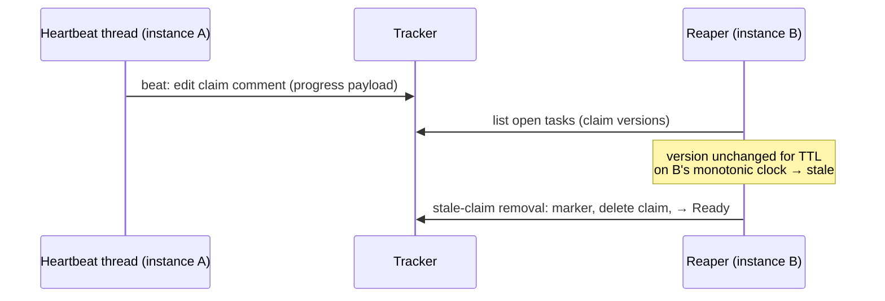

# claim-heartbeat

## Purpose

The lease-maintenance protocol over the `Tracker` port: heartbeat physics and
payload, staleness by local observation, the reaper, the takeover protocol,
zombie fencing, tracker-outage tolerance, and terminal-write reconcile. This
capability is core policy; the physical mapping lives in the adapters.

## Requirements

### Requirement: Heartbeat maintains the claim in place
An instance SHALL run one heartbeat thread that, on the configured interval,
edits the existing claim comment of every `Working` task the instance holds —
one write per beat, the claim-comment identity (the lease anchor) unchanged, no
new comments. The payload SHALL carry human-readable progress derived from
engine events (current stage, attempt, alive-at time). Beating is the
instance's duty, independent of gnome or slot-thread activity; the gnome never
sees the tracker. Claim liveness answers "is the holder process alive", never
"is the work progressing" — a hung gnome under a live instance is handled by
the per-stage `roundTimeout` of the executor, not by this protocol.
<!-- implements FR1 of add-claim-heartbeat -->
<!-- implements UX1 of add-claim-heartbeat -->

#### Scenario: Beats continue through a long round
- **WHEN** a gnome round runs for hours while the slot thread is blocked on the
  executor
- **THEN** the claim comment keeps being updated on every interval with current
  stage and attempt, and its comment identity never changes

#### Scenario: No comment spam
- **WHEN** a task is worked for one hour at the default interval
- **THEN** the issue thread gains no new heartbeat comments — only the claim
  comment's body has changed

### Requirement: Staleness by local observation of claim versions
A claim SHALL be considered stale only when its version — the pair
(claim-comment identity, last-update time) reported by the adapter — has not
changed for TTL measured on the observer's monotonic clock since the
observer's own first observation of that version. Instance and server clocks
SHALL never be compared and no `now − updated_at` arithmetic is allowed.
TTL = multiplier × beat interval, both shared protocol constants. Observation
memory and the TTL policy SHALL live in core; adapters only report version
facts.
<!-- implements FR2 of add-claim-heartbeat -->
<!-- implements NFR-R1 of add-claim-heartbeat -->

#### Scenario: Grace period by construction
- **WHEN** a fresh instance starts and observes a claim whose last update is
  older than TTL by server timestamps
- **THEN** the claim is not treated as stale before TTL has elapsed on the
  fresh instance's own clock from its first observation

#### Scenario: Beaten claim never goes stale
- **WHEN** the holder beats its claim at the configured interval while an
  observer watches for many TTLs
- **THEN** the observer sees the version change within every TTL window and
  never classifies the claim as stale

### Requirement: Reaper returns stale claims to circulation
Stale-claim detection SHALL be a duty of the heartbeat thread, running for as
long as the instance holds at least one claim: each tick it lists open tasks
with claim versions, updates its observation memory, and for every stale
`Working` claim invokes the port's stale-claim removal — recording the
holder-transition audit marker, removing the dead claim, and returning the
task to `Ready`. The reaper SHALL NOT claim the task for itself; the task
re-enters the ordinary queue. Two instances reaping the same stale claim
SHALL converge safely: the removal is idempotent in effect and subsequent
claiming follows the ordinary lease.

The reaper SHALL NEVER remove a claim currently held by its own instance: an
instance excludes its own held claims from staleness observation before
judging staleness, so a run whose beats are failing while its `listOpen` still
succeeds can never reap its own live claim — only a foreign observer may (a
running instance knows it is alive; a bare "version unchanged" cannot mean
"holder dead" for the holder itself). A `removeStaleClaim` that fails with an
infrastructure error SHALL re-arm that claim for retry on a later tick, so an
attempted-but-failed removal never leaves a stale claim silently un-reaped
until its version changes.
<!-- implements FR4 of add-claim-heartbeat -->
<!-- implements NFR-R2 of add-claim-heartbeat -->

#### Scenario: An instance never reaps its own claim
- **WHEN** an instance's beats fail for longer than TTL while its `listOpen`
  keeps returning its own claim at an unchanged version
- **THEN** the instance never removes its own claim, and a foreign stale claim
  in the same listing is still reaped

#### Scenario: A failed removal is retried, not silently dropped
- **WHEN** the reaper's `removeStaleClaim` for a stale claim fails with an
  infrastructure error
- **THEN** the same unchanged version is emitted and retried on a later tick
  instead of being suppressed until the version changes or the instance
  restarts

#### Scenario: Dead instance's task returns without a human
- **WHEN** instance A dies mid-task and instance B works another task longer
  than TTL
- **THEN** B's heartbeat thread returns A's task to `Ready` with an audit
  marker, without claiming it, and a later run picks it up normally

#### Scenario: Double reap converges
- **WHEN** two instances detect the same stale claim and both invoke removal
- **THEN** the task ends in `Ready` exactly once — no error, no duplicate
  state transition, and at most one set of audit artifacts the thread can
  carry coherently

### Requirement: Zombie fencing
The task branch SHALL NEVER be force-pushed by any party — the git
non-fast-forward refusal is the hard fence: of two writers holding the same
task, the late pusher gets a persist refusal and follows the normal `Aborted`
path. Tracker writes that git does not fence (park, finish, release) SHALL be
preceded by a cheap conditional "claim still ours" check; the residual
window may cost a stray label or comment, never data corruption, and
converges with the new holder's next write.
<!-- implements FR7 of add-claim-heartbeat -->

#### Scenario: Zombie push is rejected
- **WHEN** a reaped instance thaws and pushes its round while the new holder
  has already pushed
- **THEN** the zombie's push fails as non-fast-forward, its run ends via the
  normal abort path, and the new holder's branch is untouched

#### Scenario: Zombie park is stopped by the pre-write check
- **WHEN** a zombie attempts to park a task whose claim now belongs to another
  instance
- **THEN** the pre-write check detects the foreign claim and the park is not
  written

### Requirement: Beat failures are classified, not counted
A failed beat SHALL be handled by cause: network errors and 5xx are logged as
WARN and work continues — the next round boundary resolves the situation; a
"claim marker gone" answer means the claim is lost — at the nearest round
boundary the run SHALL stop, salvage-push best-effort (the fence arbitrates),
free the slot, and write no tracker state for the task that is no longer ours.
<!-- implements FR8 of add-claim-heartbeat -->

#### Scenario: Transient outage does not stop work
- **WHEN** three consecutive beats fail with 5xx while the gnome works
- **THEN** the run continues, each failure logged as WARN, and beats resume
  when the tracker recovers

#### Scenario: Lost claim ends the run at the boundary
- **WHEN** a beat reports the claim marker gone (task reaped or taken over)
- **THEN** at the next round boundary the run stops, pushes best-effort, and
  performs no tracker transition for the lost task

### Requirement: Tracker outage causes no false reaping
While the tracker is unreachable no staleness progress SHALL accrue: TTL is
measured between observations, and an observer that cannot read versions
observes nothing. Polls and beats SHALL retry with backoff and resume when the
tracker returns; after recovery every claim gets a fresh TTL window from its
next observation. This safety guarantee has a deliberate promptness cost: a
`listOpen` failure pattern that recurs faster than the TTL (e.g. every second
poll fails) forgets the observation windows before any dead claim accrues a
full TTL, so reaping MAY be delayed indefinitely while the pattern holds —
never reaping a live claim is preferred over reaping a dead one promptly (see
design.md Risks / Trade-offs).
<!-- implements FR9 of add-claim-heartbeat -->

#### Scenario: Long outage, no casualties
- **WHEN** the tracker is down for several TTLs while holders keep working
- **THEN** after recovery no live claim is reaped: holders resume beating
  before any observer accumulates a fresh TTL of unchanged observations

### Requirement: Terminal outcomes reconcile through the branch
A terminal outcome SHALL be durable in the task branch before its tracker
write. When the tracker is down at the finish line, the instance SHALL hold
the task and retry the terminal write with backoff. Resume SHALL begin with a
reconcile step: a terminal outcome recorded in the branch without its tracker
counterpart means the resuming instance completes the deferred tracker write
(finish or park) and runs zero engine rounds — bookkeeping, never replay.
<!-- implements FR10 of add-claim-heartbeat -->
<!-- implements NFR-C1 of add-claim-heartbeat -->

#### Scenario: Outcome survives holder death during retries
- **WHEN** an instance completes a task during a tracker outage, commits the
  outcome to the branch, and dies while retrying the finish write
- **THEN** the claim eventually goes stale, the task returns to `Ready`, and
  the next claimer's reconcile posts the deferred final report and delivers —
  without executing any stage

#### Scenario: Reconcile costs no tokens
- **WHEN** a resume finds `Completed` in the branch state and `Working` in the
  tracker
- **THEN** the run finishes the bookkeeping only — no executor call is made

### Requirement: Protocol constants come from the factory's clone
The beat interval and TTL multiplier are protocol constants shared by all
instances of a project and SHALL be read only from the factory's own clone of
`.gnomish/config.yaml` — never from any file the gnome can write. A gnome
MUST NOT be able to extend its own TTL or slow its holder's beat.
<!-- implements FR3, NFR-S1 of add-claim-heartbeat -->

#### Scenario: Gnome edits to config are inert
- **WHEN** a gnome modifies `.gnomish/config.yaml` inside its worktree during
  a round
- **THEN** the instance's beat interval and TTL are unaffected for the whole
  run
