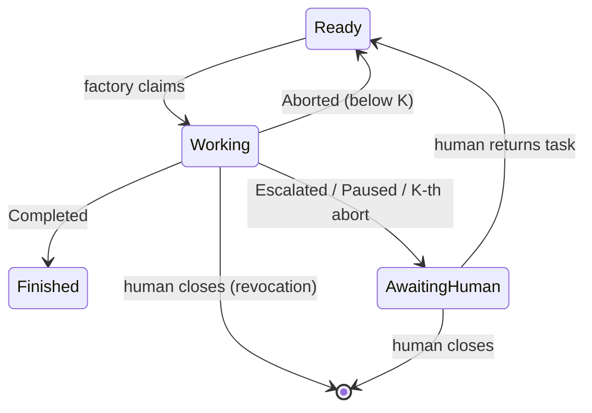

# tracker-port

## Purpose

The `Tracker` port: the factory's abstraction over any task tracker — operations,
the logical task-state dictionary and transition matrix, snapshot/decision/abort
semantics, the in-memory reference adapter, the port contract spec every adapter
must pass, and the adapter author guide.

## Requirements

### Requirement: Single Tracker port speaking the factory's language
The application layer SHALL expose one `Tracker` port with exactly the
operations `listReady`, `fetchTask`, `collectDecisions`, `claim`, `release`,
`park`, `finish`, `recordAbort`, `acknowledgeDecision`, `postNote`,
`recordProgress`, `declineFinished`, plus the lease-maintenance operations
`listOpen`, `heartbeat`, `removeStaleClaim`, and `repairIndex`.
`repairIndex` SHALL, given a task and the caller's observed tracker facts,
bring the task's indexed state to the state its recorded truth implies —
restoring `Ready` when a working-state task carries no claim footprint
(`ClaimPending`), or completing the transition toward the newest boundary
marker (`IndexLagging`) — and SHALL record a structural repair marker naming
the observed shape. It SHALL re-check the facts before acting and be a safe
no-op reporting the current facts when they no longer match the observed
ones, so concurrent repairs converge. It SHALL NOT claim the task for the
caller and SHALL NOT re-execute any work the markers record as done.
The port vocabulary SHALL be the factory's (tasks, states, decisions, abort
facts, claim facts, boundary markers); all tracker-specific mapping SHALL be
confined to adapters. Report rendering (domain report → text) SHALL happen in
core: the port accepts finished text plus structural fields, never engine
domain models.
<!-- implements FR1 of add-tracker-port -->
<!-- implements FR5 of add-claim-heartbeat -->
<!-- implements FR4 of enforce-finish-terminality -->
<!-- implements FR19, FR12 of harden-task-branch-contract -->

#### Scenario: Core compiles against the port alone
- **WHEN** the take runner drives a full task lifecycle
- **THEN** every tracker interaction goes through the `Tracker` port, and no core
  class references an adapter type or a tracker-specific concept (label, issue,
  transition id)

#### Scenario: Adapter receives rendered text
- **WHEN** the factory parks a task with an escalation report
- **THEN** the adapter receives the report as finished text plus structural fields,
  not an engine report object

#### Scenario: Index repair restores a claimless working task to Ready
- **WHEN** `repairIndex` is invoked for a task observed as working-state with
  no claim footprint after its grace
- **THEN** the task ends `Ready` with a structural repair marker recorded, and
  a re-check finding a live claim footprint instead makes the call a safe
  no-op reporting the current facts

#### Scenario: Index repair completes a marker's transition
- **WHEN** `repairIndex` is invoked for a task whose newest boundary marker is
  a finish marker while the indexed state still reads working
- **THEN** the task ends `Finished` — the transition the marker implies is
  completed and the finished work is never re-executed

### Requirement: Logical task-state dictionary and transition matrix
Task coordination SHALL follow the state dictionary `Ready`, `Working(holder)`,
`AwaitingHuman(escalation | checkpoint | infra)`, `Finished`, with tasks failing
the readiness criterion or closed being outside the factory's world (`Gone`).
Transitions SHALL be initiated only by the factory or a human — never by the
gnome. The scheduler-slot state of an instance SHALL never be written to the
tracker. The engine outcome (`Completed`/`Paused`/`Escalated`/`Aborted`) is the
event driving factory-initiated transitions; `Paused` SHALL appear in the tracker
as `AwaitingHuman(checkpoint)`, not as a distinct state. The factory SHALL claim
tasks only from `Ready`; the only exits from `AwaitingHuman` are human actions —
returning the task to `Ready` or closing it.
<!-- implements FR2 of add-tracker-port -->

#### Scenario: Outcome-to-transition mapping
- **WHEN** an engine run ends with each of Completed, Escalated(report),
  Paused(passedStage), and Aborted
- **THEN** the resulting port calls are `finish`; `park` with the reason picked
  by escalation kind — `ESCALATION` for AttemptsExhausted and DecisionNeeded,
  `INFRA` for CannotVerify, CannotExecute, and PipelineMismatch;
  `park(CHECKPOINT)`; and `recordAbort` (or `park(INFRA)` at the fuse threshold)
  respectively
- **AND** an infra park from an escalation leaves the abort counter untouched

#### Scenario: Parked task returns only through a human
- **WHEN** a task is `AwaitingHuman` and no human has returned it to `Ready`
- **THEN** no factory operation transitions it to `Working` — a claim is only
  attempted after a human return makes it `Ready`

#### Scenario: Gnome never transitions
- **WHEN** a gnome round runs to completion
- **THEN** no tracker operation was reachable from the gnome process — every
  transition originated in factory core

### Requirement: Task facts from fetchTask
`fetchTask` SHALL return the task snapshot (id, title, body), the logical state
with its holder (for `Working`) or reason (for `AwaitingHuman`), and the abort
facts (count since last durable progress, last abort time). Closed or nonexistent
tasks SHALL be reported as `Gone`, not as errors.
<!-- implements FR1 of add-tracker-port -->

#### Scenario: Full fact set for a working task
- **WHEN** `fetchTask` is called for a task claimed by instance A with two
  recorded aborts
- **THEN** the result carries the snapshot, `Working(A)`, and abort facts
  (count 2 with the last abort time)

#### Scenario: Closed task is Gone
- **WHEN** `fetchTask` is called for a closed or nonexistent task
- **THEN** the result state is `Gone` and no exception is thrown

### Requirement: Decision collection anchored to the last ack
`collectDecisions` SHALL return human reply comments posted after the factory's
last decision ack, in posting order. `acknowledgeDecision` SHALL post an
"acting on decision" marker such that a subsequent `collectDecisions` is empty
until a new human reply arrives. Pairing heuristics (which comments count as
replies) are adapter freedom under this round-trip law.
<!-- implements FR12 of add-tracker-port -->

#### Scenario: Ack consumes decisions
- **WHEN** a human posts a decision, the factory calls `acknowledgeDecision`, and
  `collectDecisions` is called again
- **THEN** the second collection is empty

#### Scenario: Stale replies never resurface
- **WHEN** a new escalation is parked after an earlier decision was acknowledged
- **THEN** `collectDecisions` returns only replies posted after the last ack,
  never the previously consumed decision

### Requirement: Abort facts round-trip across instances
`recordAbort` SHALL, as one operation, persist a structural abort marker (cause,
instance, time) and return the task to `Ready`. `recordProgress` SHALL persist a
structural durable-progress marker without changing logical state. Abort facts
SHALL be reconstructable by any instance from the tracker alone: after
`recordAbort`, a `fetchTask` or `listReady` from a different instance SHALL
observe the updated count and last-abort time; after `recordProgress`, a
different instance SHALL observe the count reset. The count semantics is "aborts
recorded strictly after the last durable-progress marker on the task";
adapters report facts and SHALL NOT apply backoff or fuse policy.
<!-- implements FR14 of add-tracker-port -->
<!-- implements FR1 of fix-abort-progress-reset -->
<!-- implements FR3 of fix-abort-progress-reset -->
<!-- implements FR4 of fix-abort-progress-reset -->

#### Scenario: Fresh instance sees abort history
- **WHEN** instance A records an abort and instance B calls `fetchTask`
- **THEN** B observes abort count incremented and the last abort time from A's
  marker

#### Scenario: Progress reset round-trips across instances
- **WHEN** instance A records two aborts, then a durable progress, and instance
  B calls `fetchTask`
- **THEN** B observes an abort count of zero (the aborts precede the progress)

#### Scenario: recordProgress leaves logical state untouched
- **WHEN** the factory calls `recordProgress` on a task it holds as `Working`
- **THEN** the task stays `Working` with the same claim holder, and only its
  abort facts are affected (the durable-progress marker is recorded)

### Requirement: Abort count resets on durable progress
Every adapter SHALL reconstruct `AbortFacts.count` as the number of abort
markers recorded strictly after the latest durable-progress marker; abort
markers at or before that marker SHALL NOT be counted. When no durable-progress
marker exists on the task, the count SHALL fall back to the existing
claim-streak reconstruction. This holds identically for the `listReady` feed and
for `fetchTask`.
<!-- implements FR3 of fix-abort-progress-reset -->

#### Scenario: Progress before an abort resets the count to one
- **WHEN** a claim is followed by a durable progress and then a single abort
- **THEN** the reconstructed abort count is one

#### Scenario: Aborts before progress are excluded
- **WHEN** two aborts are followed by a durable progress and then one abort
- **THEN** the reconstructed abort count is one, counting only the abort after
  the progress

#### Scenario: No progress marker preserves the historical count
- **WHEN** a claim aborts twice with no durable progress recorded
- **THEN** the reconstructed abort count is two (the pre-progress fallback is
  unchanged)

### Requirement: In-memory reference adapter
An in-memory adapter SHALL implement the full port as the executable reference for
adapter authors, including: configurable ready queues, human actions (reply,
return to ready, close) as test operations, and deterministic simulation of
concurrent claim interleaving for the race contract test. It SHALL require no
configuration subsection (the minimal case of the config seam).
<!-- implements FR3 of add-tracker-port -->

#### Scenario: Reference passes the contract suite
- **WHEN** the shared contract spec suite runs against the in-memory adapter
- **THEN** every contract property passes without adapter-specific exemptions

#### Scenario: Race simulation
- **WHEN** the test harness schedules two claims with an adversarial interleaving
- **THEN** exactly one claim returns Acquired and the other names the winner

### Requirement: Port contract spec suite binds every adapter
A single contract spec suite (abstract Spock base class instantiated per adapter)
SHALL verify at minimum: `listReady` returns only ready tasks (never
`Working`/`AwaitingHuman`/`Finished`/`Gone`, never non-task artifacts, no
readiness-criterion failures) in adapter queue order with abort facts, and does
NOT filter by backoff; observable claim atomicity (two concurrent claims → exactly
one `Acquired`); and structural-marker round-trip (abort facts and ack semantics
as specified above). Every shipped adapter SHALL pass the identical suite.
<!-- implements FR4 of add-tracker-port -->
<!-- implements NFR-R1 of add-tracker-port -->

#### Scenario: Feed filtering property
- **WHEN** the tracker holds tasks in every logical state plus a non-task artifact
- **THEN** `listReady` returns only the `Ready` tasks, including one with
  unexpired backoff (backoff filtering is core policy, not the adapter's)

#### Scenario: Claim atomicity property
- **WHEN** the contract race test runs repeatedly for an adapter
- **THEN** every run yields exactly one winner — no run yields zero or two

### Requirement: Adapter author guide
The change SHALL ship an adapter author guide (`docs/guides/adapter-author-guide.md`)
covering: the state dictionary and transition matrix with the three-level
distinction (tracker state / run outcome / scheduler slot); per-operation port
semantics; the contract suite as law with the in-memory adapter as the worked
reference; physical state mapping by example (GitHub labels as-built, Redmine
statuses as a thought-through sketch); snapshot, decision, and abort-fact
obligations; config-subsection ownership (adapter declares and validates its own
subsection, never touches core keys) including the mandatory declaration of
credential env variables for the gnome-environment scrub; and known limitations (branch-name sanitize
collisions, polling economy with the GitHub analysis as the model, the considered
and rejected surrogate-id approach).
<!-- implements FR19 of add-tracker-port -->

#### Scenario: Guide is self-sufficient
- **WHEN** a developer follows the guide to build a new adapter
- **THEN** every obligation the contract suite checks is stated in the guide,
  without reading factory core code

### Requirement: Open-task listing with claim versions
`listOpen` SHALL return the open tasks — `Working` and `AwaitingHuman` — each
with its tracker facts: the logical state labels present, the claim facts (a
live claim with holder and opaque version, a dead footprint with its
last-known holder, or none), and the latest boundary-marker kind. Adapters
SHALL report facts only and SHALL NOT omit a task whose combination they
cannot interpret; observation memory, TTL policy, staleness judgment, and
shape classification live in core. `listReady` SHALL keep its contract — only
`Ready` tasks — and each entry SHALL additionally carry the same claim facts,
so core can classify a ready-labeled task that still carries a claim
footprint.
<!-- implements FR5 of add-claim-heartbeat -->
<!-- implements FR19 of harden-task-branch-contract -->

#### Scenario: Listing carries versions
- **WHEN** `listOpen` is called while one task is `Working` and one is
  `AwaitingHuman`
- **THEN** both tasks are returned with their states, and the `Working` entry
  carries holder and claim version; no `Ready` or `Finished` task appears

#### Scenario: Version changes are observable across instances
- **WHEN** instance A beats its claim and instance B calls `listOpen` before
  and after
- **THEN** B observes a different claim version after the beat

#### Scenario: Uninterpretable combinations are reported as facts
- **WHEN** `listOpen` encounters a `Working`-labeled task with no claim
  footprint at all
- **THEN** the entry is returned with its label facts and an absent claim
  footprint — the adapter neither omits it nor invents a holder

#### Scenario: Ready entry carries claim facts
- **WHEN** `listReady` lists a ready task whose thread still carries a live
  claim marker
- **THEN** the entry reports the live claim fact, and core — not the
  adapter — decides what the combination means

### Requirement: Heartbeat write updates the claim marker in place
`heartbeat` SHALL update the existing claim marker of a task the caller holds
— refreshing its version and progress payload without creating any new
coordination artifact. Its failure mode SHALL distinguish "claim marker gone"
(the claim was removed or taken over — a protocol signal) from infrastructure
failure (network, 5xx — retryable); the two are different results, not one
exception.
<!-- implements FR5, FR8 of add-claim-heartbeat -->

#### Scenario: Beat refreshes the version
- **WHEN** the holder calls `heartbeat` with a progress payload
- **THEN** a subsequent `listOpen` shows the same claim identity with a new
  version and the payload readable in the claim marker

#### Scenario: Gone claim is a signal, not an error
- **WHEN** `heartbeat` is called after the claim marker was deleted by a
  reaper
- **THEN** the result reports the claim as lost, distinguishable from an
  infrastructure failure

#### Scenario: Beat of a task the tracker no longer holds is claim-gone
- **WHEN** `heartbeat` is called for a task the tracker no longer holds at all
- **THEN** the result reports the claim as lost — the strongest form of "claim
  gone" — not an infrastructure failure and never a thrown exception

### Requirement: Stale-claim removal returns the task to circulation
`removeStaleClaim` SHALL, as one operation given the task and the observed
claim facts — a live claim's stale version, or a dead footprint whose live
version is absent (`ClaimAbandoned`): record a structural holder-transition
marker ("stale claim removed", naming the dead or last-known holder), remove
the dead claim marker, and return the task to `Ready`. It SHALL NOT claim the
task for the caller. When the current claim facts no longer match the
observed ones (the claim was beaten, already removed, or replaced by a newer
live claim), the operation SHALL be a safe no-op reporting the current facts
rather than an error — making concurrent removals converge. An absent
observed version is an eligible input, never a filtered-out one: the removal
of a dead footprint follows the same guard, comparing footprint identity
instead of a live version.
<!-- implements FR4, FR5 of add-claim-heartbeat -->
<!-- implements NFR-R2 of add-claim-heartbeat -->
<!-- implements FR19, FR12 of harden-task-branch-contract -->

#### Scenario: Removal round-trip
- **WHEN** `removeStaleClaim` succeeds for a stale `Working` task
- **THEN** `fetchTask` reports `Ready`, the old claim marker is gone, and the
  holder-transition marker is recoverable from the tracker by any instance

#### Scenario: Version mismatch is a no-op
- **WHEN** `removeStaleClaim` is called with a version that no longer matches
  (the holder beat the claim meanwhile)
- **THEN** nothing is removed and the result reports the live claim

#### Scenario: Removal of a task the tracker no longer holds is a no-op
- **WHEN** `removeStaleClaim` is called for a task the tracker no longer holds
  at all
- **THEN** nothing is removed and the result reports an absent claim (a null
  current version), never a thrown exception — so a foreign reaper observing a
  vanished task converges without burning a retry

#### Scenario: Dead footprint is removable without a live version
- **WHEN** `removeStaleClaim` is called for a graced `ClaimAbandoned` task
  with the observed dead footprint and no live version
- **THEN** the holder-transition marker names the last-known holder, the dead
  claim marker is removed, and the task returns to `Ready` — the absent
  version never disqualifies the removal

### Requirement: Contract suite covers lease maintenance
The shared contract spec suite SHALL be extended to verify on every adapter:
`listOpen` filtering (only `Working`/`AwaitingHuman`, never `Ready`/
`Finished`/`Gone`, never non-task artifacts); fact reporting for
out-of-protocol combinations (a working-state task with no claim footprint is
reported with its facts, never omitted); claim facts on `listReady` entries;
heartbeat version observability (a beat changes the version another instance
reads); the heartbeat "claim gone" signal, including a beat against a task
the tracker no longer holds; `removeStaleClaim` round-trip, version-mismatch
no-op, dead-footprint removal without a live version, removal of a task the
tracker no longer holds, and concurrent-removal convergence; `repairIndex`
restoring a claimless working task and completing a marker's transition, with
its changed-facts no-op; and the holder-transition marker round-trip. Kill windows of the
multi-write tracker sequences cannot be expressed against the atomic
in-memory reference adapter; each adapter whose writes are physically
non-atomic SHALL cover them in its own suite by fault injection after every
write (see the kill-point harness).
<!-- implements FR5 of add-claim-heartbeat -->
<!-- implements NFR-R2, NFR-R3 of add-claim-heartbeat -->
<!-- implements FR19 of harden-task-branch-contract -->

#### Scenario: Suite passes on both adapters
- **WHEN** the extended contract suite runs against the in-memory reference
  and the GitHub adapter
- **THEN** every lease-maintenance and fact-reporting property passes without
  adapter-specific exemptions

#### Scenario: Concurrent removal race
- **WHEN** the harness schedules two `removeStaleClaim` calls for the same
  stale claim with an adversarial interleaving
- **THEN** the task ends `Ready` exactly once and both calls return without
  error

#### Scenario: Non-atomic adapter covers its kill windows
- **WHEN** the GitHub adapter's suite runs the claim, abort, finish, park, and
  reap sequences with the connection failing after each write
- **THEN** every frozen intermediate state classifies to a named tracker shape
  owned by a retry or the sweep — none is unreachable by both

### Requirement: Ready listing carries the finished fact
Each `listReady` entry SHALL carry an adapter-derived "finished" fact — true
when the task's recorded history contains a finish report, regardless of how
the task came back to `Ready`. The fact SHALL be reconstructed from tracker
history alone on every listing (no adapter-local state), and `fetchTask`'s
result SHALL carry the same fact so the explicit-take path can consult it.
Adapters SHALL report the fact only; refusing and declining is core policy.
<!-- implements FR1 of enforce-finish-terminality -->

#### Scenario: Reopened finished task carries the fact
- **WHEN** a task is finished with a final report and a human later moves it
  back to `Ready`, and `listReady` runs on a fresh instance
- **THEN** the entry reports the finished fact true, derived from history alone

#### Scenario: fetchTask agrees
- **WHEN** `fetchTask` is called for that same reopened task
- **THEN** the result carries the finished fact true alongside state `Ready`

### Requirement: Decline-finished operation restores terminal status
The port SHALL expose a decline operation for a finished task found in
circulation: it restores the task's terminal status (so the task leaves the
`Ready` feed) and posts a core-supplied human-readable explanation. The
status restore SHALL happen before the explanation is posted, and the
explanation SHALL be posted only when the call actually performed the
restore: declining an already-terminal task is a state-level no-op that
posts nothing. Concurrent declines by racing instances SHALL NOT corrupt
state (at worst a duplicate explanation, when both observe the task as
non-terminal before either restores it). The explanation write SHALL NOT
use a marker kind that feeds the `returned` or `finished` derivations.
<!-- implements FR4 of enforce-finish-terminality -->
<!-- implements NFR-R1, NFR-R2, NFR-O1 of enforce-finish-terminality -->

#### Scenario: Decline round-trip
- **WHEN** core declines a reopened finished task with an explanation message
- **THEN** the task's terminal status is restored, the message is visible to a
  human in the tracker, and the next `listReady` no longer lists the task

#### Scenario: Decline of an already-terminal task is a no-op
- **WHEN** decline is called for a task already in its terminal status
- **THEN** the status is unchanged, no explanation is posted, and no error is
  raised

#### Scenario: Decline does not pollute derivations
- **WHEN** a declined task's history is re-read by a fresh instance
- **THEN** the decline explanation contributes to neither the returned nor the
  finished fact — only the original finish report does

### Requirement: Ready listing carries the returned fact
Each `listReady` entry SHALL carry an adapter-derived "returned" fact — true
when the task's recorded history shows it was previously worked and given
back for more work: a park report (human-returned) or a holder-transition
marker (reaper-returned) exists. A finish report SHALL NOT count as
returned — a finished task is terminal, not given back (see the finished
fact). All adapters SHALL agree on this derivation. Adapters SHALL report the
fact only; the prioritization policy (returned first, WIP accounting) lives
in core. The open-front count remains the size of the existing `listOpen`
listing — no dedicated counting operation exists.
<!-- implements FR6, FR7 of add-factory-serve -->
<!-- implements FR2 of enforce-finish-terminality -->

#### Scenario: Fresh task is not returned
- **WHEN** `listReady` lists a task that was never claimed
- **THEN** its returned fact is false

#### Scenario: Park round-trip sets the fact
- **WHEN** a task is parked with an escalation report and later moved back to
  ready
- **THEN** `listReady` lists it with the returned fact true

#### Scenario: Reaped task is returned
- **WHEN** a stale claim is removed and its task returns to `Ready`
- **THEN** `listReady` lists it with the returned fact true

#### Scenario: Finish-reopen is not returned
- **WHEN** a task is finished and a human moves it back to `Ready`
- **THEN** `listReady` lists it with the returned fact false and the finished
  fact true

### Requirement: Contract suite covers the returned fact
The shared contract spec suite SHALL be extended to verify on every adapter:
the returned fact is false for never-claimed tasks, true after a
park-and-return round-trip, true after a stale-claim removal, and false
after a finish-and-reopen round-trip; the finished fact is true after a
finish-and-reopen round-trip and false otherwise; the decline operation
restores terminal status, removes the task from `listReady`, leaves the
derivations unpolluted, and is a silent no-op (status and thread unchanged)
on an already-terminal task; and `listOpen`'s size equals the open-front
count the WIP policy consumes.
<!-- implements FR7 of add-factory-serve -->
<!-- implements NFR-R1 of add-factory-serve -->
<!-- implements FR6 of enforce-finish-terminality -->

#### Scenario: Suite passes on both adapters
- **WHEN** the extended contract suite runs against the in-memory reference
  and the GitHub adapter
- **THEN** every returned-fact, finished-fact, and decline property passes
  without adapter-specific exemptions

#### Scenario: Finish-reopen property is adapter-equivalent
- **WHEN** the same finish-then-human-reopen history is arranged on each
  adapter
- **THEN** both report identical facts (returned false, finished true) —
  the divergence the suite previously missed

### Requirement: List entries carry the task title
`ReadyTask` and `OpenTask` SHALL carry the task title alongside their
existing facts. Every adapter SHALL populate the title from the data its
list calls already receive — enriching a list result SHALL NOT add
tracker requests (no per-task `fetchTask` fan-out). The port contract
spec suite SHALL verify title propagation on both list operations for
every adapter.
<!-- implements FR7 of add-board-command -->
<!-- implements NFR-P1 of add-board-command -->

#### Scenario: Ready listing carries titles
- **WHEN** `listReady` is called against a tracker holding ready tasks
  with known titles
- **THEN** every returned entry carries its task's title

#### Scenario: Open listing carries titles
- **WHEN** `listOpen` is called while one task is `Working` and one is
  `AwaitingHuman`
- **THEN** both returned entries carry their tasks' titles

#### Scenario: Titles cost no extra requests
- **WHEN** `listReady` and `listOpen` run against the GitHub adapter
  fixture
- **THEN** the recorded requests are the same list calls as before the
  enrichment — no issue-detail request was added

#### Scenario: Contract suite binds title propagation
- **WHEN** the shared contract suite runs against the in-memory reference
  and the GitHub adapter
- **THEN** the title-propagation properties pass on both without
  adapter-specific exemptions

### Requirement: The tenure record is published to writers
The claim epoch a tenure was issued SHALL be readable by every writer that
stamps it, through one published read-only seam on the contract — "which epoch
does this instance hold on this task right now" — filled at the single claim
choke point and never re-derived. An adapter whose writes are physically
non-atomic SHALL be handed that seam when it is constructed, so its own writers
stamp the tenure they write under; an adapter that does not stamp epochs SHALL
be constructible without one. No component SHALL keep a second tenure record of
its own: a duplicated fencing token is exactly the divergence the epoch exists
to detect.
<!-- implements FR13 of harden-task-branch-contract -->

#### Scenario: An adapter's own writes carry the tenure it holds
- **WHEN** an instance holding a claim on a task performs a tracker write for
  that task through an adapter that stamps epochs
- **THEN** the write carries the epoch that claim was issued, readable back by
  any instance

#### Scenario: A claimless writer stamps no epoch and still writes
- **WHEN** a path that holds no claim on the task performs a tracker write —
  correspondence after the claim was dropped, or a reaper acting on another
  instance's tenure
- **THEN** the write carries no tenure stamp and still succeeds; an absent
  tenure is an ordinary state, never a failure

#### Scenario: An adapter that does not stamp epochs is still constructible
- **WHEN** an adapter that carries no epoch of its own is built
- **THEN** it is constructed without a tenure record and its behavior is
  unchanged — epoch stamping is adapter-optional, and the claim token contract
  above is what every adapter still owes

### Requirement: Claim issues a monotonic claim token
A successful `claim` SHALL return an opaque claim token that is strictly
increasing per task across successive (re)claims, and the same token SHALL be
readable in the claim facts of `listOpen`, `listReady`, and `heartbeat`
observations. Each adapter chooses its own monotonic source (the GitHub
adapter uses the tracker-assigned claim comment id); core compares tokens only
for order — it never interprets their structure. This token is the claim epoch
of the `task-branch-contract` fencing: holders stamp it into commits and
tracker writes, and readers classify older-token artifacts as stale-epoch.
<!-- implements FR13 of harden-task-branch-contract -->

#### Scenario: Reclaim returns a greater token
- **WHEN** a task is claimed, reaped, and claimed again by any instance
- **THEN** the second claim's token compares strictly greater than the first's

#### Scenario: Token is observable by other instances
- **WHEN** instance A holds a claim and instance B reads the task's claim
  facts from a listing
- **THEN** B obtains the same token A was issued, as an opaque ordered value
