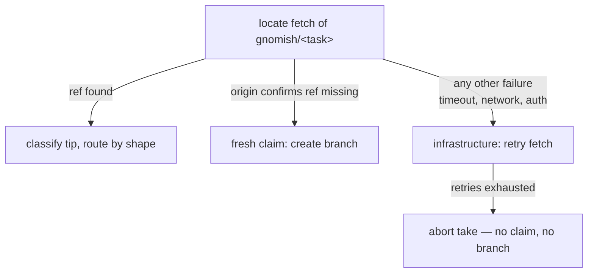

# tracker-take

## Purpose

The `gnomish take` CLI: single-task tracker modes (explicit ref and bare
auto-take), the disposition matrix, snapshot at claim, tracker-driven resume
with decision collection, abort handling with the K fuse, revocation at round
boundaries, delivery, and the operator guide.

## Requirements

### Requirement: take subcommand surface
`gnomish take` SHALL be a separate subcommand, always in git mode, with three
forms: `take <ref>` (explicit mode), `take <ref> <ref> ...` (batch mode, two
or more refs), and bare `take` (auto mode). Supported flags: `--dir`,
`--interactive[=executor|judge]` (single explicit form only),
`--base` (single explicit-mode start only), `--discard-work` (salvage-only:
reset the working copy to the last recorded round and replay the interrupted
round — see git-task-persistence "Salvage of interrupted rounds"), and the
headless takeover flag. `--discard-work` SHALL play no role in divergence:
divergence between the local branch and origin resolves automatically under
the live claim (see "Divergence resolves automatically under the lease"),
and no operator flag selects that resolution. `take` SHALL have no `--mode`, no ad-hoc source flags
(`--task`, `--task-file`, `--task-id`, `--resume`), and no `--from-stage`;
the bare form SHALL reject start modifiers (`--base`) and the headless
takeover flag (which authorizes an explicit `take <ref>` takeover only); the
batch form SHALL reject `--interactive` and `--base`. The `gnomish run` flag
matrix SHALL remain unchanged. Short refs (`42`, `#42`) expand via the
configured binding; a full canonical id naming a foreign repo is an error
(subject to the adapter's rename tolerance).
<!-- implements FR9 of add-tracker-port -->
<!-- implements FR6 of add-claim-heartbeat -->
<!-- implements FR2, FR3 of add-factory-serve -->
<!-- implements FR8 of harden-task-branch-contract -->

#### Scenario: Flag validation
- **WHEN** `take` is invoked with `--mode`, `--task`, `--resume`, or bare
  `take` with `--base` or `--takeover`
- **THEN** each invocation fails with a validation error before touching the
  tracker

#### Scenario: Batch rejects interactivity
- **WHEN** `take 42 43 --interactive` is invoked
- **THEN** the invocation fails with a validation error before touching the
  tracker

#### Scenario: Short ref expansion
- **WHEN** the operator runs `take 42` with a configured GitHub binding
- **THEN** the run targets the canonical id built from the binding and issue 42

#### Scenario: Foreign canonical id is refused
- **WHEN** `take github:other/repo#7` names a repo that is neither the configured
  binding nor (via the adapter's rename tolerance) a predecessor of it
- **THEN** the run refuses (exit 15) before fetching the task, naming both repos

### Requirement: Explicit-mode disposition by task state
`take <ref>` SHALL act as an operator mandate per the task's logical state:
`Ready` (or readiness criterion unmet) → claim and work, overriding the readiness
criterion and abort backoff without resetting the abort counter — resuming from
the branch outcome when one is recorded (a pending reply is collected and
acknowledged; a recorded `DecisionNeeded` with no reply parks again restating
the question; any other recorded outcome continues on the return alone) —
UNLESS the task's history carries a finish report: then the mandate is
refused, the decline protocol runs (terminal status restored, explanation
posted directing the operator to open a new task or bug), and the run exits
with a clear non-success outcome;
`AwaitingHuman` (any reason) → refuse, naming the pending report and the return
path (reply if needed, move the task back to ready);
`Working` held by another
instance → the takeover path: show the claim facts (holder, age of the last
beat) and require explicit confirmation — a TTY dialog, or the dedicated
takeover flag when headless; confirmed → remove the old claim via the
stale-claim removal (audit marker, dead claim deleted), then claim normally
and resume from the branch; unconfirmed → refuse with an error naming the
holder, changing nothing. This confirmation is the one deliberate deviation
from "identical with and without a TTY": a pre-claim gate, never an in-run
wait. `Finished` → skip reporting "already done"; `Gone` (closed or
nonexistent) → skip with a clear error.
<!-- implements FR9 of add-tracker-port -->
<!-- implements FR6 of add-claim-heartbeat -->
<!-- implements FR5 of enforce-finish-terminality -->

#### Scenario: Mandate overrides readiness and backoff
- **WHEN** `take <ref>` targets an open task without the ready label and with
  unexpired abort backoff
- **THEN** the task is claimed and worked, and the abort counter is not reset by
  the mandate itself

#### Scenario: Parked task is refused
- **WHEN** `take <ref>` targets a task in `AwaitingHuman`
- **THEN** the run refuses, restating the parked report and telling the operator
  to reply (if a question is pending) and move the task back to ready

#### Scenario: Held task shows facts and asks
- **WHEN** `take <ref>` targets a task claimed by instance B with a TTY
  attached
- **THEN** the run prints the holder and the age of the last beat and asks for
  confirmation; declining leaves the tracker untouched and exits as a refusal
  naming instance B

#### Scenario: Confirmed takeover resumes the task
- **WHEN** the operator confirms the takeover of a task whose holder died
  mid-work
- **THEN** the thread records the holder-transition marker, the old claim is
  removed, the run claims the task by the ordinary lease, and work resumes
  from the branch state

#### Scenario: Headless takeover needs the flag
- **WHEN** `take <ref>` targets a `Working` task without a TTY and without the
  takeover flag
- **THEN** the run refuses naming the holder and mentioning the flag; with the
  flag it proceeds as a confirmed takeover

#### Scenario: Finished task is skipped
- **WHEN** `take <ref>` targets a delivered task
- **THEN** the run reports it as already done and does not resume it

#### Scenario: Reopened finished task is declined, not worked
- **WHEN** `take <ref>` targets a task a human moved back to ready after it
  was finished
- **THEN** the run refuses even under the explicit mandate: the terminal
  status is restored, the explanation comment is posted, and the exit
  outcome clearly signals the refusal

### Requirement: Bare auto mode takes the head of the queue
Bare `gnomish take` SHALL fetch the ready queue via `listReady`, hide tasks
whose abort backoff (exponential from base, capped; computed by core from
adapter abort facts) has not expired, exclude finished tasks entirely —
declining each via the decline protocol instead of claiming — prefer
returned tasks over fresh ones, respect the WIP limit for fresh tasks
(claimed only while open fronts < W; returned tasks always claimable), claim
from the head zone — a random pick among the first K eligible, oldest-first
as a soft preference — process exactly one task to its terminal result, and
exit. An empty or fully blocked queue SHALL be a clean no-op run naming the
reason (nothing eligible, or the WIP limit). Losing the claim race SHALL
fall through to the next eligible task.
<!-- implements FR10 of add-tracker-port -->
<!-- implements NFR-C1 of add-tracker-port -->
<!-- implements FR6, FR9 of add-factory-serve -->
<!-- implements FR3 of enforce-finish-terminality -->

#### Scenario: One task per run
- **WHEN** the queue holds three ready tasks and bare `take` runs
- **THEN** exactly one task from the head zone is processed and the process
  exits after its terminal result

#### Scenario: Backoff hides a task
- **WHEN** the queue head aborted moments ago and its backoff has not expired
- **THEN** bare `take` claims the next eligible task instead

#### Scenario: WIP limit blocks a fresh start
- **WHEN** open fronts equal W and only fresh tasks are ready
- **THEN** bare `take` exits as a clean no-op naming the WIP limit

#### Scenario: Returned task preferred
- **WHEN** the queue holds an older fresh task and a younger returned task
- **THEN** bare `take` claims the returned task

#### Scenario: Finished task never claimed from the feed
- **WHEN** the queue lists a reopened finished task ahead of a fresh task
- **THEN** bare `take` declines the finished task and claims the fresh one

### Requirement: Batch take works the list with a summary and one exit code
Batch `take <ref> <ref> ...` SHALL apply the explicit-mode disposition matrix
to each ref independently, working refs through the scheduler up to N
concurrently: skipped and refused refs are reported with their reason and the
run continues. `Working` refs SHALL be skipped unless the headless takeover
flag authorizes takeover (batch never prompts). The run SHALL end with a
summary naming every ref's outcome and exit with one aggregate code in which
the "tool could not operate" family (codes below 10) dominates the
"legitimate outcome" family (10 and above); a batch where every ref delivered
exits 0.
<!-- implements FR2, FR3, FR4 of add-factory-serve -->
<!-- implements NFR-O2 of add-factory-serve -->

#### Scenario: Mixed batch summarized
- **WHEN** `take 42 43 44` delivers 42, skips 43 as held by another instance,
  and parks 44 as an escalation
- **THEN** the summary lists all three outcomes and the exit code comes from
  the legitimate-outcome family

#### Scenario: Tool failure dominates
- **WHEN** one ref fails with a pipeline load failure and the others deliver
- **THEN** the aggregate exit code comes from the below-10 family

### Requirement: Container-bound stages run through take
`gnomish take` (explicit ref, bare auto-take, and batch) SHALL execute container-bound stages through the same container assembly as `gnomish run`: fresh claim, tracker-driven resume with decision collection, salvage on takeover and revocation, keep-on-non-completed-exit, and `--discard-work` all function in container mode. Host-mode behavior SHALL be unchanged. Objects created by take SHALL be labelled `tracked`.
<!-- implements FR1, FR2, NFR-R4 of add-serve-sandbox-lifecycle -->

A resumed branch SHALL be routed by one shared routing table regardless of execution mode: a delivered branch whose tracker finish never landed reconciles the deferred finish, a park whose tracker write never landed reconciles the deferred park, an escalation-kind park enters the decision dialog, and any other recorded outcome resumes on the return alone — each with the same tracker effect and the same number of engine rounds in host and container mode.
<!-- implements FR1 of add-serve-sandbox-lifecycle -->

#### Scenario: A delivered container task with a pending finish reconciles by ref
- **WHEN** a container-mode task records `Completed` — its cleanup commit having stripped `.gnomish-task/` from the branch tip — while its tracker finish never landed, and the task is taken again by ref
- **THEN** the deferred finish is posted from the branch's own delivered state and the task ends `Finished`, with zero engine rounds and no environment reattached — identical to the host-mode reconcile

#### Scenario: Tracker task completes in a container
- **WHEN** take claims a task whose stages are container-bound
- **THEN** the pipeline runs in the box, the branch is harvested and pushed, the outcome is recorded, and the environment is disposed — identical to the run-mode container path

#### Scenario: Takeover salvages from the kept box
- **WHEN** take seizes a task whose previous holder's claim went stale, and that holder's stopped box survives
- **THEN** resume reattaches (or recreates over the surviving volume), salvages un-harvested work, and continues from the recorded pipeline position

### Requirement: Startup sweep pass with a reported summary
Each `take` invocation SHALL run one sweep pass at startup, evaluating the shared `sandbox-lifecycle` policy, and SHALL log verdicts in the uniform vocabulary plus one summary line with the per-category counts. The summary belongs to the invocation's log, not to the task's finish report: a finish report describes ONE task, while the sweep is project-wide and mostly concerns objects of other tasks. A tracker error during the pass degrades to skipped-no-verdict; a runtime error aborts the pass with a logged line. Neither ever blocks the take.
<!-- implements FR6, FR9, NFR-O4 of add-serve-sandbox-lifecycle -->

#### Scenario: Take reports its sweep
- **WHEN** a take run's startup pass stops one abandoned box and disposes two aged remnants
- **THEN** the invocation logs a summary line naming one stopped and two disposed objects, and each action is a structured log line with object, task key, and reason

#### Scenario: A failing sweep never fails the take
- **WHEN** the container runtime is unreachable when the startup pass runs
- **THEN** the pass is abandoned with one logged line, and the take proceeds to claim and work exactly as it would with nothing to sweep

### Requirement: Snapshot at first claim
At the first claim of a task the factory SHALL read id/title/body once into
`TaskContext` and persist them in `task.json`. Later issue edits SHALL NOT affect
the running or parked task; resume SHALL NOT re-read the snapshot — it collects
decisions only. Status output takes the title from the snapshot.
<!-- implements FR11 of add-tracker-port -->

#### Scenario: Issue edited mid-task
- **WHEN** a human edits the issue body while the task is `Working` or parked
- **THEN** the gnome's context and `task.json` retain the claim-time snapshot,
  and resume proceeds from the snapshot plus collected decisions

### Requirement: Decision consumption always leaves an ack
At resume claim the factory SHALL collect decisions posted after the last ack;
consuming a decision SHALL post an "acting on decision: <text>" ack comment
before acting. The ack records which reply the factory acted on and anchors
future decision collection.
<!-- implements FR12 of add-tracker-port -->

#### Scenario: Ack precedes acting
- **WHEN** a resumed run consumes a human reply
- **THEN** the tracker shows the "acting on decision" ack before any further
  work is recorded

#### Scenario: Reply consumed on resume
- **WHEN** an instance claims a returned task whose thread holds a reply after
  the last ack
- **THEN** the reply is acknowledged and recorded as the decision driving the
  resumed run

### Requirement: Escalation parks and exits
An escalation SHALL end the take run identically with or without a TTY: park
the task with its report, then exit telling the operator where the question is
and how to return the task ("reply in the tracker and move the task back to
ready"). There is no in-run decision wait. A resume claim that finds a recorded
`DecisionNeeded` outcome and no pending reply SHALL park the task again with
the question restated.
<!-- implements FR13 of add-tracker-port -->

#### Scenario: Escalation ends the run
- **WHEN** a take run escalates while a TTY is attached
- **THEN** the task is parked with the report and the run exits with the
  return-path message — no console prompt is opened

#### Scenario: Returned without an answer
- **WHEN** a human moves a `DecisionNeeded`-parked task back to ready without
  replying and a take run claims it
- **THEN** the task is parked again with the question restated

### Requirement: Abort protocol with a K fuse
An infrastructure abort is either an engine `Aborted` outcome (durable persist
failed) or an uncaught exception of the take run itself. On an infrastructure
abort the factory SHALL log ERROR, then best-effort: post the
structural abort comment, release the claim, and return the task to `Ready` via
`recordAbort` — a dead tracker never blocks the abort itself. The
consecutive-abort count SHALL be the crash-cause category of the unified
recovery accounting ("Recovery attempts share one budgeted accounting with the
crash fuse") — one counter model and one quarantine outcome, replacing the
previous standalone fuse counter while remaining shared across instances via
tracker facts. When that accounting reaches the configured threshold, the
factory SHALL instead park the task as `AwaitingHuman(infra)` with a report
carrying the categorized failure history (crash and recovery causes distinct).

Any abort-cause text handed to a tracker write — the structural abort marker's
cause and the fuse-trip report — SHALL first be capped to the abort-cause
budget, a fixed limit sized so the resulting comment body fits every supported
tracker (the smallest known comment limit is Jira Cloud's 32,767 characters)
with headroom for the report's own framing. Truncation SHALL keep the head and
the tail of the text and join them with an explicit marker naming the number of
characters omitted — never a silent cut, and never a cut that drops the end of
the text, where a rendered exception chain carries its root cause. Text within
the budget SHALL pass through byte-for-byte unchanged. The ERROR log and the
task branch's own state records SHALL keep the full, uncapped text: the bound
is the tracker's, not the diagnostic record's.
<!-- implements FR14 of add-tracker-port -->
<!-- implements NFR-R2 of add-tracker-port -->
<!-- implements NFR-C1 of add-tracker-port -->
<!-- implements FR14, NFR-O2 of harden-task-branch-contract -->
<!-- implements FR1 of cap-abort-cause-length -->
<!-- implements NFR-R1 of cap-abort-cause-length -->
<!-- implements NFR-O1 of cap-abort-cause-length -->

#### Scenario: Abort below the fuse
- **WHEN** a run aborts with the shared accounting below its threshold
- **THEN** the task returns to `Ready` with a structural abort comment and the
  slot-free process exits

#### Scenario: Fuse trips at K
- **WHEN** a run aborts and the shared accounting reaches its threshold
- **THEN** the task is parked as `AwaitingHuman(infra)` with a report carrying
  the categorized history (crash vs recovery causes, counts, last cause and
  time) pointing to the structural records as the full cross-instance history

#### Scenario: Runner crash is an abort
- **WHEN** the take run dies with an uncaught exception mid-run
- **THEN** the best-effort abort protocol runs: structural abort comment, claim
  released, task back to `Ready` (or parked at the shared threshold)

#### Scenario: Oversized cause is capped before the tracker write
- **WHEN** a run aborts with a cause longer than the abort-cause budget (e.g. a
  deep rendered exception chain)
- **THEN** the structural abort marker and, at the fuse, the park report carry
  the cause truncated to the budget — head kept, tail kept, an explicit
  omitted-characters marker between them — while the ERROR log carries the full
  text

#### Scenario: Cause within the budget is untouched
- **WHEN** a run aborts with a cause at or under the abort-cause budget
- **THEN** the tracker writes carry the cause byte-for-byte, with no marker

#### Scenario: Capped cause never breaks the abort accounting
- **WHEN** a run aborts with an arbitrarily large cause
- **THEN** the comment body the tracker write produces is within every supported
  tracker's limit, so the abort marker lands and the consecutive-abort count
  stays honest

### Requirement: Factory emits durable progress at the round boundary
On the first durable round after a claim, the factory SHALL call
`recordProgress` for the task exactly once per claim, from the round-boundary
hook that runs strictly after a round is durably persisted. The call SHALL be
best-effort: because the round is already durable when it runs, a tracker
failure SHALL be logged at WARN and swallowed — it SHALL NOT abort, block, or
fail the run. This is the mechanism that satisfies the `add-tracker-port` FR14
clause "the counter resets on the first durably persisted round after claim".
<!-- implements FR2 of fix-abort-progress-reset -->
<!-- implements NFR-R1 of fix-abort-progress-reset -->
<!-- implements NFR-O1 of fix-abort-progress-reset -->

#### Scenario: First durable round records progress
- **WHEN** a claimed task completes its first durable round
- **THEN** the factory calls `recordProgress` once for that task, after the
  round is persisted and before the revocation check

#### Scenario: Later rounds do not re-emit within the same claim
- **WHEN** a claimed task persists a second and third durable round
- **THEN** the factory does not call `recordProgress` again for that claim

#### Scenario: A progress-record failure never fails the run
- **WHEN** the `recordProgress` call throws (tracker unreachable)
- **THEN** the failure is logged at WARN and the run proceeds exactly as if the
  call had succeeded — no abort, no park, no non-zero exit attributable to it

#### Scenario: Progress resets the counter end-to-end
- **WHEN** a claim records two aborts, is reclaimed, persists a durable round,
  and later aborts once
- **THEN** the abort facts observed for the next backoff/fuse decision report a
  count of one, and backoff is computed from that count

### Requirement: Revocation detected at round boundaries
After every durably persisted round the factory SHALL verify the task is still
ours and alive in one tracker query — not closed, claim intact, state not changed
by a human. On revocation, it SHALL salvage uncommitted work through the bound
task environment — sandboxed: a salvage commit via `exec` inside the environment,
then harvest; host: a salvage commit in the worktree — push best-effort
factory-side per the push safety rules (harvest precedes any push), post a
structural "work stopped" note, release the claim, leave the tracker state
untouched, and keep the branch and the working copy per the keep semantics of
git-task-persistence — host: worktree kept; sandboxed: container stopped, volume
and network retained. Revocation SHALL surface as a runner-level result, not as
an engine `TaskOutcome`.
<!-- implements FR15 of add-tracker-port -->
<!-- implements FR5, FR6 of add-sandbox-core -->

#### Scenario: Issue closed under a working gnome
- **WHEN** a human closes the issue while a round is executing
- **THEN** at the next round boundary the run stops, salvages and pushes the work,
  posts the stop note, releases the claim, and reports the revocation result

#### Scenario: Revoked sandboxed task keeps a stopped environment
- **WHEN** revocation is detected while the task runs in container mode
- **THEN** leftovers are salvage-committed inside the environment and harvested,
  the push runs factory-side after the harvest, and the environment is kept
  stopped with volume and network retained

### Requirement: Delivery posts a final report and ends the factory's involvement
On engine `Completed` the factory SHALL transition the task to `Finished` with a
final report comment rendered from the status-report model (stages with attempts
and results, cumulative usage, branch reference, wall time) and SHALL never touch
the task again — re-running a finished task is a new task, not a resume. All
lifecycle actions SHALL be logged with the canonical task id in MDC.
<!-- implements FR18 of add-tracker-port -->
<!-- implements NFR-O1 of add-tracker-port -->

#### Scenario: Full delivery
- **WHEN** the engine completes the last stage
- **THEN** the tracker shows the delivered state and a final report comment, and
  subsequent runs treat the task only per the disposition matrix ("already done")

### Requirement: Any instance can pick up a returned task
Resume of a returned task SHALL require nothing instance-local: claim, decisions,
abort facts, and reports live in the tracker; work artifacts and state live on the
task branch. A different instance than the one that escalated SHALL be able to
claim, collect the decision, and continue from the recorded pipeline position.
<!-- implements NFR-R3 of add-tracker-port -->

#### Scenario: Cross-instance resume
- **WHEN** instance A escalates a task and instance B runs `take <ref>` after a
  human reply and return to ready
- **THEN** B claims, collects the reply, acknowledges it, and resumes from the
  branch state without any data from A

### Requirement: Exit codes by take result
`gnomish take` SHALL exit with: 0 — Delivered, or a clean bare-mode no-op
(empty queue); 1 — failure outside a claimed run (tracker unreachable at
startup, label provisioning); 2 — usage error; 3 — pipeline load failure;
10 — parked as escalation; 11 — parked as checkpoint; 12 — infrastructure
abort below the fuse; 13 — parked as infra (fuse trip or infrastructure
escalation); 14 — revoked; 15 — refused or skipped (held by another instance,
already done, closed or nonexistent, foreign repo). Codes shared with
`gnomish run` SHALL keep the same meaning. An uncaught exception follows the
abort protocol and exits 12 or 13, never a bare 1.
<!-- implements FR9 of add-tracker-port -->
<!-- implements FR10 of add-tracker-port -->
<!-- implements FR15 of add-tracker-port -->

#### Scenario: Empty queue exits clean
- **WHEN** bare `take` finds no eligible ready task
- **THEN** the process exits 0 reporting an empty queue

#### Scenario: Escalation park exit
- **WHEN** a take run parks its task as an escalation
- **THEN** the process exits 10

#### Scenario: Refusal exit
- **WHEN** `take <ref>` refuses a task held by another instance
- **THEN** the process exits 15 naming the holder

### Requirement: Operator guide
The change SHALL ship an operator guide (`docs/guides/operator-guide.md`) covering: quick
start (tracker config section, token env variable, factory config layers), handing
off a task via the ready label and automatic label provisioning, the label
dictionary with who moves what, the escalation/decision/ack flow (reply, return
to ready, re-run), snapshot behavior (issue edits do not affect a taken
task; influence via decisions or revoke-and-recreate), stuck-`Working`
recovery — automatic reaping whenever any factory instance is running, claim
in hand or not, bounded only by runs too short to observe a full TTL — the
confirmed `take <ref>` takeover with its headless flag, and the
honest limitation that one-shot cron runs cannot observe longer than TTL so
cron-only operation keeps the manual label flip until `serve` exists — the
heartbeat/TTL settings with the shared write-budget coupling (beat interval ×
concurrent tasks vs the shared token's write limits), Projects v2 boards as a
display-only parallel universe with the shipped reference "column → ready label"
cron workflow (`docs/examples/board-bridge.yml`), the fork warning ("fix
`tracker.repo`"), and the `take` CLI reference with exit behavior.
<!-- implements FR19 of add-tracker-port -->
<!-- implements FR6 of add-claim-heartbeat -->
<!-- implements NFR-P1, UX2, UX3 of add-claim-heartbeat -->
<!-- implements FR1 of fix-reaper-idle-liveness -->
<!-- implements UX1 of fix-reaper-idle-liveness -->

#### Scenario: Guide covers the operator surface
- **WHEN** an operator follows the guide against a fresh repository
- **THEN** every step from configuration to first delivered task and first
  escalation round-trip is described without reference to factory source code

#### Scenario: Guide states when recovery is automatic
- **WHEN** an operator reads the stuck-`Working` section
- **THEN** it distinguishes automatic reaping (any running instance whose run
  outlives a TTL — no claim of its own required), explicit takeover (any time,
  confirmed), and the cron-only manual escape hatch, and names the
  write-budget consequence of shortening the beat interval

### Requirement: Operator guide covers autonomous operation
The operator guide SHALL gain the autonomous-operation surface: the
`serve` / batch / drain CLI reference with lifecycle behavior (SIGTERM grace,
drain semantics, restart); the feed states and what the WIP-limit message
means (answering escalations is the unblocking action); the instance knobs
(slots N, idle interval, grace) versus the protocol constants in `.gnomish/`
(`wip-limit` beside the heartbeat keys); the shared write budget — heartbeat
dominates steady-state writes, bounding total concurrency ΣN at the default
beat interval, with the beat interval (not instance count) as the scaling
knob; the WIP method boundary (W limits how many branches are open, not
whether they merge — integration discipline stays with the pipeline author);
the autonomy gate ("who can set the ready label can execute code on the
factory host" — never auto-`ready` from untrusted sources); and CI hygiene
for gnome branches (workflows triggered by `gnomish/*` pushes carry no
privileged secrets; `GITHUB_TOKEN` read-only). The cron path SHALL now point
to drain mode, with the manual label flip demoted to a last-resort escape
hatch.
<!-- implements NFR-P2, NFR-S1, NFR-S2 of add-factory-serve -->
<!-- implements UX1, UX2, UX4 of add-factory-serve -->

#### Scenario: Guide explains the stalled factory
- **WHEN** an operator sees the daemon idle at the WIP limit
- **THEN** the guide names the state, the reason (open fronts ≥ W), and the
  unblocking action (answer escalations; returned tasks drain first)

#### Scenario: Guide states the autonomy gate
- **WHEN** an operator considers bridging external issues to the ready label
- **THEN** the guide forbids auto-`ready` from untrusted sources, equating
  ready-label access with code execution on the factory host

### Requirement: Take runs the heartbeat thread and the reaper duty
A take run SHALL start the beat-only instance heartbeat thread at its first
successful claim and stop it when no claim is held (terminal result reached or
claim lost). Independently of any claim, the run SHALL start the standing
reaper at the run start and stop it when the invocation ends: while the run
lives, the reaper lists open tasks, updates observations, and removes stale
claims on each tick, whether or not the run currently holds a claim of its
own. Reaping is a duty of the run itself, never a byproduct of holding a
claim — the same standing-reaper mechanism `serve` uses, scoped to one
invocation; the heartbeat thread performs no reaper duty.
<!-- implements FR1, FR4 of add-claim-heartbeat -->
<!-- implements FR1, FR5 of fix-reaper-idle-liveness -->

#### Scenario: Beat starts with the claim
- **WHEN** bare `take` claims the queue head
- **THEN** the claim comment starts receiving beats within one interval, until
  the run reaches its terminal result

#### Scenario: Long run reaps a neighbor
- **WHEN** a take run works a multi-hour task while another instance died
  holding a claim
- **THEN** before the run ends, the dead claim is removed and its task is
  `Ready` — unclaimed by the reaping run

#### Scenario: Reaping outlives the beat thread
- **WHEN** a take run's heartbeat thread dies abnormally while a foreign
  claim in the listing goes stale
- **THEN** the standing reaper, on its own thread, still removes the stale
  foreign claim before the run ends

### Requirement: Reconcile precedes resume
Every claim of a task with an existing branch SHALL begin with the reconcile
check, routed by the `task-branch-contract` shape classifier: when the tip
records a terminal outcome whose tracker counterpart is missing (finish or
park never landed), the run SHALL complete the deferred delivery and end —
executing no stage. For a `Completed` tip whose cleanup commit is also absent,
the delivery is the full finish of "A Completed-without-cleanup tip is
finished, never re-executed" (cleanup commit, push, tracker finish); the two
requirements name one behavior, not two checks. Only when branch and tracker
agree does the ordinary resume (decision collection, engine run) proceed.
<!-- implements FR10 of add-claim-heartbeat -->
<!-- implements NFR-C1 of add-claim-heartbeat -->
<!-- implements FR9 of harden-task-branch-contract -->

#### Scenario: Deferred finish is delivered, not re-run
- **WHEN** a take run claims a task whose branch records `Completed` but whose
  tracker state is still open after its holder died mid-outage
- **THEN** the run posts the final report, transitions the task to `Finished`,
  and exits with the delivery exit code without invoking any executor

### Requirement: Terminal tracker writes retry against an outage
When a terminal outcome (finish, park, abort record) cannot be written because
the tracker is unreachable, the run SHALL keep the outcome durable in the
branch and retry the write with backoff for a bounded period before giving up
with an ERROR naming the unreconciled state; the reconcile-on-resume closes
the gap whenever the process dies or gives up first. Abort-path writes remain
best-effort as before — a dead tracker never blocks the abort itself.
<!-- implements FR10 of add-claim-heartbeat -->
<!-- implements NFR-R3 of add-claim-heartbeat -->

#### Scenario: Finish lands after the outage
- **WHEN** the tracker recovers while a completed run is still retrying its
  final write
- **THEN** the delivery completes normally with the final report, and the
  thread shows nothing unusual beyond the beat gap

#### Scenario: Give-up past the bound names the unreconciled state
- **WHEN** the tracker stays unreachable until the retry bound elapses, so a
  finish or park write is given up as deferred
- **THEN** the run logs exactly one ERROR naming the task and its unreconciled
  tracker-write state (the pending finish, or the "tracker-write pending" park),
  keeps the outcome durable in the branch, and returns the mapped terminal
  result for reconcile-on-resume to close later

### Requirement: Routing decides only on origin-confirmed state
Fresh-vs-resume routing SHALL rely only on origin-confirmed state: the take
routes to a fresh claim only after origin confirms the task ref is missing. A
locate fetch that fails for any other reason — network error, timeout,
authentication, an interrupted or timed-out subprocess — SHALL classify as an
infrastructure failure: the fetch is retried under the existing
infrastructure-retry policy — a budget of its own, never the bounded
re-attempt that bound-subprocess-commands forbids spending on an interrupted
or timed-out invocation — and on exhaustion the take aborts without claiming;
it SHALL NOT route to a fresh claim or create a new branch.
<!-- implements FR6 of harden-task-branch-contract -->

#### Scenario: Fetch failure never forks a duplicate branch
- **WHEN** the locate fetch of `gnomish/<task>` fails with a network timeout
  while the branch exists on origin
- **THEN** the take retries the fetch and, on exhaustion, aborts without
  creating a branch or starting a round — the existing branch is untouched

#### Scenario: Confirmed-missing ref routes fresh
- **WHEN** origin answers the locate fetch confirming no `gnomish/<task>` ref
  exists
- **THEN** the take routes to a fresh claim and creates the branch

### Requirement: Divergence resolves automatically under the lease
When the instance holds a live claim, the local task branch and the origin
tip SHALL reconcile automatically before resume: local ahead of origin keeps
the local tip; local behind origin fast-forwards to the origin tip; true
divergence discards the local branch — reset to the origin tip, drafts
dropped — and the run continues from origin. No operator flag is consulted
and no divergence terminates the run with an exit demanding git surgery. The
discard's reset SHALL be an explicit local-ref compare-and-swap against the
tip the decision was made on — no push is involved, and origin history is
never rewritten.
<!-- implements FR8 of harden-task-branch-contract -->

#### Scenario: Stale local branch is discarded and work continues
- **WHEN** an instance resumes a task whose work was superseded from another
  host, so local and origin have truly diverged
- **THEN** the local branch is reset to the origin tip, the run continues from
  the origin state in the same invocation, and origin history is untouched

#### Scenario: Local-ahead is kept, not discarded
- **WHEN** the local branch holds commits origin lacks and origin has not moved
- **THEN** the local tip is kept and pushed; nothing is discarded

### Requirement: A Completed-without-cleanup tip is finished, never re-executed
When the branch tip records the `Completed` outcome but the cleanup commit is
absent, the take SHALL finish the delivery — deliver the tracker finish, then
commit the cleanup and push it — and SHALL NOT re-enter the engine: zero
rounds, no executor or judge invocation. The order is FR10's: the cleanup is
the destructive step and runs behind the confirmed finish, so a kill anywhere
in the sequence leaves the tip recording `Completed` with its envelope intact —
the same shape this requirement recovers.
<!-- implements FR9 of harden-task-branch-contract -->

#### Scenario: Kill between Completed and cleanup costs no re-run
- **WHEN** a previous run died after committing `Completed` but before its
  cleanup commit, and the task is taken again
- **THEN** the run posts the finish, commits the cleanup, pushes, and exits
  with the delivery exit code without executing any stage

#### Scenario: A finish that already landed is not posted twice
- **WHEN** the recovering run probes the tracker and finds the task already
  finished
- **THEN** no second finish is written, the cleanup commit still lands, and the
  run exits with the delivery exit code

### Requirement: Recovery attempts share one budgeted accounting with the crash fuse
Automatic recovery of a non-clean branch shape SHALL be budgeted: a persisted
per-task counter of recovery attempts with backoff between attempts, and
quarantine to the needs-human status carrying the failure history once the
budget is exhausted. This budget and the existing K crash fuse SHALL be one
accounting — one counter model and one quarantine outcome, not two parallel
fuses. Quality attempts (stage verification failures) SHALL remain a separate
count and never burn recovery budget.
<!-- implements FR14 of harden-task-branch-contract -->

#### Scenario: Exhausted recovery budget quarantines with history
- **WHEN** recovery of the same task fails repeatedly until the shared budget
  is exhausted
- **THEN** the task is parked needs-human with a report carrying the failure
  history of all recovery attempts, and no further automatic recovery runs

#### Scenario: Quality failures never burn the recovery budget
- **WHEN** a task accumulates stage-verification failures within its stage
  attempt limit
- **THEN** the recovery/crash counter is unchanged by those quality attempts

### Requirement: Non-recoverable shapes quarantine on first classification
A branch tip classifying as one of the three non-recoverable shapes of the
`task-branch-contract` closed set — `Corrupt`, `UnsupportedVersion`, or
`Unknown`, on every reading path of take and serve — SHALL quarantine
the task on its first classification with a diagnosis, without burning
crash-fuse or recovery-budget cycles and without a crash loop. The quarantine
report SHALL name the observed shape, the diagnosis (the offending file and
the expected shape), and the recovery attempts consumed, readable without
factory logs.
<!-- implements FR15 of harden-task-branch-contract -->
<!-- implements UX2, NFR-O2 of harden-task-branch-contract -->

#### Scenario: Corrupt branch parks once, not per pickup
- **WHEN** a take claims a task whose `state.json` is unparseable
- **THEN** the task is parked needs-human on that first classification with a
  report naming the file, the observed and expected shape, and attempts
  consumed — and subsequent pickups do not re-run recovery on it

#### Scenario: Unsupported version is a shape, not a crash
- **WHEN** the branch's state envelope carries a version this factory does not
  support
- **THEN** the take classifies it as `UnsupportedVersion` and parks with the
  observed and supported versions named in the diagnosis, burning no crash-fuse
  cycle
