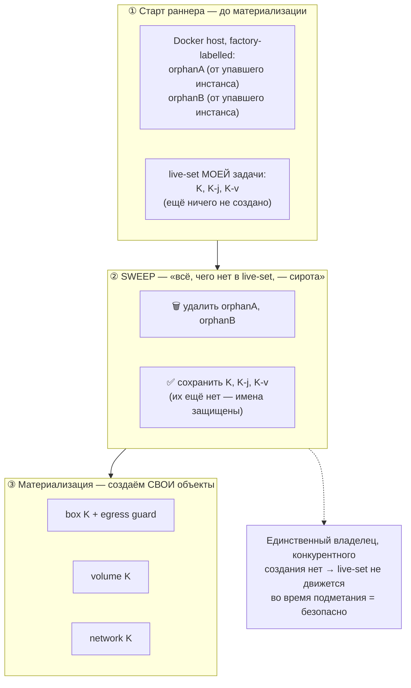
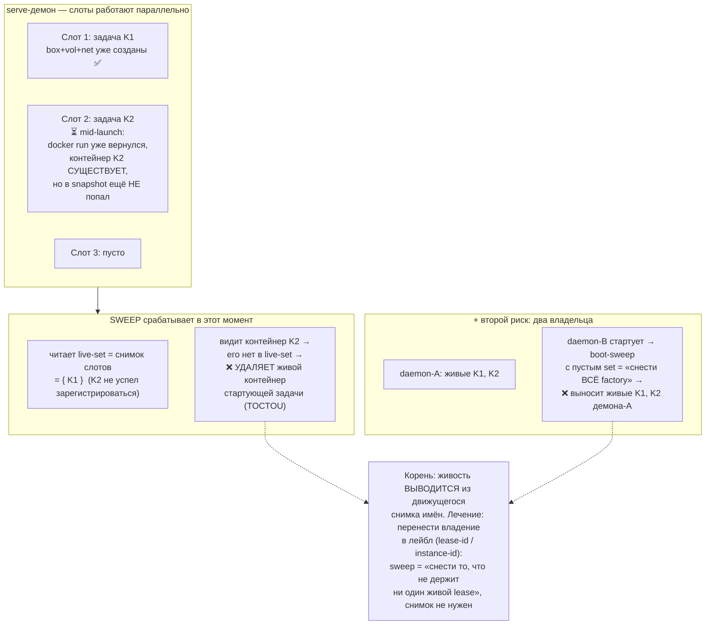
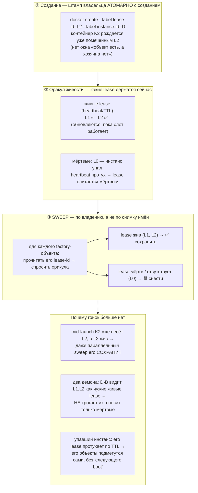

# Заметка: orphan sweep контейнеров — `run`/`take` против `serve`

> Рабочая заметка по дизайну (не спецификация). Фиксирует, почему startup
> orphan sweep, построенный в `add-sandbox-core`, безопасен для одиночных
> раннеров, но не может быть скопирован как есть в долгоживущий демон `serve`,
> и как выглядит правильное решение. Связанный код:
> `adapter/environment/ContainerOrphanSweeper.java`,
> `ContainerEnvironments.sweepOrphans()`, `app/ContainerTerminalDrive.java`.

## Два способа запуска фабрики

- **`gnomish run` / `gnomish take`** — процесс берёт ровно одну задачу, доводит
  до конца, завершается. Startup orphan sweep живёт сейчас именно здесь.
- **`gnomish serve`** — долгоживущий демон, держащий несколько задач
  одновременно («in-flight»), запуская их параллельно (по одной на слот).

## Что sweep делает сейчас

`ContainerOrphanSweeper.sweep(liveKeys)` листает **все** docker-объекты с
factory-лейблом на хосте, оставляет только те, чьи имена выводятся из
`liveKeys`, а остальные удаляет как «осиротевшее после падения» (FR11, NFR-R2).
Это зеркало `git worktree prune`. Docker недоступен → пишет в лог и ничего не
делает, старт не блокирует.

В `run`/`take` живой набор — это ровно три роли одной задачи:

```java
sweep(Set.of(baseKey, baseKey + "-j", baseKey + "-v"));
// key   -> box-контейнер + его egress guard
// key-j -> свежий judge-box
// key-v -> свежий verification-box
```

Sweep вызывается **один раз, на старте раннера, до материализации любого
окружения** (`ContainerTerminalDrive.run` → `support.sweepOrphans()`).

Три разные операции работают с factory-объектами — их нельзя путать:

| Операция | Когда | Что трогает |
|---|---|---|
| **sweep** (`ContainerOrphanSweeper`) | старт раннера, 1 раз | *чужое* — всё, чего нет в live-set текущей задачи |
| **disposeExisting** | resume / `--discard-work` | объекты *этой* задачи (`baseKey`) |
| **dispose** (lease) | штатное завершение | окружение этой задачи |

## Почему `run`/`take` безопасен

В момент, когда бежит sweep, процесс держит ровно одну задачу и **ещё ничего не
создал**; живых соседей на таймлайне нет. Значит live-set статичен во время
подметания — «всё, что не моё, — сирота» верно по определению.



## Почему `serve` нельзя скопировать

Демон крутит несколько слотов сразу. Задачи стартуют и останавливаются
**параллельно со sweep**, поэтому живой набор шевелится, пока sweep принимает
решение. Собрать «все ключи слотов» (тривиальный union) — лёгкая часть; тяжёлая
в том, что корректность sweep держится на *статичности* live-set, а `serve`
ломает это двумя независимыми способами.



1. **Гонка mid-launch (TOCTOU).** Слот уже выполнил `docker create/run` —
   объекты существуют, — но ключ слота ещё не попал в снимок, который читает
   sweeper. Sweeper видит «незнакомый factory-объект» и удаляет контейнер
   только что стартующей задачи. Сбор всех ключей не спасает: новый слот может
   появиться между «собрал ключи» и «снёс остальное».
2. **Много-инстансность.** Пустой-set сегодня означает «снести все
   factory-объекты». На хосте со вторым `serve` (или `take` параллельно)
   boot-sweep одного демона выносит живые задачи другого. Имя-как-владение уже
   предполагает единственного владельца factory-namespace.

Оба случая — одна болезнь: живость выводится из движущегося снимка имён, а не
хранится на самом объекте.

### Не покрыто в `add-sandbox-hardening`

Упоминания orphan/sweep в `add-sandbox-hardening` (FR15, задача 4.5, spec
`sandbox-provisioning`) относятся исключительно к **snapshot-образам
провижининга** — другой тип объекта, чистящийся тем же label-based приёмом.
Проблема serve-sweep / много-инстансности там не решается. Это пока незанятая
территория (lifecycle serve, а не hardening).

## Правильное решение: владение в лейбле

Перестать выводить живость из снимка. Штамповать каждый factory-объект его
владельцем (`lease-id`, `instance-id`) атомарно при создании и дать sweep
**оракул живости**. Тогда sweep спрашивает у каждого объекта, кто его хозяин и
жив ли этот хозяин.



| | Снимок имён (сейчас) | Владение в лейбле |
|---|---|---|
| Что защищает sweep | имена из live-set, снятого в момент X | объекты, чей `lease-id` жив прямо сейчас |
| Критичный момент | **sweep должен идти до создания** (статичный набор) | **штамп должен идти вместе с созданием** (`--label` атомарен) |
| Гонка mid-launch | объект есть, но не в снимке → снесут | объект уже помечен живым lease → сохранят |
| Второй демон | пустой set = «снести всё» → выносит чужое живое | чужой живой lease виден → не трогается |
| Упавший инстанс | чистится на следующем boot | чистится сам по TTL lease |

Гарантия смещается с **порядка во времени** («подмети раньше, чем создашь») на
**атомарность метки** («объект не может существовать без записи о хозяине»).
Второе не зависит от того, сколько задач и демонов крутится параллельно, —
именно поэтому оно годится для `serve`.

## Открытый вопрос: оракул живости

Решить «мёртв» требует heartbeat/TTL:

- **Один демон** — оракул это его же таблица слотов.
- **Много-инстансность** — общий реестр lease с heartbeat/TTL (файл-лок с
  обновляемой меткой времени либо запись в трекере). Без него «мёртвый» нельзя
  отличить от «живого, но чужого». Это ровно та часть, что заменяет нынешнее
  «подметём на следующем старте».

## Почему это отложено: прецедент 4.8

Serve-start sweep отложен не по забывчивости, а по сквозной договорённости
`add-sandbox-core`, впервые сформулированной в задаче 4.8: **механику
(адаптер/компонент) кладём сейчас, аддитивно; её подключение к жизненному циклу
демона откладываем отдельным заходом — «serve/lifecycle pass».** Ниже — только
ещё не реализованные пункты этого захода (механика для них уже лежит в коде).

| Задача | Что отложено | Что уже сделано (механика лежит) |
|---|---|---|
| 4.4 | serve-start sweep — вызов подметания на старте демона с набором ключей всех in-flight задач | `ContainerOrphanSweeper.sweep(liveKeys)` готов; в `run`/`take` вызывается с ключами одной задачи |
| 4.8 | планирование в демоне + вызов `stopKeeping` в конце задачи | `ContainerEnvironmentReaper.stopKeeping`/`reapAged` (измеряет runtime finished-at, сносит через `ContainerEnvironmentDisposal`) |
| 9.2 | контейнерная адаптация `take`/`serve` (сам код запуска задач демоном) | контейнерный `gnomish run` полностью собран (`ContainerRunSupport`, `SelfCheckedEnvironment`, `EnvironmentLease` …) |
| 9.5 | тот же boundary, зафиксированный в операторской доке | `docs/operator-guide-sandbox.md` честно называет границу |

Пояснения к каждому:

- **4.4 — serve-start sweep.** Это ровно предмет всей заметки. В `run`/`take`
  живой набор — одна задача, sweep безопасен (статичный live-set). В `serve`
  живой набор должен охватывать *все* in-flight задачи и меняется прямо во время
  подметания → нужен не расширенный union ключей, а ownership-в-лейбле с оракулом
  живости (см. выше). Поэтому вызов отложен вместе с остальным serve-циклом.
- **4.8 — `stopKeeping` + планирование.** «Keep»-семантика (остановить
  контейнер, сохранить том и сеть для resume) и «reap» (снести окружения,
  простаивающие дольше порога) как операции уже есть. Не хватает того, кто их
  зовёт: демон, который в конце задачи помечает бокс «kept», а по расписанию
  подчищает старьё. Это часть планировщика serve, которого пока нет.
- **9.2 — адаптация `take`/`serve`.** Весь контейнерный путь собран и проверен
  E2E, но только для ручного `gnomish run`. `take` (взять задачу из трекера) и
  `serve` (демон на много слотов) ту же сборку ещё не переиспользуют — это и есть
  основной объём serve/lifecycle pass.
- **9.5 — док-граница.** Не код, а честная фиксация в операторском гайде: в
  контейнерном режиме сейчас поддержан `run`, а `take`/`serve` придут отдельным
  заходом. Пункт держит документацию не расходящейся с реальным состоянием.

Вывод для дизайна: serve-sweep — не одинокий особый случай, а один из четырёх
пунктов единого отложенного захода. Ownership-в-лейбле и оракул живости из
разделов выше — естественная часть дизайна именно этого захода, а не текущего
change.
