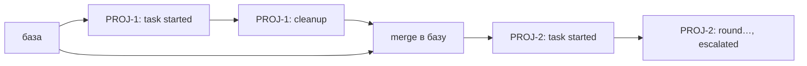

# Проверка issue: `status` показывает `Delivered` для эскалированной задачи (2026-09-29)

Рабочая заметка по итогам `/check-issue`. Две исправленные проблемы и наблюдения, которые
остались открытыми. Ветка: `fix-operator-blockers`, изменения не закоммичены.

## Исходный отчёт (кратко)

- После эскалации (`task summary: outcome=awaitingHuman (ESCALATION), stage=implement,
  attempts=0`) команда `./gnomish status <task>` вывела только `Shape: Delivered`. В режиме
  списка три незавершённые задачи (одна эскалирована, две прерваны по SIGINT) тоже показали
  `Delivered`.
- Тот же прогон упал с `[GF112] executor threw … MissingResultEventException: stream-json
  carried no result event`. К этому моменту гном сделал 33 вызова инструментов при `maxTurns: 30`.

---

## Решено 1: чужой cleanup-коммит в базе делал живую задачу `Delivered`

### Причина

- Классификатор первым правилом проверяет «доставлено»
  (`domain/.../branch/BranchShapeClassifier.java`, `if (facts.cleanupCommitInHistory())`).
- Этот признак вычислял `GitShowTip.cleanupCommit()` (`adapters/git/.../GitShowTip.java`)
  командой `git rev-list --max-count=1 --fixed-strings --grep="gnomish: cleanup" <tip>`, то есть
  по **всей** достижимой истории.
- Ветка задачи ответвляется от базы. Если раньше в базу влили (без squash) ветку другой
  доставленной задачи, её коммит `gnomish: cleanup` достижим из вершины новой задачи. Поэтому
  любая новая задача сразу получала `Delivered`, и это перекрывало `Parked`, `InProgress` и
  `Created`.
- Сама эскалация cleanup-коммит **не пишет**. Он создаётся только при `COMPLETED`: в
  `GitObjectsTerminalCommits.cleanUp` и `CleanupCommit.commit`.



Старый поиск шёл от вершины `PROJ-2` по всем родителям и находил `PROJ-1: cleanup`.

### Последствия шире, чем в отчёте

Тот же признак читают все потребители классификатора через `RefTipSource`:

- `BranchStateReader`: `status <task>`;
- `TaskBranchLister`: `status` в режиме списка;
- `GitTaskBranches.java:102`: **подхват задачи в `take`**. Эскалированная задача на такой базе
  получала disposition `TERMINAL` и не возобновлялась;
- `ContainerTipReader` в `:bootstrap`: контейнерный режим.

### Исправление

`GitShowTip.cleanupCommit()` теперь ищет только в собственной истории задачи:

1. Найти ближайший STARTED-коммит задачи на первой родительской линии:
   `rev-list --first-parent --max-count=1 --fixed-strings --grep="gnomish: task started" <tip>`.
   Ближайший, потому что STARTED-коммиты более ранних задач могут лежать дальше, в базе.
2. Если его нет, у ветки нет своей доставки, результат пустой.
3. Иначе выполнить `rev-list --first-parent --max-count=1 --fixed-strings --grep="gnomish:
   cleanup" <tip> ^<started>`.

`--first-parent` дополнительно отсекает cleanup-коммиты из базы, влитой в ветку задачи уже
после её старта.

Уже пострадавшие ветки чинить не нужно: классификация читается заново при каждом вызове,
поэтому после исправления они получат верный shape.

### Регрессионные спеки

`adapters/git/src/test/groovy/.../DeliveryAncestrySpec.groovy`. До исправления первая фича
была красной (`cleanupCommitInHistory() == true` у свежей ветки `PROJ-2`).

- живая задача от базы с чужим cleanup-коммитом не считается доставленной;
- база с чужим cleanup-коммитом, влитая в живую ветку после старта, не делает её доставленной;
- голая ветка (без своего STARTED) на такой базе не считается доставленной;
- ранняя задача `PROJ-1` по-прежнему `Delivered`.

---

## Решено 2: ход, упёршийся в `maxTurns`, превращался в `MissingResultEventException`

### Причина

- Контракт Claude CLI (тип `SDKResultMessage` в документации Agent SDK): поле `result` есть
  **только** у `subtype: "success"`. У `error_max_turns`, `error_during_execution`,
  `error_max_budget_usd` и `error_max_structured_output_retries` его нет, вместо него есть
  `errors: string[]`, `num_turns`, `terminal_reason`.
- `StreamJsonEventMapper.toResult` (`adapters/agent/...`) отбрасывал любую result-строку без
  поля `result` (DEBUG-строка `stream-json: skipping line of type 'result' (result line without
  a result field)`).
- В результате `AgentRoundResultExtractor.extract` не находил `ResultEvent` и бросал
  `MissingResultEventException`: это инфраструктурный сбой, и задача уходит в эскалацию.
- Это противоречит замыслу кода: javadoc `AgentEvent.ResultEvent#subtype` и
  `AgentProgressEvent.RoundFinished#subtype` прямо называют `error_max_turns` обычным подтипом.

Чем это подтверждено: красным спеком на строке в форме контракта CLI. Реальный stream-json из
отчёта не воспроизводился. То, что в том прогоне CLI действительно выпустил `error_max_turns`,
вывод аналитический: 33 вызова инструментов при `maxTurns: 30` и полное совпадение симптома.

### Исправление

`StreamJsonEventMapper`:

- `isResultEvent(wire)`: строка считается result-событием, если в ней есть поле `result` **или**
  подтип начинается с `error_`;
- `resultTextOf(wire)`: при отсутствии поля текст пустой;
- строка `success` без `result` по-прежнему отбрасывается, это закреплено существующим спеком в
  `StreamJsonParserSpec`.

Решение вынесено из метода с `@DoNotMutate` в отдельные методы, поэтому PIT их мутирует.

### Регрессионные спеки

`adapters/agent/src/test/groovy/.../StreamJsonErrorResultSpec.groovy`. До исправления все 4
кейса были красными.

- `error_max_turns`, `error_during_execution`, `error_max_budget_usd` разбираются в
  `ResultEvent` с пустым текстом и подтипом как есть;
- для init-строки и строки `error_max_turns` экстрактор возвращает результат и не бросает
  исключение;
- строка без `result` и без подтипа по-прежнему пропускается.

### Проверки

`:adapters:git:check`, `:adapters:agent:check` и `:bootstrap:test` зелёные. PIT 100%: git
871/871, agent 293/293.

---

## Открытые наблюдения

### Н1. Что должен означать ход, упёршийся в лимит (вопрос дизайна)

**Что сейчас.** После исправления 2 ход с `error_max_turns` завершается как обычный: подтип
попадает в лог `RoundFinished` (`LoggingAgentProgressListener`), дальше стадия идёт своей
проверкой (`verify`). Если проверки не проходят, это провал по качеству: попытка +1, повтор с
замечаниями, при исчерпании попыток эскалация. Если гном успел доделать работу, стадия может
пройти.

**Почему это вопрос.** Возможны три разумных варианта:

1. **Как сейчас:** лимит ходов — обычный конец хода, решает проверка. Это соответствует
   `stage-description.md`: только проверка определяет исход.
2. **Провал по качеству без проверки:** «ходы кончились» — это находка для следующей попытки
   (нужен текст находки, например `errors[]` из строки CLI).
3. **Отдельный исход или эскалация с внятной причиной** вроде «turn limit reached (30)»,
   вместо общего сбоя.

Другие подтипы `error_*` тоже стоит разобрать: `error_during_execution` скорее похож на
инфраструктурный сбой, чем на исход по качеству, а `error_max_budget_usd` — это лимит
стоимости (NFR-C).

**Как воспроизвести.** Раньше проще всего было собрать сценарий fake-agent со строкой
`{"type":"result","subtype":"error_max_turns","is_error":true,"session_id":"…"}` без `result` и
прогнать стадию. Сейчас такой сценарий пройдёт через проверку, и можно посмотреть итоговый
исход. Сценарии fake-agent лежат там же, где `plain-round` и `premature-death`, их читает
`FakeAgentScenarioReader`. Вживую: `maxTurns: 1–2` в настройках стадии и задача, которой нужно
больше ходов.

**Что решить.** Выбрать вариант 1, 2 или 3 для каждого подтипа `error_*`. Варианты 2 и 3
требуют передавать `subtype` и `errors[]` дальше `AgentRoundResult` (сейчас там только
`sessionId`, `result`, `usage`). Скорее всего, это отдельный change через `/opsx:propose`.

**Смежное.** `StreamJsonLine` не читает поля `errors`, `num_turns` и `terminal_reason`. По
документации CLI для различения причин нужно смотреть сначала на `terminal_reason`, потом на
`subtype`: при API-ошибке CLI отдаёт `subtype: "success"`, а причина лежит в `terminal_reason`
(`api_error`). Сейчас такой ход фабрика считает успешным с пустым или ошибочным текстом в
`result`.

### Н2. `status` не подсказывает, как вернуть эскалированную задачу

**Поправка к моему выводу в чате.** Там я написал, что `status` не печатает для `Parked`
стадию и причину. Это неверно: после исправления 1 ветка `Parked` или `InProgress` идёт в
`StatusCommand.printFound` → `StatusTextRenderer.renderFull`. Там печатаются стадия с
попытками (`Stage: implement (attempt n/limit)`), история попыток, решения, итоги, активность и
строка `Last escalation: …`. Для `CannotExecute` под ней выводятся и отказы (denials). В режиме
списка (`TaskListRenderer`) есть колонки task, shape, stage, attempts, outcome.

**Что проверить.**
1. Прогнать реальный сценарий из отчёта (эскалация из-за исключения исполнителя, `attempts=0`) и
   убедиться, что `Last escalation:` действительно заполнена и причина читается. Эскалация
   «executor threw» записывается как `CannotExecute`? Проверить по `EscalationReport` и по
   тому, что пишется в `state.json`.
2. Подсказки «как вернуть в работу» в выводе нет: ни команды `take` / `run --resume
   --decision`, ни статуса в трекере. Отчёт просил «путь возврата». Это доработка
   функциональности, а не дефект: `/opsx:propose`. Возможно, она пересекается с
   `make-run-headless` (`--resume --decision`) и `add-doctor-command`, которые уже лежат в
   `openspec/changes/`.

**Как воспроизвести.** Локальный клон с базой, fake-agent со сценарием, который эскалирует
(или реальный CLI с `maxTurns: 1`), затем `./gnomish status --dir <clone> <task>`. Удобная
заготовка — `TakeLifecycleEscalateResumeSpecBase` в `:bootstrap`.

### Н3. `GitObjects.historyContains` без production-вызовов, с той же ловушкой

`gitobjects/src/main/java/.../GitObjects.java:131`: тот же `rev-list --grep` по всей истории.
Вызовов в production-коде нет (`grep -rn historyContains --include='*.java' . | grep -v /test/`),
есть только `GitObjectsHistorySpec`.

**Риск.** Если его подключат для вопроса «доставлено ли», вернётся дефект из исправления 1.

**Что решить.** Удалить (метод и спек), если он не нужен контейнерному режиму, или привести к
той же семантике «своя история» и назвать это явно. Если оставить, это уже вторая реализация
одного правила: по `manual-sync-pairs.md` нужна либо общая абстракция, либо объявленная пара.

### Н4. Оставшиеся границы нового правила «своя история»

Правило опирается на два предположения, которые стоит зафиксировать или закрыть спеками:

- **STARTED-коммит лежит на первой родительской линии ветки задачи.** Это верно для
  `createTask` в обоих режимах. Если кто-то когда-нибудь пересоберёт ветку задачи (rebase на
  новую базу), STARTED-коммит останется на линии, и правило продолжит работать. Если же
  человек сделает `git merge` ветки задачи **в** другую ветку и продолжит работу там, первым
  родителем окажется чужая линия. Это экзотика, но она не закрыта спеком.
- **Сообщение `gnomish: task started` стало частью контракта разбора.** Javadoc
  `ServiceCommitMessages` говорит, что сообщения, кроме snapshot, — «не контракт разбора». Теперь
  это не так для `cleanup` (так было и раньше) и для `task started`. Стоит обновить javadoc
  класса и, возможно, завести константу рядом с `SNAPSHOT_PREFIX`, как сделано для snapshot.
  Иначе переименование сообщения тихо сломает классификацию.

Как проверить: добавить в `DeliveryAncestrySpec` сценарий с rebase-merge или fast-forward
ранней задачи в базу. Ожидание: STARTED новой задачи ближе, поэтому она не `Delivered`.
Аналитически это верно, но спеком не закреплено.

### Н5. Нестабильный первый прогон `:adapters:git:pitest`

Первый `./gradlew :adapters:git:check` упал на двух задачах: Spotless (ожидаемо, форматирование
нового кода) и `:adapters:git:pitest` с `Process 'java' finished with non-zero exit value 1`,
без причины в отфильтрованном выводе. Повторный прогон на том же коде (после `spotlessApply`)
прошёл, 871/871.

**Как разобраться.** Если повторится, смотреть полный вывод pitest, а не отфильтрованный grep'ом:
падение минион-процесса, `RUN_ERROR`, нехватка памяти. Проверить, не связан ли сбой с
параллельным прогоном тестов в том же Gradle-демоне. Смежная известная проблема: гонка на
`.git/config` в `harden()` (заметка «Concurrent harden race» в памяти от 2026-09-24).

---

## Рекомендуемый коммит

```
fix: scope delivery to the task's own history; keep error_* result lines
```
